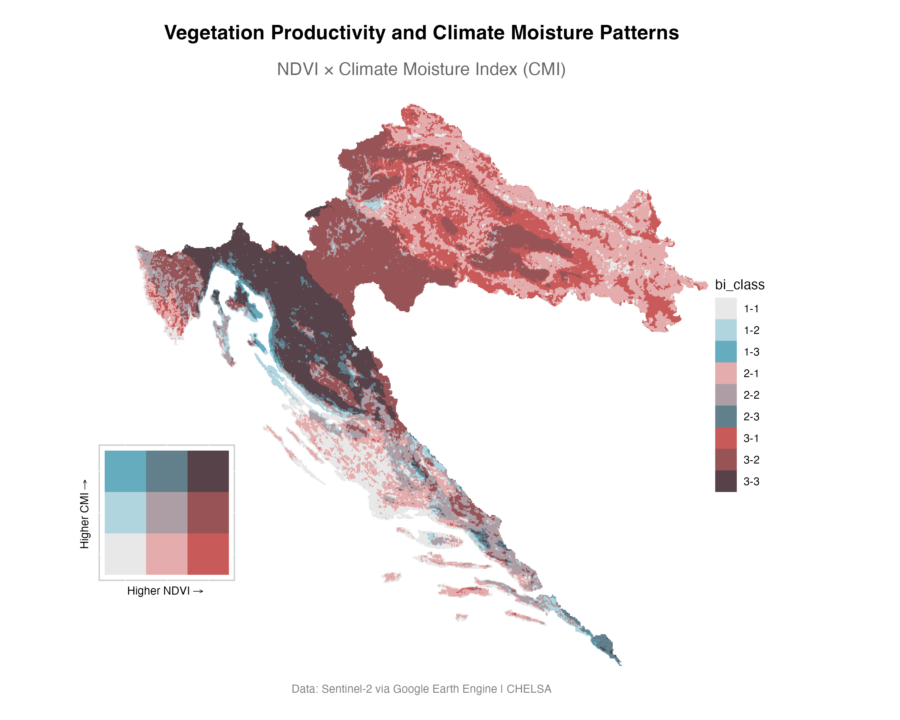
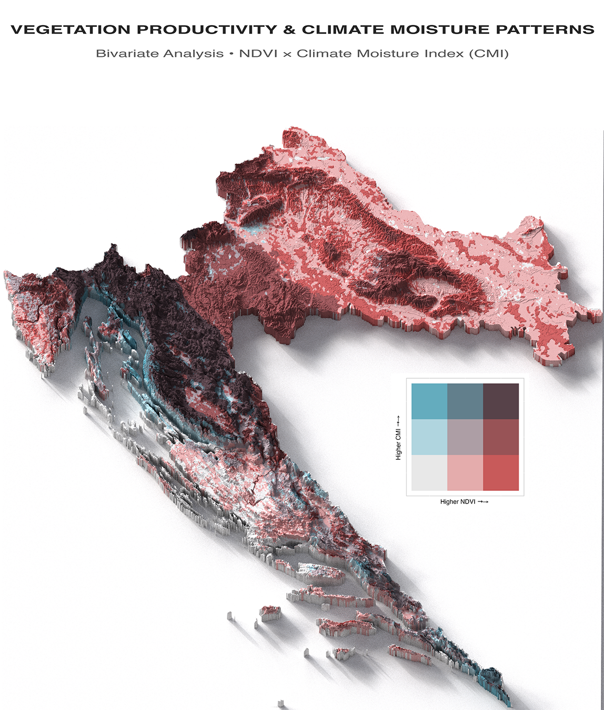

Vegetation across landscapes responds to climate conditions in complex patterns that vary dramatically from place to place. Single-variable maps often miss the interconnected nature of these responses. Bivariate analysis changes this by showing how vegetation productivity and moisture availability work together across space. This tutorial demonstrates how to build sophisticated 3D bivariate maps that merge satellite vegetation data with climate information, using Croatia's varied landscape as our testing ground.

<br>

## Why Bivariate Analysis Transforms Research

Traditional mapping approaches examine one variable at a time. Bivariate mapping breaks this limitation by displaying two variables simultaneously, exposing relationships that remain invisible otherwise. For vegetation research, pairing vegetation productivity (NDVI) with climate moisture availability (CMI) reveals essential patterns that single-variable maps cannot capture.

Adding 3D terrain visualization makes these patterns immediately interpretable for land managers and researchers.

<br>

## Building the Data Foundation

### Accessing Sentinel-2 NDVI Through Google Earth Engine

[Google Earth Engine](https://earthengine.google.com/) transforms satellite data access by providing computational power alongside massive data archives. Sentinel-2 satellites capture images at 10-meter resolution, while the NDVI measures vegetation greenness and productivity across all vegetation types.

NDVI calculates the ratio between near-infrared and red light reflectance: (NIR - Red) / (NIR + Red). Healthy vegetation strongly reflects near-infrared light while absorbing red light for photosynthesis, creating high NDVI values. Values range from -1 to +1, with water and bare soil showing negative values, sparse vegetation around 0.2-0.4, and dense healthy vegetation reaching 0.7-0.9.


``` r
# Load packages for bivariate analysis workflow
if (!require("pacman")) install.packages("pacman")
if (!require("remotes")) install.packages("remotes")
if (!require("rgee")) remotes::install_github("r-spatial/rgee")
if (!require("biscale")) remotes::install_github("chris-prener/biscale")

pacman::p_load(
    rgee,          # Google Earth Engine interface
    geodata,       # Administrative boundaries
    tidyverse,     # Data manipulation tools
    sf,            # Spatial vector data handling
    terra,         # Modern raster data processing
    biscale,       # Bivariate mapping functions
    elevatr,       # Elevation data access
    cowplot,       # Plot composition tools
    rayshader,     # 3D visualization engine
    magick         # Image composition and editing
)
```


``` r
# Set the working directory
main_dir <- getwd()

# Establish Google Earth Engine connection
ee_Initialize()  # Requires prior authentication setup

# Define Croatia as study area using Earth Engine's country boundaries
croatia <- ee$FeatureCollection("USDOS/LSIB_SIMPLE/2017")$
    filter(ee$Filter$eq("country_na", "Croatia"))
```

The NDVI calculation function shows how Earth Engine handles large-scale satellite data processing. Rather than downloading individual images, the function processes entire collections on Google's servers, returning only the final composite.


``` r
# Function to calculate NDVI for any specified year
get_ndvi_for_year <- function(year) {
    # Focus on summer growing season when vegetation signals are strongest
    start <- paste0(year, "-06-01")
    end <- paste0(year, "-08-31")

    # Build filtered Sentinel-2 collection with quality controls
    s2_collection <- ee$ImageCollection("COPERNICUS/S2_SR")$
        filterDate(start, end)$                              # Temporal filter
        filterBounds(croatia)$                               # Spatial filter
        filter(ee$Filter$lt("CLOUDY_PIXEL_PERCENTAGE", 20))  # Cloud filter

    # Calculate NDVI for each image: (NIR - Red) / (NIR + Red)
    # Band 8 = Near Infrared, Band 4 = Red
    ndvi_collection <- s2_collection$map(function(image) {
        return(image$normalizedDifference(c('B8', 'B4')))
    })

    # Median compositing reduces cloud effects and atmospheric noise
    ndvi_median <- ndvi_collection$median()
    
    # Clip result to country boundary
    return(ndvi_median$clip(croatia))
}
```

<br>

### Multi-Year NDVI Time Series

Vegetation conditions change from year to year based on weather patterns, disturbances, and land management activities. Calculating NDVI across multiple years reveals these temporal dynamics and enables more robust long-term analysis.


``` r
# Calculate NDVI for six-year period to capture temporal variability
ndvi_2018 <- get_ndvi_for_year(2018)
ndvi_2019 <- get_ndvi_for_year(2019)
ndvi_2020 <- get_ndvi_for_year(2020)
ndvi_2021 <- get_ndvi_for_year(2021)
ndvi_2022 <- get_ndvi_for_year(2022)
ndvi_2023 <- get_ndvi_for_year(2023)

# Export function sends processed data to Google Drive for local analysis
export_to_drive <- function(image, year) {
    task <- ee$batch$Export$image$toDrive(
        image = image,
        description = paste0("croatia_ndvi_", year),
        folder = "Earth_Engine_Exports",
        fileNamePrefix = paste0("croatia_ndvi_", year),
        scale = 1000,  # 1km pixel size balances detail with processing speed
        region = croatia$geometry()$bounds(),
        maxPixels = 1e9  # Limit prevents timeout on large exports
    )
    task$start()
}

# Submit all export tasks to Earth Engine
years <- 2018:2023
lapply(years, function(year) export_to_drive(get(paste0("ndvi_", year)), year))
```

You can monitor the status of your export in two ways: Google Earth Engine Tasks tab (https://code.earthengine.google.com/tasks) or your Google Drive folder when complete (https://drive.google.com/drive/).

<br>

### CHELSA Climate Data Integration

[CHELSA](https://chelsa-climate.org/) provides high-resolution climate data that accounts for topographic effects on temperature and precipitation. The Climate Moisture Index (CMI) integrates precipitation with potential evapotranspiration, creating a comprehensive measure of water availability for vegetation growth.


``` r
# Create directory structure for climate data storage
dir.create("chelsa_cmi", showWarnings = FALSE)

# Base URL for CHELSA CMI climatological data (1981-2010 averages)
base_url <- "https://os.zhdk.cloud.switch.ch/chelsav2/GLOBAL/climatologies/1981-2010/cmi/"

# Download monthly CMI files to capture seasonal patterns
for(month in 1:12) {
    month_str <- sprintf("%02d", month)  # Format as two-digit string
    filename <- paste0("CHELSA_cmi_", month_str, "_1981-2010_V.2.1.tif")
    url <- paste0(base_url, filename)
    local_path <- file.path("chelsa_cmi", filename)

    # Skip download if file already exists locally
    if(!file.exists(local_path)) {
        download.file(url, local_path, mode = "wb", method = "auto")
        Sys.sleep(2)  # Brief pause to avoid overwhelming the server
    }
}

# Process monthly files into annual average
cmi_files <- list.files("chelsa_cmi", pattern = "CHELSA_cmi_.*\\.tif$", full.names = TRUE)
cmi_stack <- terra::rast(cmi_files)
annual_cmi <- terra::app(cmi_stack, fun = "mean")

# Save processed annual CMI for later use
terra::writeRaster(annual_cmi, "chelsa_cmi/annual_cmi_1981-2010.tif", overwrite=TRUE)
```

<br>

## Spatial Data Alignment and Preprocessing

### Loading and Temporal Compositing

Combining multiple years of NDVI data requires careful alignment and compositing. This process reduces the influence of unusual weather years and creates a more representative vegetation baseline.


``` r
# Load all NDVI files from Google Earth Engine exports
ndvi_files <- paste0("croatia_ndvi_", 2018:2023, ".tif")
ndvi_list <- lapply(ndvi_files, rast)

# Align all rasters to same coordinate system and extent
# Using 2023 as reference ensures consistency
ndvi_aligned <- lapply(ndvi_list, function(r) {
    terra::project(r, ndvi_list[[6]])  # Project to 2023 coordinate system
})

# Calculate multi-year average 
ndvi_avg <- do.call(terra::mean, ndvi_aligned)
writeRaster(ndvi_avg, "croatia_ndvi_2018_2023_avg.tif", overwrite=TRUE)

# Load previously processed climate data
annual_cmi <- rast("chelsa_cmi/annual_cmi_1981-2010.tif")
```

<br>

### Administrative Boundaries and Elevation Data

Accurate spatial context requires administrative boundaries and topographic information. These datasets provide essential reference frames for analysis and help interpret patterns in relation to geographic features.


``` r
# Download Croatia administrative boundaries from GADM database
croatia_sf <- geodata::gadm(
    country = "HRV",  # ISO country code for Croatia
    level = 0,        
    path = main_dir
) |> sf::st_as_sf()

# Use WGS84 geographic coordinate system for broad compatibility
target_crs <- "EPSG:4326"

# Obtain high-resolution elevation data for terrain context
dem_raw <- elevatr::get_elev_raster(
    locations = croatia_sf,  
    z = 9,                  
    clip = "locations"       
) |>
    terra::rast() |>                    # Convert to terra format
    terra::crop(croatia_sf, mask = TRUE) |>  # Crop and mask to country
    terra::project(target_crs)         
```

<br>

### Achieving Spatial Alignment

Proper spatial alignment ensures that vegetation and climate data correspond to the same geographic locations. Misaligned data creates false patterns that can mislead analysis and interpretation.


``` r
# Crop climate and vegetation data to Croatia boundaries
cmi_croatia <- terra::crop(annual_cmi, croatia_sf, mask = TRUE)
ndvi_croatia <- terra::crop(ndvi_avg, croatia_sf, mask = TRUE)

# Resample all data to match DEM grid exactly
# This ensures identical extent, resolution, and cell alignment
ndvi_aligned <- terra::resample(
    x = ndvi_croatia,
    y = dem_raw,           
    method = "bilinear"   
) |> terra::project(target_crs)

cmi_aligned <- terra::resample(
    x = cmi_croatia,
    y = dem_raw,           
    method = "bilinear"
) |> terra::project(target_crs)

# Combine datasets into single raster stack
ndvi_cmi_aligned <- c(ndvi_aligned, cmi_aligned)
names(ndvi_cmi_aligned) <- c("ndvi", "cmi")
```

<br>

## Creating Bivariate Classifications and Maps

Fisher's natural breaks classification, also known as Jenks optimization, represents one of the most sophisticated approaches to data classification in spatial analysis. This method addresses a fundamental challenge in bivariate mapping: how to divide continuous data into discrete classes while preserving the natural structure and relationships within your dataset.

The algorithm was originally developed by Fisher (1958) for statistical optimization problems, then adapted by Jenks (1967) specifically for cartographic applications. What makes Fisher's method particularly powerful for bivariate analysis is its ability to minimize within-class variance while maximizing between-class variance, effectively identifying natural "breaks" or boundaries where data clusters separate most distinctly.


``` r
# Transform raster data into dataframe for bivariate classification
ndvi_cmi_df <- as.data.frame(
    ndvi_cmi_aligned,
    xy = TRUE,      # Include spatial coordinates for mapping
    na.rm = TRUE    # Remove missing values from analysis
)

# Apply Fisher's natural breaks classification 
breaks <- biscale::bi_class(
    ndvi_cmi_df,
    x = ndvi,           
    y = cmi,            
    style = "fisher",   
    dim = 3             # Create 3x3 grid for 9 total classes
)

```

Now, we'll make functions for 2D and 3D rendering.

``` r
# Create theme functions for 2D and 3D 
theme_base_bivariate <- function() {
    theme_void() +
        theme(
            plot.background = element_rect(fill = "white", color = NA),
            panel.background = element_rect(fill = "white", color = NA)
        )
}

# Specialized theme additions for 2D mapping
theme_2d_additions <- function() {
    theme(
        plot.title = element_text(
            size = 16, hjust = 0.5, face = "bold", margin = margin(b = 15)
        ),
        plot.subtitle = element_text(
            size = 12, hjust = 0.5, color = "grey40", margin = margin(b = 20)
        ),
        plot.caption = element_text(
            size = 9, hjust = 0.5, color = "grey50", margin = margin(t = 15)
        ),
        plot.margin = margin(20, 20, 20, 20)
    )
}

# Specialized theme additions for 3D rendering
theme_3d_additions <- function() {
    theme(
        legend.position = "none",
        plot.margin = unit(c(0, 0, 0, 0), "lines")
    )
}

# Core bivariate mapping function 
create_bivariate_base <- function(data, include_labels = TRUE, theme_additions = NULL) {
    base_map <- ggplot(data) +
        geom_raster(aes(x = x, y = y, fill = bi_class)) +
        biscale::bi_scale_fill(
            pal = "GrPink",        # Green for high NDVI, Pink for high CMI
            dim = 3,
            flip_axes = FALSE,
            rotate_pal = FALSE
        ) +
        coord_sf(crs = target_crs, expand = FALSE) +
        theme_base_bivariate()
    
    if (include_labels) {
        base_map <- base_map +
            labs(
                title = "Vegetation Productivity and Climate Moisture Patterns",
                subtitle = "NDVI × Climate Moisture Index (CMI)",
                caption = "Data: Sentinel-2 via Google Earth Engine | CHELSA",
                x = "", y = ""
            )
    }
    
    # Apply additional theme elements when provided
    if (!is.null(theme_additions)) {
        base_map <- base_map + theme_additions
    }
    
    return(base_map)
}

# Create legend
bivariate_legend <- function(size = 9) {
    biscale::bi_legend(
        pal = "GrPink",
        dim = 3,
        xlab = "Higher NDVI →",
        ylab = "Higher CMI →",
        size = size
    ) +
    theme(
        panel.background = element_rect(fill = "white", color = "grey80", size = 1),
        plot.background = element_rect(fill = "white", color = NA),
        plot.margin = margin(10, 10, 10, 10)
    )
}
```

<br>

### 2D Bivariate Mapping

With our functions established, creating the 2D bivariate map becomes straightforward and efficient. 


``` r
bivariate_2d_map <- create_bivariate_base(
    data = breaks, 
    include_labels = TRUE, 
    theme_additions = theme_2d_additions()
)

# Create legend for 2D display
bivariate_legend <- bivariate_legend(size = 9)

# Combine map and legend using cowplot
complete_2d_map <- cowplot::ggdraw() +
    cowplot::draw_plot(
        plot = bivariate_2d_map,
        x = 0, y = 0, width = 1, height = 1
    ) +
    cowplot::draw_plot(
        plot = bivariate_legend,
        x = 0.05, y = 0.15, width = 0.25, height = 0.25
    )

# Display and save the 2D map
print(complete_2d_map)

ggsave(
    filename = "croatia_bivariate_2d.png",
    plot = complete_2d_map,
    width = 10, height = 8, dpi = 300,
    device = "png", bg = "white"
)
```

<div class="figure" style="text-align: center">

<p class="caption"><span id="fig:unnamed-chunk-2"></span>Figure 1: Vegetation-climate relationships across Croatia</p>
</div>

<br>

### Understanding the Nine Vegetation-Climate Classes

➡️ Class 1-1 (Light Blue): Low NDVI + Low CMI  
These areas represent the combination of limited moisture and low vegetation productivity 

➡️ Class 1-2 (Medium Blue): Low NDVI + Medium CMI
These areas have moderate moisture availability but still show limited vegetation response. 

➡️ Class 1-3 (Dark Blue): Low NDVI + High CMI  
Zones where abundant moisture exists but vegetation coverage remains low due to land cover type rather than climate limitations.

➡️ Class 2-1 (Light Pink): Medium NDVI + Low CMI  
These regions demonstrate vegetation adaptation to water-limited conditions.

➡️ Class 2-2 (Medium Pink): Medium NDVI + Medium CMI
These zones show balanced relationships between moisture availability and vegetation response.

➡️ Class 2-3 (Dark Pink): Medium NDVI + High CMI  
These regions have abundant moisture but vegetation response remains moderate, possibly due to topographic factors, soil conditions, or land management practices that limit maximum productivity.

➡️ Class 3-1 (Light Red): High NDVI + Low CMI  
This represent highly efficient vegetation that maintains strong productivity despite limited water availability. 

➡️ Class 3-2 (Medium Red): High NDVI + Medium CMI
These regions indicate productive vegetation thriving under favorable but not exceptional moisture conditions. 

➡️ Class 3-3 (Dark Red): High NDVI + High CMI  
This represent optimal growing conditions where abundant moisture combines with high vegetation productivity.

<br>

### 3D Visualization and Terrain Integration

The transition from 2D to 3D visualization adds terrain context that reveals how topography influences vegetation-climate relationships.


``` r
main_map <- create_bivariate_base(
    data = breaks, 
    include_labels = FALSE, 
    theme_additions = theme_3d_additions()
)

# Prepare elevation data for height mapping in 3D visualization
dem_df <- dem_raw |>
    as.data.frame(xy = TRUE, na.rm = TRUE)
names(dem_df)[3] <- "elevation"

# Create neutral elevation map 
dem_map <- ggplot(dem_df, aes(x = x, y = y, fill = elevation)) +
    geom_raster() +
    scale_fill_gradientn(colors = "white") +  
    guides(fill = "none") +
    coord_sf(crs = target_crs, expand = FALSE) +
    theme_void() +
    theme(
        plot.background = element_rect(fill = "white", color = NA),
        panel.background = element_rect(fill = "white", color = NA),
        legend.position = "none"
    )
```


The rayshader package transforms our 2D map into stunning 3D visualization by treating the bivariate classification as surface texture and elevation data as terrain height. 


``` r
options(rgl.useNULL = FALSE)

# Create initial 3D scene combining bivariate map with terrain
rayshader::plot_gg(
    ggobj = main_map,           # Bivariate classification as surface texture
    ggobj_height = dem_map,     # Terrain elevation as height information
    width = 9,                  # Output dimensions in inches
    height = 9,
    windowsize = c(900, 900),   # Display window size in pixels
    scale = 250,                # Vertical exaggeration for dramatic terrain
    shadow = TRUE,              # Enable shadows for depth perception
    shadow_intensity = 1,     # Shadow strength (0-1 scale)
    phi = 90,                   # Camera elevation angle (0-90 degrees)
    theta = 0,                # Camera azimuth angle (0-360 degrees)
    zoom = 0.56,                # Camera zoom level
    multicore = TRUE            # Use multiple processor cores for speed
)

# Download high-quality lighting file for realistic rendering
hdri_url <- "https://dl.polyhaven.org/file/ph-assets/HDRIs/hdr/4k/brown_photostudio_02_4k.hdr"
hdri_file <- "lighting.hdr"

if (!file.exists(hdri_file)) {
    try(download.file(
        url = hdri_url,
        destfile = hdri_file,
        mode = "wb"
    ))
}

# Render final high-resolution image 
rayshader::render_highquality(
    filename = "croatia_3d_bivariate.png",
    preview = TRUE,              # Show preview during rendering
    light = FALSE,               # Use environmental lighting instead of point lights
    environment_light = hdri_file,
    intensity = 1.0,             # Overall light intensity
    rotate_env = 90,             # Rotate lighting environment for optimal appearance
    parallel = TRUE,             # Enable parallel processing for speed
    width = 2400,                # Final image dimensions in pixels
    height = 2400,
    samples = 200,               # Ray sampling rate (higher = better quality, slower)
    interactive = FALSE          # Non-interactive batch rendering
)
```

The final composition combines the 3D visualization with informative legends and titles.

``` r
# Create legend with larger text for 3D composition
legend_plot <- bivariate_legend(size = 13)

# Save legend as separate high-resolution image
ggsave("legend.png", plot = legend_plot, width = 4, height = 4, dpi = 300, bg = "white")

# Create title
title_plot <- ggplot() +
    theme_void() +
    theme(
        plot.background = element_rect(fill = "white", color = NA),
        plot.margin = margin(30, 30, 30, 30)
    ) +
    annotate(
        "text", x = 0.5, y = 0.7,
        label = "VEGETATION PRODUCTIVITY & CLIMATE MOISTURE PATTERNS",
        size = 14, fontface = "bold", color = "grey15", hjust = 0.5
    ) +
    annotate(
        "text", x = 0.5, y = 0.3,
        label = "Bivariate Analysis • NDVI × Climate Moisture Index (CMI)",
        size = 10, color = "grey35", hjust = 0.5
    ) +
    xlim(0, 1) + ylim(0, 1)

# Save title as high-resolution image
ggsave("title.png", plot = title_plot, width = 20, height = 4, dpi = 300, bg = "white")


# Load all components for final assembly
main_img <- magick::image_read("croatia_3d_bivariate.png")
legend_img <- magick::image_read("legend.png")
title_img <- magick::image_read("title.png")

# Resize components for proper proportions in final layout
title_resized <- magick::image_resize(title_img, "2400x300!")
legend_resized <- magick::image_resize(legend_img, "500x500")

# Combine title with main image vertically
img_with_title <- magick::image_append(c(title_resized, main_img), stack = TRUE)

# Calculate precise legend positioning for optimal visual balance
legend_x <- 2400 - 880    # Position from left edge
legend_y <- (2700 - 400) / 2 + 200  # Center vertically with adjustment

# Create final composite image with all elements
final_composite <- magick::image_composite(
    img_with_title,
    legend_resized,
    offset = paste0("+", legend_x, "+", legend_y),
    operator = "over"
)

# Save final high-quality map 
magick::image_write(final_composite, "croatia_bivariate_final_map.png", quality = 95)
```

<div class="figure" style="text-align: center">

<p class="caption"><span id="fig:unnamed-chunk-3"></span>Figure 2: 3D bivariate map showing vegetation-climate relationships across Croatia</p>
</div>

<br>

## References

1. Biscale Package Documentation: https://chris-prener.github.io/biscale/
2. CHELSA Climate Data: https://chelsa-climate.org/
3. Fisher, W.D. (1958). On grouping for maximum homogeneity. Journal of the American Statistical Association, 53(284), 789-798
4. Google Earth Engine Documentation: https://developers.google.com/earth-engine/
5. Jenks, G.F. (1967). The data model concept in statistical mapping. International Yearbook of Cartography, 7, 186-190
6. Popović, M. 3D Bivariate Climate Maps: https://github.com/milos-agathon/3d-bivariate-climate-maps/blob/main/R/main.r
7. Rayshader GitHub Repository: https://github.com/tylermorganwall/rayshader
8. Rayshader Package: https://www.rayshader.com/

<br>

---

<br>

**Need Advanced Forest Data Science?**

*I help research organizations transform their data workflows from manual to automated, providing comprehensive services from statistical analysis and modeling to spatial data integration and advanced visualizations. If you're spending days on data collection and processing instead of focusing on analysis and insights, let's talk about how custom R solutions can streamline your research pipeline.*

*My clients typically see:*

* *90% reduction in data processing time*
* *Improved accuracy through automated workflows*
* *Rigorous statistical insights that strengthen research conclusions*
* *Reproducible analyses that scale across projects*

📩*Contact me: marijana@andalytics.com*

