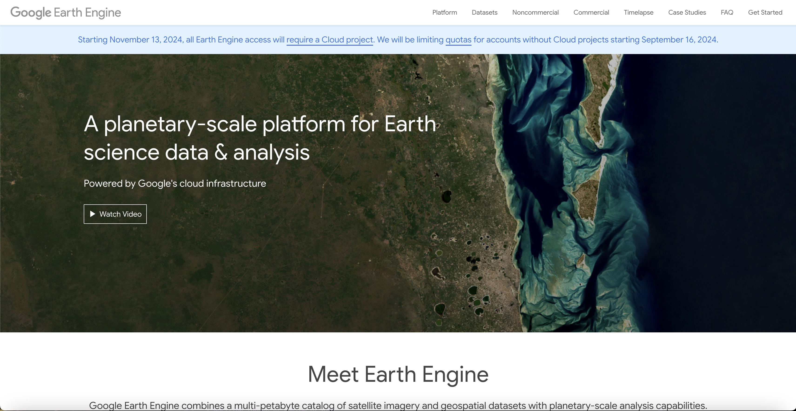

<link href="index_files/htmltools-fill/fill.css" rel="stylesheet" />
<script src="index_files/htmlwidgets/htmlwidgets.js"></script>
<script src="index_files/jquery/jquery-3.6.0.min.js"></script>
<link href="index_files/leaflet/leaflet.css" rel="stylesheet" />
<script src="index_files/leaflet/leaflet.js"></script>
<link href="index_files/leafletfix/leafletfix.css" rel="stylesheet" />
<script src="index_files/proj4/proj4.min.js"></script>
<script src="index_files/Proj4Leaflet/proj4leaflet.js"></script>
<link href="index_files/rstudio_leaflet/rstudio_leaflet.css" rel="stylesheet" />
<script src="index_files/leaflet-binding/leaflet.js"></script>
<script src="index_files/leaflet-providers/leaflet-providers_2.0.0.js"></script>
<script src="index_files/leaflet-providers-plugin/leaflet-providers-plugin.js"></script>
<script src="index_files/clipboard/setClipboardText.js"></script>
<link href="index_files/htmltools-fill/fill.css" rel="stylesheet" />
<script src="index_files/htmlwidgets/htmlwidgets.js"></script>
<script src="index_files/jquery/jquery-3.6.0.min.js"></script>
<link href="index_files/leaflet/leaflet.css" rel="stylesheet" />
<script src="index_files/leaflet/leaflet.js"></script>
<link href="index_files/leafletfix/leafletfix.css" rel="stylesheet" />
<script src="index_files/proj4/proj4.min.js"></script>
<script src="index_files/Proj4Leaflet/proj4leaflet.js"></script>
<link href="index_files/rstudio_leaflet/rstudio_leaflet.css" rel="stylesheet" />
<script src="index_files/leaflet-binding/leaflet.js"></script>
<script src="index_files/leaflet-providers/leaflet-providers_2.0.0.js"></script>
<script src="index_files/leaflet-providers-plugin/leaflet-providers-plugin.js"></script>
<script src="index_files/clipboard/setClipboardText.js"></script>
<link href="index_files/htmltools-fill/fill.css" rel="stylesheet" />
<script src="index_files/htmlwidgets/htmlwidgets.js"></script>
<script src="index_files/jquery/jquery-3.6.0.min.js"></script>
<link href="index_files/leaflet/leaflet.css" rel="stylesheet" />
<script src="index_files/leaflet/leaflet.js"></script>
<link href="index_files/leafletfix/leafletfix.css" rel="stylesheet" />
<script src="index_files/proj4/proj4.min.js"></script>
<script src="index_files/Proj4Leaflet/proj4leaflet.js"></script>
<link href="index_files/rstudio_leaflet/rstudio_leaflet.css" rel="stylesheet" />
<script src="index_files/leaflet-binding/leaflet.js"></script>
<script src="index_files/leaflet-providers/leaflet-providers_2.0.0.js"></script>
<script src="index_files/leaflet-providers-plugin/leaflet-providers-plugin.js"></script>
<link href="index_files/htmltools-fill/fill.css" rel="stylesheet" />
<script src="index_files/htmlwidgets/htmlwidgets.js"></script>
<script src="index_files/jquery/jquery-3.6.0.min.js"></script>
<link href="index_files/leaflet/leaflet.css" rel="stylesheet" />
<script src="index_files/leaflet/leaflet.js"></script>
<link href="index_files/leafletfix/leafletfix.css" rel="stylesheet" />
<script src="index_files/proj4/proj4.min.js"></script>
<script src="index_files/Proj4Leaflet/proj4leaflet.js"></script>
<link href="index_files/rstudio_leaflet/rstudio_leaflet.css" rel="stylesheet" />
<script src="index_files/leaflet-binding/leaflet.js"></script>
<script src="index_files/leaflet-providers/leaflet-providers_2.0.0.js"></script>
<script src="index_files/leaflet-providers-plugin/leaflet-providers-plugin.js"></script>
<script src="index_files/clipboard/setClipboardText.js"></script>
<link href="index_files/htmltools-fill/fill.css" rel="stylesheet" />
<script src="index_files/htmlwidgets/htmlwidgets.js"></script>
<script src="index_files/jquery/jquery-3.6.0.min.js"></script>
<link href="index_files/leaflet/leaflet.css" rel="stylesheet" />
<script src="index_files/leaflet/leaflet.js"></script>
<link href="index_files/leafletfix/leafletfix.css" rel="stylesheet" />
<script src="index_files/proj4/proj4.min.js"></script>
<script src="index_files/Proj4Leaflet/proj4leaflet.js"></script>
<link href="index_files/rstudio_leaflet/rstudio_leaflet.css" rel="stylesheet" />
<script src="index_files/leaflet-binding/leaflet.js"></script>
<script src="index_files/leaflet-providers/leaflet-providers_2.0.0.js"></script>
<script src="index_files/leaflet-providers-plugin/leaflet-providers-plugin.js"></script>

## Introduction

Forest ecosystems face unprecedented challenges from climate change, land-use transformation,
and increasing natural disturbances. Traditional forest monitoring methods, while valuable,
are often limited by their spatial coverage and temporal frequency. In the current era of big
data and rapid environmental change, forest researchers need to analyze vast amounts of
information across different spatial and temporal scales spanning decades. This presents three major challenges: data acquisition, processing power, and analysis complexity.

## What is Google Earth Engine?

Google Earth Engine (GEE) emerges as a transformative solution by addressing these challenges
through its cloud computing architecture. GEE is a cloud-based platform developed by Google that enables analysis and visualization of vast amounts of geospatial data. This powerful platform combines a multi-petabyte catalog of satellite imagery and geospatial datasets with planetary-scale analysis capabilities.

<div class="figure" style="text-align: center">


<p class="caption">
<span id="fig:gee-image"></span>Figure 1: Google Earth Engine Website
</p>

</div>

What makes GEE particularly powerful for forest science is its combination of immediate access
to regularly updated satellite imagery, built-in algorithms for environmental analysis, cloud-based processing that eliminates local hardware limitations and integration capabilities with popular programming languages like R and Python.

This technological advancement means you can now monitor forest health in near-real-time, detect and track disturbances as they occur, analyze long-term trends in forest dynamics, study climate change impacts, combine multiple data sources for more comprehensive analyses and much more.

With GEE the processing is automatically distributed across thousands of computers, turning what would be days and weeks into minutes or hours. Most importantly, you only download the final results to computers, while all intermediate data processing happens entirely in the cloud. For perspective, analyzing 30 years of Landsat data for a large forest area traditionally would require approximately 500 GB of storage and weeks of processing time. With GEE the same analysis runs in minutes with zero local storage requirements.

The rgee package serves as a crucial bridge between the R programming language and the GEE platform. This integration is particularly valuable for forest researchers who are already familiar with R programming, as it eliminates the need to learn JavaScript, which is typically required for GEE operations. The package seamlessly integrates GEE functionalities into existing R workflows, providing access to all GEE capabilities through a familiar R interface.

## Getting Started with Google Earth Engine

Before you can start using Google GEE in R, you’ll need to complete several setup steps:

1.  **Create a Google Account**

If you don’t already have one, create a Google account. Visit <a href="https://earthengine.google.com" target="_blank">https://earthengine.google.com</a>,
click ‘Sign Up’, and accept the terms of use.

2.  **Install Required Software**

- R (version 3.6 or higher)
- RStudio (recommended for better interface)
- Python (required for rgee functionality)

3.  **Package Installation**

The rgee package needs to be installed from GitHub to ensure you have the latest version with
all features:

``` r
# Install rgee from GitHub
remotes::install_github("r-spatial/rgee")

# Install additional required packages
install.packages(c("sf", "raster"))
```

4.  **Loading and Initializing**

``` r
# Load required packages
library(rgee)        
library(sf)      # handling spatial data
library(raster)  # handling spatial data
library(dplyr)   # data manipulation      
library(readr)   # reading rectangular data
library(leaflet) # creating interactive maps
library(ggplot2) # data visualization

# First-time setup
ee_install()  # This installs required Python dependencies

# Initialize Earth Engine
ee_Initialize()
```

5.  **Authentication Process**

When you run ee_Initialize() for the first time a web browser window will automatically open and you’ll be asked to log in to your Google account. Google will generate an authentication token. Copy this token from your browser, return to RStudio and paste the token when prompted.
rgee will store these credentials for future sessions.

If successful, you’ll see a confirmation message in the R console. This authentication process only needs to be completed once on each computer you use.

## GEE Data Catalogue

GEE data catalog offers a rich collection of datasets particularly valuable for forest research:

- Landsat Series (1972-present)
  - 30-meter resolution
  - Global coverage every 16 days
  - Multispectral and thermal data
- Sentinel-2 (Copernicus Program)
  - High-resolution optical imagery
  - Multiple spectral bands
  - Frequent revisit time
- Climate and Weather
  - Historical reanalysis (NCEP/NCAR)
  - GridMET datasets
  - NLDAS-2 meteorological data
  - Precipitation data (TRMM)
  - Temperature and humidity data
  - Wind measurements
- Atmospheric Data
  - Ozone measurements
  - MODIS atmospheric products
- Elevation Data
  - SRTM (30-meter resolution globally)
  - Various regional DEMs
  - HydroSHEDS hydrology database
- Land Cover Maps
  - Dynamic World (near real-time)
  - ESA World Cover
  - Forest/non-forest classifications

## Getting Started: Visualizing Forest Plots and Satellite Imagery

Combining ground-based plot data with satellite imagery provides valuable insights into forest conditions and spatial patterns. In this example, we’ll explore how to visualize forest plots using GEE and Sentinel-2 satellite imagery.

The first step involves preparing plot coordinates for use with satellite imagery. Our forest plots, located in the Dinaric region of Croatia, were originally surveyed using the Gauss Kruger coordinate system. However, to work with GEE, we need to transform these coordinates to the global WGS84 system.

``` r
#-------------------------------------------
# Read forest plot coordinates from CSV
#-------------------------------------------
plots <- read_csv("data/extracted_coordinates.csv")

#---------------------------------------------
# Transform coordinates from Gauss Kruger to 
# WGS84 (lat/lon) system
#---------------------------------------------
coords_df <- plots %>%
    st_as_sf(coords = c("x_coordinate", "y_coordinate"),
             crs = 31275) %>%  
    st_transform(4326)  

# Display first few rows
coords_df %>% 
    head()
#> Simple feature collection with 6 features and 3 fields
#> Geometry type: POINT
#> Dimension:     XY
#> Bounding box:  xmin: 14.52124 ymin: 45.52129 xmax: 14.66221 ymax: 45.58453
#> Geodetic CRS:  WGS 84
#> # A tibble: 6 × 4
#>   file_name     plot_number folder_name            geometry
#>   <chr>         <chr>       <chr>               <POINT [°]>
#> 1 5-1053-10.xls 5-1053      Delnice     (14.52124 45.56628)
#> 2 5-1054-3.xls  5-1054      Delnice     (14.58516 45.58453)
#> 3 5-1055-12.xls 5-1055      Delnice     (14.64935 45.56674)
#> 4 5-1056-13.xls 5-1056      Delnice     (14.66221 45.55779)
#> 5 5-1135-14.xls 5-1135      Delnice     (14.52162 45.52129)
#> 6 5-1136-10.xls 5-1136      Delnice     (14.57275 45.53049)
```

Once we have our coordinates, we need to convert them into a format that GEE understands.

``` r
#------------------------------------------------
# Convert our spatial data to GEE format
#------------------------------------------------
plots_ee <- sf_as_ee(coords_df)
```

With plot locations properly formatted, we can now access Sentinel-2 satellite imagery. Sentinel-2 provides high-resolution optical imagery perfect for forest monitoring, with new images available every few days. We’ll focus on summer months and filter out cloudy images to ensure the best possible visualization.

``` r
#-------------------------------------------------
# Access and process Sentinel-2 satellite imagery
#-------------------------------------------------
s2_imagery <- ee$ImageCollection('COPERNICUS/S2_SR')$
    #-------------------------
    # Limit to study area
    #-------------------------
    filterBounds(plots_ee)$ 
    #--------------------------
    # Select summer months only
    #--------------------------
    filterDate('2023-06-01', '2023-09-30')$ 
    #----------------------------------------------
    # Remove images with more than 20% cloud cover
    #----------------------------------------------
    filter(ee$Filter$lt('CLOUDY_PIXEL_PERCENTAGE', 20))$
    #----------------------------------------------
    # Creates a composite image using the median 
    # values, helping to remove any remaining clouds 
    # or artifacts
    #----------------------------------------------
    median() 
```

To display the satellite imagery we need to set appropriate visualization parameters. We’ll use a true-color combination that shows the forest as it would appear to the human eye, with some adjustments to enhance visibility and contrast.

``` r
#--------------------------------------------
# Set parameters for true-color visualization
#--------------------------------------------
vis_params <- list(
    bands = c('B4', 'B3', 'B2'),   # Red, Green, Blue bands for true color
    min = 0,                       # Minimum reflectance value
    max = 3000,                    # Maximum reflectance value
    gamma = 1.2                    # Slight contrast enhancement
) 
```

These parameters control how the satellite imagery is displayed. Bands (‘B4’, ‘B3’, ‘B2’) create a true-color image. Min and max control the brightness range and gamma adjusts the contrast (values \> 1 increase contrast).

Finally, we can create our visualization by combining the satellite imagery with plot locations.
The resulting map allows users to zoom in and out, toggle between different base maps, and switch layers on and off using the layer control panel in the top-left corner. This interactivity allow us to understand the spatial distribution of our sampling plots within the broader forest landscape.

``` r
#-----------------------------
# Center view on study area 
#-----------------------------
Map$centerObject(plots_ee, zoom = 9)  
#-----------------------------
# Add satellite imagery
#-----------------------------
map <- Map$addLayer(s2_imagery, vis_params, "Sentinel-2") +
Map$addLayer(plots_ee, list(color = 'white', pointSize = 1), "Forest Plots")  

map
```

<div class="leaflet html-widget html-fill-item" id="htmlwidget-1" style="width:60%;height:480px;"></div>
<script type="application/json" data-for="htmlwidget-1">{"x":{"options":{"minZoom":1,"maxZoom":24,"crs":{"crsClass":"L.CRS.EPSG3857","code":null,"proj4def":null,"projectedBounds":null,"options":{}},"preferCanvas":false,"bounceAtZoomLimits":false,"maxBounds":[[[-90,-370]],[[90,370]]]},"calls":[{"method":"addProviderTiles","args":["CartoDB.Positron","CartoDB.Positron","CartoDB.Positron",{"errorTileUrl":"","noWrap":false,"detectRetina":false,"pane":"tilePane","maxZoom":24}]},{"method":"addProviderTiles","args":["OpenStreetMap","OpenStreetMap","OpenStreetMap",{"errorTileUrl":"","noWrap":false,"detectRetina":false,"pane":"tilePane","maxZoom":24}]},{"method":"addProviderTiles","args":["CartoDB.DarkMatter","CartoDB.DarkMatter","CartoDB.DarkMatter",{"errorTileUrl":"","noWrap":false,"detectRetina":false,"pane":"tilePane","maxZoom":24}]},{"method":"addProviderTiles","args":["Esri.WorldImagery","Esri.WorldImagery","Esri.WorldImagery",{"errorTileUrl":"","noWrap":false,"detectRetina":false,"pane":"tilePane","maxZoom":24}]},{"method":"addProviderTiles","args":["OpenTopoMap","OpenTopoMap","OpenTopoMap",{"errorTileUrl":"","noWrap":false,"detectRetina":false,"pane":"tilePane","maxZoom":24}]},{"method":"addLayersControl","args":[["CartoDB.Positron","OpenStreetMap","CartoDB.DarkMatter","Esri.WorldImagery","OpenTopoMap"],[],{"collapsed":true,"autoZIndex":true,"position":"topleft"}]},{"method":"addScaleBar","args":[{"maxWidth":100,"metric":true,"imperial":true,"updateWhenIdle":true,"position":"bottomleft"}]},{"method":"addTiles","args":["https://earthengine.googleapis.com/v1alpha/projects/earthengine-legacy/maps/fadfe8b79656b6d6a784e077c006a929-e86774f928c9d4aa7ebba26fc49451f5/tiles/{z}/{x}/{y}","Sentinel-2","Sentinel-2",{"minZoom":0,"maxZoom":24,"tileSize":256,"subdomains":"abc","errorTileUrl":"","tms":false,"noWrap":false,"zoomOffset":0,"zoomReverse":false,"opacity":1,"zIndex":1,"detectRetina":false}]},{"method":"addLayersControl","args":[["CartoDB.Positron","OpenStreetMap","CartoDB.DarkMatter","Esri.WorldImagery","OpenTopoMap"],"Sentinel-2",{"collapsed":true,"autoZIndex":true,"position":"topleft"}]},{"method":"hideGroup","args":[null]},{"method":"addTiles","args":["https://earthengine.googleapis.com/v1alpha/projects/earthengine-legacy/maps/1d46c8eed2e3781b8f6c20a7437395c2-23466c60e33624658efeaf217864b2b3/tiles/{z}/{x}/{y}","Forest Plots","Forest Plots",{"minZoom":0,"maxZoom":18,"tileSize":256,"subdomains":"abc","errorTileUrl":"","tms":false,"noWrap":false,"zoomOffset":0,"zoomReverse":false,"opacity":1,"zIndex":1,"detectRetina":false}]},{"method":"addLayersControl","args":[["CartoDB.Positron","OpenStreetMap","CartoDB.DarkMatter","Esri.WorldImagery","OpenTopoMap"],["Sentinel-2","Forest Plots"],{"collapsed":true,"autoZIndex":true,"position":"topleft"}]},{"method":"hideGroup","args":[null]}],"setView":[[45.5662812,14.52124],9,[]]},"evals":[],"jsHooks":{"render":[{"code":"function(el, x, data) {\n  return (\n      function(el, x, data) {\n      // get the leaflet map\n      var map = this; //HTMLWidgets.find('#' + el.id);\n      // we need a new div element because we have to handle\n      // the mouseover output separately\n      // debugger;\n      function addElement () {\n      // generate new div Element\n      var newDiv = $(document.createElement('div'));\n      // append at end of leaflet htmlwidget container\n      $(el).append(newDiv);\n      //provide ID and style\n      newDiv.addClass('lnlt');\n      newDiv.css({\n      'position': 'relative',\n      'bottomleft':  '0px',\n      'background-color': 'rgba(255, 255, 255, 0.7)',\n      'box-shadow': '0 0 2px #bbb',\n      'background-clip': 'padding-box',\n      'margin': '0',\n      'padding-left': '5px',\n      'color': '#333',\n      'font': '9px/1.5 \"Helvetica Neue\", Arial, Helvetica, sans-serif',\n      'z-index': '700',\n      });\n      return newDiv;\n      }\n\n\n      // check for already existing lnlt class to not duplicate\n      var lnlt = $(el).find('.lnlt');\n\n      if(!lnlt.length) {\n      lnlt = addElement();\n\n      // grab the special div we generated in the beginning\n      // and put the mousmove output there\n\n      map.on('mousemove', function (e) {\n      if (e.originalEvent.ctrlKey) {\n      if (document.querySelector('.lnlt') === null) lnlt = addElement();\n      lnlt.text(\n                           ' lon: ' + (e.latlng.lng).toFixed(5) +\n                           ' | lat: ' + (e.latlng.lat).toFixed(5) +\n                           ' | zoom: ' + map.getZoom() +\n                           ' | x: ' + L.CRS.EPSG3857.project(e.latlng).x.toFixed(0) +\n                           ' | y: ' + L.CRS.EPSG3857.project(e.latlng).y.toFixed(0) +\n                           ' | epsg: 3857 ' +\n                           ' | proj4: +proj=merc +a=6378137 +b=6378137 +lat_ts=0.0 +lon_0=0.0 +x_0=0.0 +y_0=0 +k=1.0 +units=m +nadgrids=@null +no_defs ');\n      } else {\n      if (document.querySelector('.lnlt') === null) lnlt = addElement();\n      lnlt.text(\n                      ' lon: ' + (e.latlng.lng).toFixed(5) +\n                      ' | lat: ' + (e.latlng.lat).toFixed(5) +\n                      ' | zoom: ' + map.getZoom() + ' ');\n      }\n      });\n\n      // remove the lnlt div when mouse leaves map\n      map.on('mouseout', function (e) {\n      var strip = document.querySelector('.lnlt');\n      if( strip !==null) strip.remove();\n      });\n\n      };\n\n      //$(el).keypress(67, function(e) {\n      map.on('preclick', function(e) {\n      if (e.originalEvent.ctrlKey) {\n      if (document.querySelector('.lnlt') === null) lnlt = addElement();\n      lnlt.text(\n                      ' lon: ' + (e.latlng.lng).toFixed(5) +\n                      ' | lat: ' + (e.latlng.lat).toFixed(5) +\n                      ' | zoom: ' + map.getZoom() + ' ');\n      var txt = document.querySelector('.lnlt').textContent;\n      console.log(txt);\n      //txt.innerText.focus();\n      //txt.select();\n      setClipboardText('\"' + txt + '\"');\n      }\n      });\n\n      }\n      ).call(this.getMap(), el, x, data);\n}","data":null},{"code":"function(el, x, data) {\n  return (function(el,x,data){\n           var map = this;\n\n           map.on('keypress', function(e) {\n               console.log(e.originalEvent.code);\n               var key = e.originalEvent.code;\n               if (key === 'KeyE') {\n                   var bb = this.getBounds();\n                   var txt = JSON.stringify(bb);\n                   console.log(txt);\n\n                   setClipboardText('\\'' + txt + '\\'');\n               }\n           })\n        }).call(this.getMap(), el, x, data);\n}","data":null}]}}</script>

## Assessing Forest Health Through Vegetation Indices

Understanding vegetation health and vigor across large areas requires efficient and reliable methods of assessment. While traditional field measurements provide detailed ground data, satellite-based vegetation indices offer a powerful complement, enabling us to analyze entire forest landscapes systematically. Among these indices, the Normalized Difference Vegetation Index (NDVI) stands out as one of the most valuable tools for forest health assessment.

NDVI leverages a fundamental characteristic of vegetation: healthy plants strongly absorb visible red light for photosynthesis while reflecting most near-infrared (NIR) light. By calculating the difference between NIR and red reflectance values, normalized by their sum, NDVI provides a standardized way to measure vegetation health and density. The resulting values range from -1 to +1, where higher positive values typically indicate healthier and denser vegetation. Negative values usually represent water, snow, or clouds

Let’s analyze the vegetation health across our study plots using Sentinel-2 satellite imagery. We’ll calculate NDVI values, visualize their spatial distribution, and examine the patterns of forest health in our study area.

We use Sentinel-2’s specific bands for this calculation. Band 8 (NIR, 842nm) captures the high reflectance of vegetation in the near-infrared spectrum and Band 4 (RED, 665nm) captures chlorophyll absorption during photosynthesis. Both bands have 10-meter spatial resolution, providing detailed forest structure information.

``` r
#---------------------------------------------------
# Using Sentinel-2's NIR (B8) and RED (B4) bands for 
# NDVI calculation
#---------------------------------------------------
ndvi <- s2_imagery$normalizedDifference(c('B8', 'B4')) 
#-------------------------------------------------------
# Setting value range and color palette for NDVI display
#-------------------------------------------------------
ndvi_params <- list(
    min = 0,
    max = 0.8,  # Typical range for vegetation
    palette = c(
        '#CE7E45',  # Orange - low vegetation
        '#DF923D',  # Light orange
        '#F1B555',  # Yellow
        '#99B718',  # Light green
        '#74A901'   # Dark green - dense vegetation
    )
)
```

Interactive map shows NDVI patterns across the entire landscape through a color gradient from orange (low NDVI) to dark green (high NDVI). White dots represent forest plot locations. You can zoom in/out to explore and layer control allows toggling between the NDVI layer and plot locations.

``` r

#--------------------------------------------------
# Creating interactive map with NDVI visualization
#--------------------------------------------------
Map$centerObject(plots_ee, zoom = 9)

map1 <-Map$addLayer(ndvi, ndvi_params, "NDVI") +
Map$addLayer(plots_ee, list(color = 'white', pointSize = 1), "Forest Plots")

map1
```

<div class="leaflet html-widget html-fill-item" id="htmlwidget-2" style="width:60%;height:480px;"></div>
<script type="application/json" data-for="htmlwidget-2">{"x":{"options":{"minZoom":1,"maxZoom":24,"crs":{"crsClass":"L.CRS.EPSG3857","code":null,"proj4def":null,"projectedBounds":null,"options":{}},"preferCanvas":false,"bounceAtZoomLimits":false,"maxBounds":[[[-90,-370]],[[90,370]]]},"calls":[{"method":"addProviderTiles","args":["CartoDB.Positron","CartoDB.Positron","CartoDB.Positron",{"errorTileUrl":"","noWrap":false,"detectRetina":false,"pane":"tilePane","maxZoom":24}]},{"method":"addProviderTiles","args":["OpenStreetMap","OpenStreetMap","OpenStreetMap",{"errorTileUrl":"","noWrap":false,"detectRetina":false,"pane":"tilePane","maxZoom":24}]},{"method":"addProviderTiles","args":["CartoDB.DarkMatter","CartoDB.DarkMatter","CartoDB.DarkMatter",{"errorTileUrl":"","noWrap":false,"detectRetina":false,"pane":"tilePane","maxZoom":24}]},{"method":"addProviderTiles","args":["Esri.WorldImagery","Esri.WorldImagery","Esri.WorldImagery",{"errorTileUrl":"","noWrap":false,"detectRetina":false,"pane":"tilePane","maxZoom":24}]},{"method":"addProviderTiles","args":["OpenTopoMap","OpenTopoMap","OpenTopoMap",{"errorTileUrl":"","noWrap":false,"detectRetina":false,"pane":"tilePane","maxZoom":24}]},{"method":"addLayersControl","args":[["CartoDB.Positron","OpenStreetMap","CartoDB.DarkMatter","Esri.WorldImagery","OpenTopoMap"],[],{"collapsed":true,"autoZIndex":true,"position":"topleft"}]},{"method":"addScaleBar","args":[{"maxWidth":100,"metric":true,"imperial":true,"updateWhenIdle":true,"position":"bottomleft"}]},{"method":"addTiles","args":["https://earthengine.googleapis.com/v1alpha/projects/earthengine-legacy/maps/5d4ed7efe1dc20c85cdde67dafbb7419-dc988bb3b172612ebf56f14c5461119a/tiles/{z}/{x}/{y}","NDVI","NDVI",{"minZoom":0,"maxZoom":24,"tileSize":256,"subdomains":"abc","errorTileUrl":"","tms":false,"noWrap":false,"zoomOffset":0,"zoomReverse":false,"opacity":1,"zIndex":1,"detectRetina":false}]},{"method":"addLayersControl","args":[["CartoDB.Positron","OpenStreetMap","CartoDB.DarkMatter","Esri.WorldImagery","OpenTopoMap"],"NDVI",{"collapsed":true,"autoZIndex":true,"position":"topleft"}]},{"method":"hideGroup","args":[null]},{"method":"addTiles","args":["https://earthengine.googleapis.com/v1alpha/projects/earthengine-legacy/maps/1d46c8eed2e3781b8f6c20a7437395c2-e5791a1cc45bc4cc3bd3c916021fb64c/tiles/{z}/{x}/{y}","Forest Plots","Forest Plots",{"minZoom":0,"maxZoom":18,"tileSize":256,"subdomains":"abc","errorTileUrl":"","tms":false,"noWrap":false,"zoomOffset":0,"zoomReverse":false,"opacity":1,"zIndex":1,"detectRetina":false}]},{"method":"addLayersControl","args":[["CartoDB.Positron","OpenStreetMap","CartoDB.DarkMatter","Esri.WorldImagery","OpenTopoMap"],["NDVI","Forest Plots"],{"collapsed":true,"autoZIndex":true,"position":"topleft"}]},{"method":"hideGroup","args":[null]}],"setView":[[45.5662812,14.52124],9,[]]},"evals":[],"jsHooks":{"render":[{"code":"function(el, x, data) {\n  return (\n      function(el, x, data) {\n      // get the leaflet map\n      var map = this; //HTMLWidgets.find('#' + el.id);\n      // we need a new div element because we have to handle\n      // the mouseover output separately\n      // debugger;\n      function addElement () {\n      // generate new div Element\n      var newDiv = $(document.createElement('div'));\n      // append at end of leaflet htmlwidget container\n      $(el).append(newDiv);\n      //provide ID and style\n      newDiv.addClass('lnlt');\n      newDiv.css({\n      'position': 'relative',\n      'bottomleft':  '0px',\n      'background-color': 'rgba(255, 255, 255, 0.7)',\n      'box-shadow': '0 0 2px #bbb',\n      'background-clip': 'padding-box',\n      'margin': '0',\n      'padding-left': '5px',\n      'color': '#333',\n      'font': '9px/1.5 \"Helvetica Neue\", Arial, Helvetica, sans-serif',\n      'z-index': '700',\n      });\n      return newDiv;\n      }\n\n\n      // check for already existing lnlt class to not duplicate\n      var lnlt = $(el).find('.lnlt');\n\n      if(!lnlt.length) {\n      lnlt = addElement();\n\n      // grab the special div we generated in the beginning\n      // and put the mousmove output there\n\n      map.on('mousemove', function (e) {\n      if (e.originalEvent.ctrlKey) {\n      if (document.querySelector('.lnlt') === null) lnlt = addElement();\n      lnlt.text(\n                           ' lon: ' + (e.latlng.lng).toFixed(5) +\n                           ' | lat: ' + (e.latlng.lat).toFixed(5) +\n                           ' | zoom: ' + map.getZoom() +\n                           ' | x: ' + L.CRS.EPSG3857.project(e.latlng).x.toFixed(0) +\n                           ' | y: ' + L.CRS.EPSG3857.project(e.latlng).y.toFixed(0) +\n                           ' | epsg: 3857 ' +\n                           ' | proj4: +proj=merc +a=6378137 +b=6378137 +lat_ts=0.0 +lon_0=0.0 +x_0=0.0 +y_0=0 +k=1.0 +units=m +nadgrids=@null +no_defs ');\n      } else {\n      if (document.querySelector('.lnlt') === null) lnlt = addElement();\n      lnlt.text(\n                      ' lon: ' + (e.latlng.lng).toFixed(5) +\n                      ' | lat: ' + (e.latlng.lat).toFixed(5) +\n                      ' | zoom: ' + map.getZoom() + ' ');\n      }\n      });\n\n      // remove the lnlt div when mouse leaves map\n      map.on('mouseout', function (e) {\n      var strip = document.querySelector('.lnlt');\n      if( strip !==null) strip.remove();\n      });\n\n      };\n\n      //$(el).keypress(67, function(e) {\n      map.on('preclick', function(e) {\n      if (e.originalEvent.ctrlKey) {\n      if (document.querySelector('.lnlt') === null) lnlt = addElement();\n      lnlt.text(\n                      ' lon: ' + (e.latlng.lng).toFixed(5) +\n                      ' | lat: ' + (e.latlng.lat).toFixed(5) +\n                      ' | zoom: ' + map.getZoom() + ' ');\n      var txt = document.querySelector('.lnlt').textContent;\n      console.log(txt);\n      //txt.innerText.focus();\n      //txt.select();\n      setClipboardText('\"' + txt + '\"');\n      }\n      });\n\n      }\n      ).call(this.getMap(), el, x, data);\n}","data":null},{"code":"function(el, x, data) {\n  return (function(el,x,data){\n           var map = this;\n\n           map.on('keypress', function(e) {\n               console.log(e.originalEvent.code);\n               var key = e.originalEvent.code;\n               if (key === 'KeyE') {\n                   var bb = this.getBounds();\n                   var txt = JSON.stringify(bb);\n                   console.log(txt);\n\n                   setClipboardText('\\'' + txt + '\\'');\n               }\n           })\n        }).call(this.getMap(), el, x, data);\n}","data":null}]}}</script>

After calculating and visualizing NDVI across our study area, we can extract specific NDVI values for each forest plot location and analyze how these values vary across different forest management units.

``` r
#-------------------------------------------
# Extract NDVI values for each plot location
#-------------------------------------------
ndvi_values <- ee_extract(ndvi, coords_df)

ndvi_values %>% 
    head()

#-------------------------------------------
# Calculate summary statistics by management
# unit
#-------------------------------------------
unit_summary <- ndvi_values %>%
    group_by(folder_name) %>%
    summarise(
        mean_ndvi = mean(nd, na.rm = TRUE),
        min_ndvi = min(nd, na.rm = TRUE),
        max_ndvi = max(nd, na.rm = TRUE),
        sd_ndvi = sd(nd, na.rm = TRUE),
        n_plots = n()
    )

unit_summary %>% 
    head()
#>       file_name plot_number folder_name        nd
#> 1 5-1053-10.xls      5-1053     Delnice 0.5386036
#> 2  5-1054-3.xls      5-1054     Delnice 0.5090945
#> 3 5-1055-12.xls      5-1055     Delnice 0.5291917
#> 4 5-1056-13.xls      5-1056     Delnice 0.5818992
#> 5 5-1135-14.xls      5-1135     Delnice 0.4860941
#> 6 5-1136-10.xls      5-1136     Delnice 0.5070886
#> # A tibble: 4 × 6
#>   folder_name mean_ndvi min_ndvi max_ndvi sd_ndvi n_plots
#>   <chr>           <dbl>    <dbl>    <dbl>   <dbl>   <int>
#> 1 Delnice         0.535  0.395      0.636  0.0366     106
#> 2 Gospić          0.546  0.275      0.629  0.0559     213
#> 3 Ogulin          0.552  0.486      0.604  0.0275      55
#> 4 Senj            0.473  0.00858    0.627  0.113       78
```

We’ll create an interactive map that categorizes NDVI values and allows users to explore individual plot characteristics. This visualization combines both categorical classification of forest health and precise NDVI values, making it easier to identify patterns and potential areas of interest across different management units.

The map’s interactive elements allow viewers to access plot information by hovering over locations, while clicking on specific plots reveals detailed information including management unit name, plot identification number, precise NDVI value, and NDVI category. For easier interpretation, a legend displays the NDVI value color scale, and users can freely navigate through different areas using zoom and pan functions.

``` r
#------------------------------------------------------
# Prepare data for interactive visualization
# Categorize NDVI values and create informative labels
#------------------------------------------------------
plots_with_ndvi <- ndvi_values %>%
    mutate(
        # Classify NDVI values into meaningful categories
        ndvi_category = case_when(
            nd < 0.2 ~ "Very Low",    # Indicates non-vegetated or disturbed areas
            nd < 0.4 ~ "Low",         # Sparse or stressed vegetation
            nd < 0.5 ~ "Moderate",    # Moderate vegetation density
            nd < 0.6 ~ "High",        # Dense, healthy vegetation
            TRUE ~ "Very High"        # Very dense, vigorous vegetation
        ),
        # Create informative labels for interactive display
        label = paste(
            "Management Unit:", folder_name,
            "<br>Plot:", plot_number,
            "<br>NDVI Value:", round(nd, 3),
            "<br>Category:", ndvi_category
        )
    ) %>%
    # Add geographic coordinates for mapping
    bind_cols(
        st_coordinates(coords_df) %>% 
            as.data.frame() %>%
            rename(lon = X, lat = Y)
    )

#--------------------------------------------------
# Create interactive map using Leaflet
#--------------------------------------------------
leaflet() %>%
    
    # Add clean, minimalist CartoDB basemap
    addProviderTiles("CartoDB.Positron") %>%
    
    # Center view on study area
    setView(lng = mean(plots_with_ndvi$lon), 
            lat = mean(plots_with_ndvi$lat), 
            zoom = 9) %>%
    
    # Add plot locations as colored circles
    addCircleMarkers(
        data = plots_with_ndvi,
        lng = ~lon, 
        lat = ~lat,
        
        # Color circles based on NDVI values
        color = ~colorNumeric(
            palette = c('#CE7E45', '#DF923D', '#F1B555', '#99B718', '#74A901'),
            domain = range(nd)
        )(nd),
        radius = 5,
        popup = ~label,        # Show detailed info on click
        label = ~label %>% lapply(htmltools::HTML),  # Show info on hover
        fillOpacity = 0.7
    ) %>%
    
    # Add legend to explain NDVI value colors
    addLegend(
        position = "bottomright",
        pal = colorNumeric(
            palette = c('#CE7E45', '#DF923D', '#F1B555', '#99B718', '#74A901'),
            domain = range(plots_with_ndvi$nd)
        ),
        values = plots_with_ndvi$nd,
        title = "NDVI Values",
        opacity = 1
    )
```

<div class="leaflet html-widget html-fill-item" id="htmlwidget-3" style="width:60%;height:480px;"></div>
<script type="application/json" data-for="htmlwidget-3">{"x":{"options":{"crs":{"crsClass":"L.CRS.EPSG3857","code":null,"proj4def":null,"projectedBounds":null,"options":{}}},"calls":[{"method":"addProviderTiles","args":["CartoDB.Positron",null,null,{"errorTileUrl":"","noWrap":false,"detectRetina":false}]},{"method":"addCircleMarkers","args":[[45.56628124383029,45.58452700815959,45.56674470017974,45.55778500526678,45.52129118310295,45.53049159325755,45.53975027488781,45.53082746331254,45.52193150055879,45.484693467231,45.49382395938898,45.50312837254237,45.50334775375254,45.49449909257144,45.50375750783422,45.48579937581903,45.51293324655044,45.48607994421672,45.51328089937734,45.46641550968344,45.45769965148686,45.45789613112917,45.4581949759524,45.44941010412281,45.47654967427906,45.4676409819121,45.46790917581464,45.4499450689716,45.47705615333096,45.45920730059461,45.46828349563128,45.46829283075091,45.45928195907596,45.45027600347431,45.42135205243166,45.41250063743829,45.42190393097601,45.42202760817766,45.41341721001809,45.41346688387113,45.43164791106395,45.42291738552129,45.41401227578245,45.414139180113,45.4321951343851,45.44122580685314,45.41428580838512,45.41430444516111,45.4142895273766,45.42326128196409,45.41422316218087,45.39531710697665,45.38652021657702,45.38665625078011,45.3778913254233,45.40498417289338,45.38714368727598,45.40519967236908,45.40523184629278,45.38729697683493,45.40530339626803,45.405297055418,45.40527459819907,45.40522465420376,45.40517219551705,45.35032568473176,45.34148028484739,45.35970353292564,45.36882077840345,45.36895924184618,45.35114949730557,45.3421915718389,45.36027656361014,45.36030121431649,45.36931163246125,45.35131018986971,45.35128315633943,45.34221867741358,45.36917808734422,45.32316500680208,45.33238140042902,45.32353158713867,45.32375069568604,45.33293273447664,45.31505674934744,45.33315231680949,45.30621521471912,45.32427098810798,45.33329032995896,45.32431595555142,45.32431425068747,45.33326383654151,45.32425202883596,45.29648819513898,45.29667185776378,45.28790606575969,45.28797225885138,45.29719837967321,45.27026634440678,45.29731060347844,45.28832367274889,45.24263683618732,45.24331809606669,45.65655652231546,45.61142530667761,45.59369907863817,45.09919488198472,45.05434781131722,45.07225397417842,45.07217636779193,45.04535186697316,45.03632286169461,45.01820351436488,45.00934759623278,45.00032628863801,44.98224566145966,45.00916004800811,45.00911005723462,44.98202725041237,44.97331852294872,44.97327951945913,44.97320781124965,44.92832228873206,44.91929845097621,44.91916828230021,44.92761135078425,44.93656368384666,44.9181994389302,44.90896043042187,44.93582844178916,44.91733684620269,44.87432633763563,44.87425454506532,44.90121394505171,44.88297242570926,44.8827883720031,44.87366195276886,44.90056744882791,44.89136773841568,44.90008433833173,44.87290133729951,44.88149000452248,44.89933946909512,44.86530246107421,44.83821856377534,44.85606814284353,44.8552064788036,44.84602987980273,44.85477245177438,44.83656770227355,44.86311221192526,44.82031834238773,44.81129163155467,44.8021995718629,44.80207199813097,44.80197866542524,44.81909333182508,44.81870917693049,44.80050041708392,44.82727343683801,44.80903972714455,44.76629417678969,44.77517849137312,44.77510201930388,44.76598106740452,44.79291009215608,44.78303650464298,44.78291140908617,44.79157315852554,44.77312460852254,44.76379750315996,44.75727894660962,44.74820267297761,44.73915641064019,44.73004670215176,44.72991419760376,44.74767232294244,44.73858155650295,44.72871900576013,44.72843579704748,44.75479875151179,44.71235419856432,44.72131064733099,44.70324595861829,44.71213233542187,44.69395140455693,44.69391622931229,44.70267534695224,44.71148656452488,44.6929200427831,44.71943678934023,44.70045608905143,44.69136642736982,44.69958739878056,44.66733710809704,44.66726583603904,44.68524670981451,44.6581601038441,44.66701885209638,44.67588061338044,44.6657921958594,44.66481043821685,44.68254808393416,44.66399294388776,44.68159044000608,44.62232700129109,44.63131391170572,44.62218533889818,44.63984445669978,44.62176535598387,44.62128241062774,44.63916790985759,44.61989947986766,44.62855506213605,44.61909577123306,44.6454930519446,44.64506596168734,44.61336468132438,44.59534913922008,44.59530060017836,44.60424938468476,44.6131616564816,44.60398904927883,44.59492063804107,44.59433853974632,44.58499131771956,44.58356047825797,44.60119304096263,44.61773612816521,44.57736541022517,44.56834963709268,44.56826857113673,44.55925037187806,44.57716264189111,44.54923066933431,44.56711387161446,44.55780062845019,44.57428987055859,44.57390824740999,44.57307840005609,44.52334015643515,44.52326924432612,44.54118729577117,44.51413855806196,44.54105394811617,44.53073556070371,44.53052669007537,44.53937980203099,44.53781432666008,44.51008851443207,44.53640446180695,44.49630196809323,44.47821047993424,44.49608414187868,44.48702409161518,44.51311680808422,44.50380406760942,44.49466966956064,44.4763094608162,44.49320627636724,44.47482243473789,44.50130514829466,44.49198160701518,44.46913900951763,44.44202450935086,44.44192405190605,44.44111991917762,44.44023560102787,44.47557199698973,44.46592203909979,44.46487479215451,44.44642022704996,44.45493915305423,44.43302455007621,44.43212024344335,44.42223678865756,44.41283545469441,44.42166428123038,44.41212064828068,44.42942045787326,44.42020972976044,44.41976940398,44.41030848669325,44.4185719937318,44.38799249588223,44.37774358042075,44.37683810155332,44.37675368611385,44.36507667365251,44.34116399089631,44.33208567821893,44.35858211814099,44.33963712674435,44.33843720341195,44.35619831610251,44.32833326701836,44.31424270120735,44.32308615480709,44.32258473915055,44.29493958543979,44.29464170055549,44.2940088296953,44.31946318487738,44.27722646513369,44.26774484443686,44.27622727066623,44.26547253254589,44.24994332894661,44.2224433126345,44.24890391215158,44.23021688846502,44.22960496533194,44.22935060070176,44.20434047045375,44.21312652954444,44.2034554456015,44.21209973781962,44.12246480295853,44.1312294561824,45.31501463372339,45.31484914947921,45.27931009673926,45.2703039042588,45.28824275432644,45.2881485668761,45.28801880858518,45.29698720163311,45.23433180057428,45.25231382619205,45.24328845078208,45.25221447500233,45.25215377054723,45.25202417533459,45.25192936576011,45.26074152105075,45.26065697318543,45.1983367781738,45.20732577148734,45.21631116388861,45.22521817073694,45.20720177920129,45.20705927875385,45.22489891746202,45.21582715947231,45.2155739131907,45.18933756369034,45.17133801403405,45.18028493543341,45.17122517749411,45.16214277748275,45.17103541589817,45.18893841643562,45.15334117727869,45.13534225678377,45.15331015041831,45.12623062461192,45.14420974580865,45.12604116129429,45.14397735296232,45.13483845662271,45.1256327993162,45.11734429272967,45.09931631623237,45.10825000879939,45.10758966975609,45.09854390667505,45.08063882799603,45.08049796700714,45.04459790932844,45.03555214899885,44.99940762819219,44.95441303279201,44.97219284501055,44.96307653902969,45.27016173612783,45.2337241975368,45.25194532815322,45.23406874863596,45.25216429908844,45.26120356946825,45.23428372684028,45.19740431012185,45.22472556636112,45.19795308160094,45.22504195476802,45.21616925397421,45.20719140130349,45.20728727075085,45.22532047969165,45.1796464045421,45.17117512688323,45.17130279529829,45.16233370256731,45.13465280993772,45.12581965250475,45.15325250080493,45.14429504140256,45.14432375991447,45.09808608163451,45.10746835781746,45.10765648151531,45.08974438315266,45.1172719576673,45.09033654144034,45.11734604431958,45.08020535871807,45.05337331123348,45.08056887522257,45.062788365856,45.08086317721544,45.05434559300103,45.08135027938602,45.02621290523863,45.02642870110812,45.03566564296239,45.01775310347168,45.02694073873644,45.03630673885782,45.03635483143971,45.00035076930222,45.00035714302327,44.95535235231249,44.91036535010201,44.92835908741237,44.89235430312315,44.8923666728866,44.88335195136812,44.90136114060524,44.77535490084144,44.85636914758039,44.86535913988941,44.80236009812815,44.81137192055334,44.80236757248839,44.76599660842262,44.76636201738231,44.77537388261398,44.77535858143231,44.75702896344892,44.73921337520933,44.73923398551862,44.73035706076152,44.74837446883987,44.73036665112824,44.70337392886038,44.72137155330498,44.67635918268532,44.66737873061076,44.68537295230293,44.63137871802595,44.42436230588493,44.42437628092883],[14.52123996980043,14.5851603755639,14.64934561465613,14.66221003831079,14.52162056124421,14.57275370426271,14.64951276573944,14.67517355912521,14.71362686592224,14.39400599699121,14.41949714542768,14.48338438553628,14.53456867315473,14.57302504579127,14.64973526632137,14.66263871626339,14.7136722780658,14.77777094683228,14.95684799885059,14.34304854434143,14.39429453640757,14.43265130801467,14.49658009706364,14.5477955057735,14.58595067416959,14.61159265142752,14.70111063762071,14.71398956489697,14.76501557973993,14.85459530743589,14.94409258348698,14.96966982913186,15.05918056124417,15.07195546934635,14.33079221347896,14.35644862779484,14.43301101596654,14.45856615936988,14.54808194379326,14.56085780366293,14.61183870706156,14.70134700612245,14.73972284486072,14.80360427171052,14.84188353284017,14.86742356180774,14.93136809624128,14.98247381850444,15.05913241637116,15.09747737410429,15.13579084754724,14.52268145386732,14.57383600680948,14.61214562527974,14.68881475965675,14.72698974148842,14.80369709833617,14.84195818106804,14.86750687604125,14.94417043691505,14.96970196902705,15.04634840290635,15.08467158324105,15.13576906093699,15.17409206361411,14.52305865075394,14.56141286339214,14.62509328787729,14.66333188107584,14.71439597200146,14.8038206639747,14.82937179516609,14.90590352707552,14.94419631614694,14.98248659010626,15.03354071053269,15.08458968691627,15.1483770175291,15.17398070681779,14.48501810269875,14.53596685279572,14.57430695466529,14.63808567346442,14.70181807798217,14.75292786626739,14.80388235986143,14.84223099483957,14.89320606915688,14.91870575933531,14.96974314212735,15.03352410187655,15.11007880756112,15.12281730554538,14.56175871554767,14.61275729859081,14.68930492845648,14.71480066267742,14.8295056641509,14.88056196744293,14.9442565617089,14.98250950859916,14.60038531395409,14.9443080460081,14.5974621016547,14.55932055138828,14.63636138792211,15.18585814391649,15.03335934370135,15.14767015799975,15.19846986800043,15.02065985279924,15.08411661134243,15.18559396875156,15.04601820128049,15.08406304704725,15.16011682883254,15.21093662972348,15.23630851120011,15.27423674681655,15.09670106654131,15.13473539627385,15.18544769026214,15.09662444789777,15.12194161518461,15.2106049209221,15.41332525692872,15.42605973828993,15.51458562551946,15.56515887408095,15.59076277682925,15.67923354050995,15.0965327456129,15.15981447669675,15.18521436295646,15.29907990913812,15.36237014636266,15.40028136040315,15.42579293102906,15.47636529898135,15.53974763565535,15.57746103289874,15.65349484622918,15.67902116998802,15.12182626383729,15.18501092398891,15.26098281023293,15.51402277647288,15.55189148424217,15.60258357458592,15.64033769906148,15.71655605045044,15.10908585026291,15.13435380217543,15.19753551218068,15.26073796180619,15.29865920852579,15.53898952047778,15.61485116458848,15.65257797724198,15.69081886526001,15.72852700185367,15.13424837967052,15.2100774343793,15.24798123278002,15.29847280218248,15.32388936778649,15.55128946186266,15.57656104561854,15.63983887477476,15.71544019187172,15.76585369571567,15.14685809750071,15.19735022435256,15.22257295797639,15.27303731729442,15.32353608828162,15.39940783564543,15.42459849530268,15.61389485750715,15.66438992914155,15.76573460974432,15.07101716436456,15.12152025860354,15.1719582503697,15.23508969659266,15.31071789976421,15.32333473604248,15.39909725385721,15.44964137190485,15.5756652778346,15.66428671858942,15.81549037094479,15.82797903777752,15.92904229284906,15.09618363091109,15.15923974107823,15.1719045656653,15.22226095650135,15.28535096759619,15.33584710841845,15.60061790552551,15.76454681941202,15.80262412794836,15.87803068513523,15.9287541810969,15.10870973370607,15.12133017879327,15.20952132377634,15.34824360311065,15.37333785641578,15.49934755213519,15.52471165391522,15.7513551429849,15.80187836711738,15.86475188025615,15.94078361680512,15.99120232133651,15.05829449850065,15.08346742444677,15.13385003941725,15.17166361013758,15.22208819286973,15.29763830186797,15.32278296585817,15.4865206685079,15.56200308062097,15.80125850035451,15.85188891834326,16.02853802607119,15.05825767114166,15.08342816735927,15.15896706560066,15.17153018699246,15.22195027437755,15.51131512593369,15.5366513396881,15.59950333568805,15.83890429286583,15.88926289410171,15.98997694967767,15.09594300468037,15.15884358891981,15.20922870978279,15.23428761818355,15.27214806596747,15.61180671670524,15.64954958257293,15.67481539630447,15.90129571199869,15.98890850980002,16.06485201349982,15.13362104989676,15.19643160332517,15.25936347612269,15.28446780282006,15.53615428527388,15.59894839780865,15.62400262292684,15.68665662469401,15.85031271512573,15.90032403816076,15.96360905227918,16.00117539882634,15.23410648197344,15.28424830478703,15.32193581727856,15.53549371621717,15.69879540649251,15.79977673113158,15.88761922201193,16.01327885015292,16.06321365016781,16.11363006078503,15.28420446694835,15.53541131898059,15.69858054391297,15.76125047763994,15.78648185161854,15.86169124936569,15.94986548431999,15.97483207190419,16.02505626154225,16.07511416254759,16.1506114562363,15.29653655670849,15.61020783510535,15.76078308905884,15.77333069344727,16.0993777445364,15.71015633523832,15.72258573336126,15.79818084506587,15.9233310345224,16.06125770158754,16.08666722670349,16.17392026419886,15.69729558103666,15.72247504501082,15.79769175174989,15.8850355393786,15.92262461220043,15.99780095421183,16.16120672066089,15.84718673651293,15.90967765877933,15.97244504566311,16.16014196689872,15.88435942689551,15.94652626558463,16.00955845409859,16.08434343227919,16.14691892810097,16.17194856118138,15.95874793159864,15.98391842629409,16.05882813364527,16.09652414607333,16.05737853389546,16.08252821453796,15.26309227076147,15.32686183936856,15.05898867496694,15.07172320845959,15.13548677704153,15.1992269621756,15.26296677099447,15.27575850664562,15.00799682772509,15.05896005091405,15.0971646280022,15.16088027256504,15.19910018093552,15.26279971521291,15.30101920623575,15.36477572523271,15.39025903949729,14.99526288044775,15.04618242521653,15.07165396329104,15.16080343833446,15.17348221165991,15.24986151608945,15.31360978405287,15.33902351733762,15.41541314488948,15.00798941142259,15.0207084478144,15.10977983958653,15.16065009776003,15.21150414742945,15.26242499461788,15.30068544114001,14.98254750610812,15.0206945290922,15.08429140274605,15.16052264701077,15.17328949961236,15.26221750509876,15.28773197735807,15.33854130442053,15.40204578819862,15.02068758007645,15.08421059506139,15.14776382522503,15.41462648959385,15.42726661535062,15.40172900036867,15.43983346972695,15.41416966136013,15.42679605660283,15.46457842375242,15.46421414810821,15.51506954600685,15.54033950468194,14.80409784021331,14.62591938926732,14.70224015317087,14.75327703479874,14.80415927623191,14.82961253375295,14.89337250642951,14.53706187706026,14.62597818869288,14.70252054694775,14.74058188785446,14.80428197564067,14.81704253221934,14.89342228644604,14.94432517578874,14.6008246272714,14.80443502690794,14.90621052212207,14.95710499471903,14.60113753918912,14.65204640176992,14.85536779110546,14.89353816953958,14.93168608258233,14.46162832660468,14.55049501464421,14.60132493403305,14.62685687414927,14.86816780790659,14.94445314691658,15.00797758611496,14.48719936391364,14.52552602108366,14.57610901389126,14.63972951012152,14.66502018888168,14.95718315070984,14.99526968096624,14.48768034228312,14.53843787211311,14.60182336578419,14.62732298349654,14.69071346901518,14.893735949652,14.99527228938034,14.95722206819157,14.98259027016558,15.0459737144088,15.0079438660265,15.0332832757266,14.94463924669735,15.00794095319684,15.05857295907601,15.03326704266287,14.93211358945462,15.00793513677617,15.04589985467053,14.94472321759075,15.00792788353734,15.03320772332202,14.70473553637457,14.94475669820835,15.00792209474242,15.05846109524651,14.71741175044198,14.80588625735282,14.81851307071686,14.9321651735832,14.98266001876471,15.04578972922741,14.970053301529,15.03315942427018,14.9322269180303,14.99529352997708,15.03313802559353,14.98269211495802,14.93251281793929,15.03298411892504],5,null,null,{"interactive":true,"className":"","stroke":true,"color":["#8BB211","#92B414","#8DB312","#81AE0A","#97B617","#92B515","#8EB312","#81AE0A","#82AE0A","#86B00D","#8FB312","#84AF0C","#8DB211","#85B00D","#89B10F","#8CB211","#84AF0C","#86B00E","#81AE0A","#8DB212","#84AF0C","#80AE09","#7FAD09","#88B00E","#98B718","#85AF0C","#8AB110","#8AB110","#84AF0C","#8DB211","#8FB313","#82AE0B","#8FB313","#8EB312","#8CB211","#8BB210","#8AB110","#97B617","#87B00E","#8DB211","#84AF0C","#87B00E","#8BB210","#8CB211","#87B00E","#81AE0A","#8BB210","#85AF0D","#8CB211","#8CB211","#7FAD08","#91B414","#8CB211","#83AF0B","#98B717","#92B414","#8AB110","#90B413","#89B10F","#88B10F","#8AB110","#8AB110","#89B10F","#87B00E","#84AF0C","#90B413","#8CB211","#8CB211","#87B00E","#9AB719","#80AD09","#8AB110","#91B414","#A1B71F","#8DB312","#8FB313","#89B10F","#86B00D","#83AE0B","#B7B730","#86B00E","#A2B721","#87B00E","#8AB110","#8CB211","#9AB719","#95B616","#74A901","#8FB313","#9BB71A","#95B516","#97B617","#89B10F","#CAB73D","#A6B724","#8CB211","#8CB211","#97B617","#85B00D","#80AD09","#91B414","#98B717","#93B515","#90B413","#8BB211","#8FB313","#8EB312","#7DAC07","#7DAC07","#89B10F","#7BAC06","#8CB211","#86B00D","#86B00E","#7EAD08","#9CB71B","#84AF0C","#87B00E","#8EB312","#83AF0C","#88B10F","#85AF0D","#7CAC06","#85AF0D","#83AE0B","#88B00F","#8DB312","#94B515","#87B00E","#81AE0A","#81AE0A","#81AE0A","#89B10F","#98B718","#A2B720","#82AE0A","#8BB210","#8CB211","#8EB312","#93B515","#8BB211","#81AE0A","#84AF0C","#8BB210","#81AE0A","#AAB727","#BAB732","#8EB312","#93B515","#80AD09","#81AE0A","#86B00D","#84AF0C","#77AA03","#8FB313","#98B717","#84AF0C","#8EB312","#87B00E","#8CB211","#8DB212","#84AF0C","#80AE09","#83AF0C","#83AF0B","#92B414","#7CAC06","#87B00E","#89B10F","#7FAD09","#7AAB05","#82AE0B","#84AF0C","#82AE0A","#95B616","#8FB313","#95B516","#7EAD08","#81AE0A","#80AD09","#84AF0C","#7DAC07","#87B00E","#7EAD08","#81AE0A","#85B00D","#89B10F","#82AE0B","#84AF0C","#76AA02","#7FAD08","#81AE0A","#82AE0B","#87B00E","#7DAC07","#7CAC07","#98B718","#87B00E","#86B00E","#81AE0A","#7EAD08","#77AA03","#7AAB05","#83AF0B","#7FAD08","#82AE0B","#87B00E","#8EB312","#81AE0A","#80AD09","#81AE0A","#8AB110","#7FAD08","#7EAD08","#88B00F","#A6B724","#8FB313","#8BB211","#8AB110","#87B00E","#81AE0A","#7CAC06","#8FB313","#90B414","#81AE0A","#81AE0A","#8CB211","#8EB312","#88B10F","#83AF0B","#89B10F","#8AB110","#8EB312","#79AB04","#82AE0B","#86B00E","#80AD09","#78AA04","#7FAD08","#77AA03","#EFB253","#89B10F","#80AE09","#7AAB05","#84AF0C","#85AF0C","#8EB312","#89B10F","#80AE09","#78AB04","#8AB110","#F1B555","#81AE0A","#78AB04","#7BAC05","#93B515","#8AB110","#94B515","#86B00D","#81AE0A","#89B10F","#80AD09","#86B00D","#B8B731","#8AB110","#88B00E","#9CB71B","#83AF0C","#BBB733","#88B00E","#89B110","#89B110","#86B00D","#88B10F","#86B00D","#B1B72C","#91B414","#84AF0C","#95B516","#85AF0D","#94B516","#7CAC06","#88B00E","#9DB71C","#ECAB4E","#95B516","#8BB211","#82AE0B","#82AE0B","#93B515","#84AF0C","#86B00D","#84AF0C","#84AF0C","#80AE09","#8BB210","#8BB210","#7EAD08","#CEB740","#C7B73B","#87B00E","#90B313","#8AB110","#8DB211","#87B00E","#B2B72D","#7CAC07","#90B413","#8EB312","#8AB110","#C9B73D","#90B313","#81AE0A","#B7B731","#87B00E","#B1B72C","#D8B746","#A3B721","#ADB729","#89B10F","#7FAD08","#8CB211","#8FB313","#81AE0A","#83AE0B","#82AE0B","#93B515","#85AF0C","#91B414","#8EB312","#86B00D","#89B10F","#8AB110","#85AF0C","#97B617","#8BB210","#81AE0A","#89B10F","#91B414","#87B00E","#8DB212","#80AD09","#83AF0B","#87B00E","#80AE09","#84AF0C","#7CAC06","#80AE09","#96B616","#86B00D","#87B00E","#87B00E","#8CB211","#85AF0D","#82AE0B","#8AB110","#8BB110","#88B10F","#88B00E","#80AD09","#81AE0A","#8BB110","#80AE09","#85AF0D","#7EAD08","#8BB110","#91B414","#8EB312","#84AF0C","#89B10F","#84AF0C","#90B313","#92B415","#90B413","#8DB312","#AAB727","#88B00E","#95B516","#82AE0B","#90B413","#91B414","#C2B738","#AAB727","#92B414","#90B313","#8CB211","#8CB211","#89B10F","#9AB719","#BBB733","#8DB312","#83AF0B","#8CB211","#89B10F","#A9B726","#BBB733","#8DB312","#8AB110","#D1B742","#A6B724","#A6B724","#A6B724","#9DB71C","#7FAD08","#9EB71D","#91B414","#93B515","#88B00F","#A7B725","#BBB734","#76AA02","#8AB110","#CE7E45","#93B515","#F0B454","#DB8D3F","#EAB651","#A9B726","#82AE0B","#A2B720","#7EAD08","#80AD09","#83AE0B","#7CAC06","#A3B721","#85B00D","#88B10F","#85AF0D","#A5B723","#93B515","#97B617","#ADB729","#8EB312","#7BAC05","#97B617","#A1B720","#95B616","#8AB110","#EFB052","#E8B650","#EDAC4F","#CAB73D","#85B00D","#87B00E","#C4B73A","#84AF0C","#D6B745","#9CB71B","#83AF0B","#ECAB4E","#DC8E3F","#E8A449"],"weight":5,"opacity":0.5,"fill":true,"fillColor":["#8BB211","#92B414","#8DB312","#81AE0A","#97B617","#92B515","#8EB312","#81AE0A","#82AE0A","#86B00D","#8FB312","#84AF0C","#8DB211","#85B00D","#89B10F","#8CB211","#84AF0C","#86B00E","#81AE0A","#8DB212","#84AF0C","#80AE09","#7FAD09","#88B00E","#98B718","#85AF0C","#8AB110","#8AB110","#84AF0C","#8DB211","#8FB313","#82AE0B","#8FB313","#8EB312","#8CB211","#8BB210","#8AB110","#97B617","#87B00E","#8DB211","#84AF0C","#87B00E","#8BB210","#8CB211","#87B00E","#81AE0A","#8BB210","#85AF0D","#8CB211","#8CB211","#7FAD08","#91B414","#8CB211","#83AF0B","#98B717","#92B414","#8AB110","#90B413","#89B10F","#88B10F","#8AB110","#8AB110","#89B10F","#87B00E","#84AF0C","#90B413","#8CB211","#8CB211","#87B00E","#9AB719","#80AD09","#8AB110","#91B414","#A1B71F","#8DB312","#8FB313","#89B10F","#86B00D","#83AE0B","#B7B730","#86B00E","#A2B721","#87B00E","#8AB110","#8CB211","#9AB719","#95B616","#74A901","#8FB313","#9BB71A","#95B516","#97B617","#89B10F","#CAB73D","#A6B724","#8CB211","#8CB211","#97B617","#85B00D","#80AD09","#91B414","#98B717","#93B515","#90B413","#8BB211","#8FB313","#8EB312","#7DAC07","#7DAC07","#89B10F","#7BAC06","#8CB211","#86B00D","#86B00E","#7EAD08","#9CB71B","#84AF0C","#87B00E","#8EB312","#83AF0C","#88B10F","#85AF0D","#7CAC06","#85AF0D","#83AE0B","#88B00F","#8DB312","#94B515","#87B00E","#81AE0A","#81AE0A","#81AE0A","#89B10F","#98B718","#A2B720","#82AE0A","#8BB210","#8CB211","#8EB312","#93B515","#8BB211","#81AE0A","#84AF0C","#8BB210","#81AE0A","#AAB727","#BAB732","#8EB312","#93B515","#80AD09","#81AE0A","#86B00D","#84AF0C","#77AA03","#8FB313","#98B717","#84AF0C","#8EB312","#87B00E","#8CB211","#8DB212","#84AF0C","#80AE09","#83AF0C","#83AF0B","#92B414","#7CAC06","#87B00E","#89B10F","#7FAD09","#7AAB05","#82AE0B","#84AF0C","#82AE0A","#95B616","#8FB313","#95B516","#7EAD08","#81AE0A","#80AD09","#84AF0C","#7DAC07","#87B00E","#7EAD08","#81AE0A","#85B00D","#89B10F","#82AE0B","#84AF0C","#76AA02","#7FAD08","#81AE0A","#82AE0B","#87B00E","#7DAC07","#7CAC07","#98B718","#87B00E","#86B00E","#81AE0A","#7EAD08","#77AA03","#7AAB05","#83AF0B","#7FAD08","#82AE0B","#87B00E","#8EB312","#81AE0A","#80AD09","#81AE0A","#8AB110","#7FAD08","#7EAD08","#88B00F","#A6B724","#8FB313","#8BB211","#8AB110","#87B00E","#81AE0A","#7CAC06","#8FB313","#90B414","#81AE0A","#81AE0A","#8CB211","#8EB312","#88B10F","#83AF0B","#89B10F","#8AB110","#8EB312","#79AB04","#82AE0B","#86B00E","#80AD09","#78AA04","#7FAD08","#77AA03","#EFB253","#89B10F","#80AE09","#7AAB05","#84AF0C","#85AF0C","#8EB312","#89B10F","#80AE09","#78AB04","#8AB110","#F1B555","#81AE0A","#78AB04","#7BAC05","#93B515","#8AB110","#94B515","#86B00D","#81AE0A","#89B10F","#80AD09","#86B00D","#B8B731","#8AB110","#88B00E","#9CB71B","#83AF0C","#BBB733","#88B00E","#89B110","#89B110","#86B00D","#88B10F","#86B00D","#B1B72C","#91B414","#84AF0C","#95B516","#85AF0D","#94B516","#7CAC06","#88B00E","#9DB71C","#ECAB4E","#95B516","#8BB211","#82AE0B","#82AE0B","#93B515","#84AF0C","#86B00D","#84AF0C","#84AF0C","#80AE09","#8BB210","#8BB210","#7EAD08","#CEB740","#C7B73B","#87B00E","#90B313","#8AB110","#8DB211","#87B00E","#B2B72D","#7CAC07","#90B413","#8EB312","#8AB110","#C9B73D","#90B313","#81AE0A","#B7B731","#87B00E","#B1B72C","#D8B746","#A3B721","#ADB729","#89B10F","#7FAD08","#8CB211","#8FB313","#81AE0A","#83AE0B","#82AE0B","#93B515","#85AF0C","#91B414","#8EB312","#86B00D","#89B10F","#8AB110","#85AF0C","#97B617","#8BB210","#81AE0A","#89B10F","#91B414","#87B00E","#8DB212","#80AD09","#83AF0B","#87B00E","#80AE09","#84AF0C","#7CAC06","#80AE09","#96B616","#86B00D","#87B00E","#87B00E","#8CB211","#85AF0D","#82AE0B","#8AB110","#8BB110","#88B10F","#88B00E","#80AD09","#81AE0A","#8BB110","#80AE09","#85AF0D","#7EAD08","#8BB110","#91B414","#8EB312","#84AF0C","#89B10F","#84AF0C","#90B313","#92B415","#90B413","#8DB312","#AAB727","#88B00E","#95B516","#82AE0B","#90B413","#91B414","#C2B738","#AAB727","#92B414","#90B313","#8CB211","#8CB211","#89B10F","#9AB719","#BBB733","#8DB312","#83AF0B","#8CB211","#89B10F","#A9B726","#BBB733","#8DB312","#8AB110","#D1B742","#A6B724","#A6B724","#A6B724","#9DB71C","#7FAD08","#9EB71D","#91B414","#93B515","#88B00F","#A7B725","#BBB734","#76AA02","#8AB110","#CE7E45","#93B515","#F0B454","#DB8D3F","#EAB651","#A9B726","#82AE0B","#A2B720","#7EAD08","#80AD09","#83AE0B","#7CAC06","#A3B721","#85B00D","#88B10F","#85AF0D","#A5B723","#93B515","#97B617","#ADB729","#8EB312","#7BAC05","#97B617","#A1B720","#95B616","#8AB110","#EFB052","#E8B650","#EDAC4F","#CAB73D","#85B00D","#87B00E","#C4B73A","#84AF0C","#D6B745","#9CB71B","#83AF0B","#ECAB4E","#DC8E3F","#E8A449"],"fillOpacity":0.7},null,null,["Management Unit: Delnice <br>Plot: 5-1053 <br>NDVI Value: 0.539 <br>Category: High","Management Unit: Delnice <br>Plot: 5-1054 <br>NDVI Value: 0.509 <br>Category: High","Management Unit: Delnice <br>Plot: 5-1055 <br>NDVI Value: 0.529 <br>Category: High","Management Unit: Delnice <br>Plot: 5-1056 <br>NDVI Value: 0.582 <br>Category: High","Management Unit: Delnice <br>Plot: 5-1135 <br>NDVI Value: 0.486 <br>Category: Moderate","Management Unit: Delnice <br>Plot: 5-1136 <br>NDVI Value: 0.507 <br>Category: High","Management Unit: Delnice <br>Plot: 5-1137 <br>NDVI Value: 0.527 <br>Category: High","Management Unit: Delnice <br>Plot: 5-1138 <br>NDVI Value: 0.583 <br>Category: High","Management Unit: Delnice <br>Plot: 5-1139 <br>NDVI Value: 0.579 <br>Category: High","Management Unit: Delnice <br>Plot: 5-1223 <br>NDVI Value: 0.561 <br>Category: High","Management Unit: Delnice <br>Plot: 5-1224 <br>NDVI Value: 0.524 <br>Category: High","Management Unit: Delnice <br>Plot: 5-1225 <br>NDVI Value: 0.568 <br>Category: High","Management Unit: Delnice <br>Plot: 5-1226 <br>NDVI Value: 0.532 <br>Category: High","Management Unit: Delnice <br>Plot: 5-1227 <br>NDVI Value: 0.563 <br>Category: High","Management Unit: Delnice <br>Plot: 5-1228 <br>NDVI Value: 0.548 <br>Category: High","Management Unit: Delnice <br>Plot: 5-1229 <br>NDVI Value: 0.534 <br>Category: High","Management Unit: Delnice <br>Plot: 5-1230 <br>NDVI Value: 0.568 <br>Category: High","Management Unit: Delnice <br>Plot: 5-1231 <br>NDVI Value: 0.559 <br>Category: High","Management Unit: Delnice <br>Plot: 5-1233 <br>NDVI Value: 0.582 <br>Category: High","Management Unit: Delnice <br>Plot: 5-1326 <br>NDVI Value: 0.53 <br>Category: High","Management Unit: Delnice <br>Plot: 5-1327 <br>NDVI Value: 0.568 <br>Category: High","Management Unit: Delnice <br>Plot: 5-1328 <br>NDVI Value: 0.585 <br>Category: High","Management Unit: Delnice <br>Plot: 5-1329 <br>NDVI Value: 0.589 <br>Category: High","Management Unit: Delnice <br>Plot: 5-1330 <br>NDVI Value: 0.554 <br>Category: High","Management Unit: Delnice <br>Plot: 5-1331 <br>NDVI Value: 0.482 <br>Category: Moderate","Management Unit: Delnice <br>Plot: 5-1332 <br>NDVI Value: 0.566 <br>Category: High","Management Unit: Delnice <br>Plot: 5-1333 <br>NDVI Value: 0.544 <br>Category: High","Management Unit: Delnice <br>Plot: 5-1334 <br>NDVI Value: 0.545 <br>Category: High","Management Unit: Delnice <br>Plot: 5-1335 <br>NDVI Value: 0.568 <br>Category: High","Management Unit: Delnice <br>Plot: 5-1336 <br>NDVI Value: 0.532 <br>Category: High","Management Unit: Delnice <br>Plot: 5-1338 <br>NDVI Value: 0.522 <br>Category: High","Management Unit: Delnice <br>Plot: 5-1339 <br>NDVI Value: 0.575 <br>Category: High","Management Unit: Delnice <br>Plot: 5-1340 <br>NDVI Value: 0.523 <br>Category: High","Management Unit: Delnice <br>Plot: 5-1341 <br>NDVI Value: 0.527 <br>Category: High","Management Unit: Delnice <br>Plot: 5-1433 <br>NDVI Value: 0.534 <br>Category: High","Management Unit: Delnice <br>Plot: 5-1434 <br>NDVI Value: 0.54 <br>Category: High","Management Unit: Delnice <br>Plot: 5-1435 <br>NDVI Value: 0.545 <br>Category: High","Management Unit: Delnice <br>Plot: 5-1436 <br>NDVI Value: 0.488 <br>Category: Moderate","Management Unit: Delnice <br>Plot: 5-1437 <br>NDVI Value: 0.558 <br>Category: High","Management Unit: Delnice <br>Plot: 5-1438 <br>NDVI Value: 0.532 <br>Category: High","Management Unit: Delnice <br>Plot: 5-1439 <br>NDVI Value: 0.567 <br>Category: High","Management Unit: Delnice <br>Plot: 5-1440 <br>NDVI Value: 0.556 <br>Category: High","Management Unit: Delnice <br>Plot: 5-1441 <br>NDVI Value: 0.539 <br>Category: High","Management Unit: Delnice <br>Plot: 5-1442 <br>NDVI Value: 0.534 <br>Category: High","Management Unit: Delnice <br>Plot: 5-1443 <br>NDVI Value: 0.555 <br>Category: High","Management Unit: Delnice <br>Plot: 5-1444 <br>NDVI Value: 0.58 <br>Category: High","Management Unit: Delnice <br>Plot: 5-1445 <br>NDVI Value: 0.541 <br>Category: High","Management Unit: Delnice <br>Plot: 5-1446 <br>NDVI Value: 0.565 <br>Category: High","Management Unit: Delnice <br>Plot: 5-1447 <br>NDVI Value: 0.534 <br>Category: High","Management Unit: Delnice <br>Plot: 5-1448 <br>NDVI Value: 0.537 <br>Category: High","Management Unit: Delnice <br>Plot: 5-1449 <br>NDVI Value: 0.592 <br>Category: High","Management Unit: Delnice <br>Plot: 5-1547 <br>NDVI Value: 0.514 <br>Category: High","Management Unit: Delnice <br>Plot: 5-1548 <br>NDVI Value: 0.534 <br>Category: High","Management Unit: Delnice <br>Plot: 5-1549 <br>NDVI Value: 0.572 <br>Category: High","Management Unit: Delnice <br>Plot: 5-1550 <br>NDVI Value: 0.483 <br>Category: Moderate","Management Unit: Delnice <br>Plot: 5-1551 <br>NDVI Value: 0.511 <br>Category: High","Management Unit: Delnice <br>Plot: 5-1552 <br>NDVI Value: 0.544 <br>Category: High","Management Unit: Delnice <br>Plot: 5-1553 <br>NDVI Value: 0.517 <br>Category: High","Management Unit: Delnice <br>Plot: 5-1554 <br>NDVI Value: 0.549 <br>Category: High","Management Unit: Delnice <br>Plot: 5-1555 <br>NDVI Value: 0.551 <br>Category: High","Management Unit: Delnice <br>Plot: 5-1556 <br>NDVI Value: 0.544 <br>Category: High","Management Unit: Delnice <br>Plot: 5-1557 <br>NDVI Value: 0.545 <br>Category: High","Management Unit: Delnice <br>Plot: 5-1558 <br>NDVI Value: 0.549 <br>Category: High","Management Unit: Delnice <br>Plot: 5-1559 <br>NDVI Value: 0.557 <br>Category: High","Management Unit: Delnice <br>Plot: 5-1560 <br>NDVI Value: 0.569 <br>Category: High","Management Unit: Delnice <br>Plot: 5-1658 <br>NDVI Value: 0.516 <br>Category: High","Management Unit: Delnice <br>Plot: 5-1659 <br>NDVI Value: 0.534 <br>Category: High","Management Unit: Delnice <br>Plot: 5-1660 <br>NDVI Value: 0.535 <br>Category: High","Management Unit: Delnice <br>Plot: 5-1661 <br>NDVI Value: 0.557 <br>Category: High","Management Unit: Delnice <br>Plot: 5-1662 <br>NDVI Value: 0.478 <br>Category: Moderate","Management Unit: Delnice <br>Plot: 5-1663 <br>NDVI Value: 0.587 <br>Category: High","Management Unit: Delnice <br>Plot: 5-1664 <br>NDVI Value: 0.545 <br>Category: High","Management Unit: Delnice <br>Plot: 5-1665 <br>NDVI Value: 0.513 <br>Category: High","Management Unit: Delnice <br>Plot: 5-1666 <br>NDVI Value: 0.466 <br>Category: Moderate","Management Unit: Delnice <br>Plot: 5-1667 <br>NDVI Value: 0.53 <br>Category: High","Management Unit: Delnice <br>Plot: 5-1668 <br>NDVI Value: 0.523 <br>Category: High","Management Unit: Delnice <br>Plot: 5-1669 <br>NDVI Value: 0.549 <br>Category: High","Management Unit: Delnice <br>Plot: 5-1670 <br>NDVI Value: 0.56 <br>Category: High","Management Unit: Delnice <br>Plot: 5-1671 <br>NDVI Value: 0.575 <br>Category: High","Management Unit: Delnice <br>Plot: 5-1771 <br>NDVI Value: 0.428 <br>Category: Moderate","Management Unit: Delnice <br>Plot: 5-1772 <br>NDVI Value: 0.559 <br>Category: High","Management Unit: Delnice <br>Plot: 5-1773 <br>NDVI Value: 0.464 <br>Category: Moderate","Management Unit: Delnice <br>Plot: 5-1774 <br>NDVI Value: 0.554 <br>Category: High","Management Unit: Delnice <br>Plot: 5-1775 <br>NDVI Value: 0.544 <br>Category: High","Management Unit: Delnice <br>Plot: 5-1776 <br>NDVI Value: 0.535 <br>Category: High","Management Unit: Delnice <br>Plot: 5-1777 <br>NDVI Value: 0.477 <br>Category: Moderate","Management Unit: Delnice <br>Plot: 5-1778 <br>NDVI Value: 0.495 <br>Category: Moderate","Management Unit: Delnice <br>Plot: 5-1779 <br>NDVI Value: 0.636 <br>Category: Very High","Management Unit: Delnice <br>Plot: 5-1780 <br>NDVI Value: 0.523 <br>Category: High","Management Unit: Delnice <br>Plot: 5-1781 <br>NDVI Value: 0.476 <br>Category: Moderate","Management Unit: Delnice <br>Plot: 5-1782 <br>NDVI Value: 0.496 <br>Category: Moderate","Management Unit: Delnice <br>Plot: 5-1783 <br>NDVI Value: 0.486 <br>Category: Moderate","Management Unit: Delnice <br>Plot: 5-1784 <br>NDVI Value: 0.548 <br>Category: High","Management Unit: Delnice <br>Plot: 5-1886 <br>NDVI Value: 0.395 <br>Category: Low","Management Unit: Delnice <br>Plot: 5-1887 <br>NDVI Value: 0.458 <br>Category: Moderate","Management Unit: Delnice <br>Plot: 5-1888 <br>NDVI Value: 0.535 <br>Category: High","Management Unit: Delnice <br>Plot: 5-1889 <br>NDVI Value: 0.535 <br>Category: High","Management Unit: Delnice <br>Plot: 5-1891 <br>NDVI Value: 0.485 <br>Category: Moderate","Management Unit: Delnice <br>Plot: 5-1892 <br>NDVI Value: 0.563 <br>Category: High","Management Unit: Delnice <br>Plot: 5-1893 <br>NDVI Value: 0.586 <br>Category: High","Management Unit: Delnice <br>Plot: 5-1894 <br>NDVI Value: 0.512 <br>Category: High","Management Unit: Delnice <br>Plot: 5-1998 <br>NDVI Value: 0.483 <br>Category: Moderate","Management Unit: Delnice <br>Plot: 5-2005 <br>NDVI Value: 0.505 <br>Category: High","Management Unit: Delnice <br>Plot: 5-899 <br>NDVI Value: 0.518 <br>Category: High","Management Unit: Delnice <br>Plot: 5-974 <br>NDVI Value: 0.538 <br>Category: High","Management Unit: Delnice <br>Plot: 5-975 <br>NDVI Value: 0.522 <br>Category: High","Management Unit: Gospić <br>Plot: 5-2408 <br>NDVI Value: 0.527 <br>Category: High","Management Unit: Gospić <br>Plot: 5-2477 <br>NDVI Value: 0.6 <br>Category: High","Management Unit: Gospić <br>Plot: 5-2479 <br>NDVI Value: 0.599 <br>Category: High","Management Unit: Gospić <br>Plot: 5-2480 <br>NDVI Value: 0.546 <br>Category: High","Management Unit: Gospić <br>Plot: 5-2533 <br>NDVI Value: 0.607 <br>Category: Very High","Management Unit: Gospić <br>Plot: 5-2534 <br>NDVI Value: 0.533 <br>Category: High","Management Unit: Gospić <br>Plot: 5-2536 <br>NDVI Value: 0.56 <br>Category: High","Management Unit: Gospić <br>Plot: 5-2586 <br>NDVI Value: 0.559 <br>Category: High","Management Unit: Gospić <br>Plot: 5-2587 <br>NDVI Value: 0.594 <br>Category: High","Management Unit: Gospić <br>Plot: 5-2588 <br>NDVI Value: 0.474 <br>Category: Moderate","Management Unit: Gospić <br>Plot: 5-2589 <br>NDVI Value: 0.57 <br>Category: High","Management Unit: Gospić <br>Plot: 5-2590 <br>NDVI Value: 0.555 <br>Category: High","Management Unit: Gospić <br>Plot: 5-2591 <br>NDVI Value: 0.526 <br>Category: High","Management Unit: Gospić <br>Plot: 5-2640 <br>NDVI Value: 0.572 <br>Category: High","Management Unit: Gospić <br>Plot: 5-2641 <br>NDVI Value: 0.552 <br>Category: High","Management Unit: Gospić <br>Plot: 5-2642 <br>NDVI Value: 0.565 <br>Category: High","Management Unit: Gospić <br>Plot: 5-2684 <br>NDVI Value: 0.601 <br>Category: Very High","Management Unit: Gospić <br>Plot: 5-2685 <br>NDVI Value: 0.566 <br>Category: High","Management Unit: Gospić <br>Plot: 5-2686 <br>NDVI Value: 0.575 <br>Category: High","Management Unit: Gospić <br>Plot: 5-2690 <br>NDVI Value: 0.553 <br>Category: High","Management Unit: Gospić <br>Plot: 5-2691 <br>NDVI Value: 0.529 <br>Category: High","Management Unit: Gospić <br>Plot: 5-2692 <br>NDVI Value: 0.501 <br>Category: High","Management Unit: Gospić <br>Plot: 5-2693 <br>NDVI Value: 0.558 <br>Category: High","Management Unit: Gospić <br>Plot: 5-2694 <br>NDVI Value: 0.58 <br>Category: High","Management Unit: Gospić <br>Plot: 5-2696 <br>NDVI Value: 0.582 <br>Category: High","Management Unit: Gospić <br>Plot: 5-2722 <br>NDVI Value: 0.579 <br>Category: High","Management Unit: Gospić <br>Plot: 5-2723 <br>NDVI Value: 0.548 <br>Category: High","Management Unit: Gospić <br>Plot: 5-2724 <br>NDVI Value: 0.483 <br>Category: Moderate","Management Unit: Gospić <br>Plot: 5-2726 <br>NDVI Value: 0.464 <br>Category: Moderate","Management Unit: Gospić <br>Plot: 5-2727 <br>NDVI Value: 0.579 <br>Category: High","Management Unit: Gospić <br>Plot: 5-2728 <br>NDVI Value: 0.539 <br>Category: High","Management Unit: Gospić <br>Plot: 5-2729 <br>NDVI Value: 0.534 <br>Category: High","Management Unit: Gospić <br>Plot: 5-2730 <br>NDVI Value: 0.526 <br>Category: High","Management Unit: Gospić <br>Plot: 5-2731 <br>NDVI Value: 0.503 <br>Category: High","Management Unit: Gospić <br>Plot: 5-2732 <br>NDVI Value: 0.537 <br>Category: High","Management Unit: Gospić <br>Plot: 5-2733 <br>NDVI Value: 0.58 <br>Category: High","Management Unit: Gospić <br>Plot: 5-2734 <br>NDVI Value: 0.57 <br>Category: High","Management Unit: Gospić <br>Plot: 5-2753 <br>NDVI Value: 0.539 <br>Category: High","Management Unit: Gospić <br>Plot: 5-2754 <br>NDVI Value: 0.583 <br>Category: High","Management Unit: Gospić <br>Plot: 5-2755 <br>NDVI Value: 0.45 <br>Category: Moderate","Management Unit: Gospić <br>Plot: 5-2760 <br>NDVI Value: 0.423 <br>Category: Moderate","Management Unit: Gospić <br>Plot: 5-2761 <br>NDVI Value: 0.525 <br>Category: High","Management Unit: Gospić <br>Plot: 5-2762 <br>NDVI Value: 0.504 <br>Category: High","Management Unit: Gospić <br>Plot: 5-2763 <br>NDVI Value: 0.587 <br>Category: High","Management Unit: Gospić <br>Plot: 5-2764 <br>NDVI Value: 0.58 <br>Category: High","Management Unit: Gospić <br>Plot: 5-2783 <br>NDVI Value: 0.562 <br>Category: High","Management Unit: Gospić <br>Plot: 5-2784 <br>NDVI Value: 0.567 <br>Category: High","Management Unit: Gospić <br>Plot: 5-2785 <br>NDVI Value: 0.624 <br>Category: Very High","Management Unit: Gospić <br>Plot: 5-2786 <br>NDVI Value: 0.521 <br>Category: High","Management Unit: Gospić <br>Plot: 5-2787 <br>NDVI Value: 0.484 <br>Category: Moderate","Management Unit: Gospić <br>Plot: 5-2792 <br>NDVI Value: 0.57 <br>Category: High","Management Unit: Gospić <br>Plot: 5-2793 <br>NDVI Value: 0.526 <br>Category: High","Management Unit: Gospić <br>Plot: 5-2794 <br>NDVI Value: 0.556 <br>Category: High","Management Unit: Gospić <br>Plot: 5-2795 <br>NDVI Value: 0.534 <br>Category: High","Management Unit: Gospić <br>Plot: 5-2796 <br>NDVI Value: 0.531 <br>Category: High","Management Unit: Gospić <br>Plot: 5-2814 <br>NDVI Value: 0.57 <br>Category: High","Management Unit: Gospić <br>Plot: 5-2815 <br>NDVI Value: 0.585 <br>Category: High","Management Unit: Gospić <br>Plot: 5-2816 <br>NDVI Value: 0.571 <br>Category: High","Management Unit: Gospić <br>Plot: 5-2817 <br>NDVI Value: 0.574 <br>Category: High","Management Unit: Gospić <br>Plot: 5-2818 <br>NDVI Value: 0.509 <br>Category: High","Management Unit: Gospić <br>Plot: 5-2822 <br>NDVI Value: 0.603 <br>Category: Very High","Management Unit: Gospić <br>Plot: 5-2823 <br>NDVI Value: 0.558 <br>Category: High","Management Unit: Gospić <br>Plot: 5-2824 <br>NDVI Value: 0.546 <br>Category: High","Management Unit: Gospić <br>Plot: 5-2825 <br>NDVI Value: 0.589 <br>Category: High","Management Unit: Gospić <br>Plot: 5-2826 <br>NDVI Value: 0.61 <br>Category: Very High","Management Unit: Gospić <br>Plot: 5-2843 <br>NDVI Value: 0.578 <br>Category: High","Management Unit: Gospić <br>Plot: 5-2844 <br>NDVI Value: 0.568 <br>Category: High","Management Unit: Gospić <br>Plot: 5-2845 <br>NDVI Value: 0.579 <br>Category: High","Management Unit: Gospić <br>Plot: 5-2846 <br>NDVI Value: 0.494 <br>Category: Moderate","Management Unit: Gospić <br>Plot: 5-2847 <br>NDVI Value: 0.521 <br>Category: High","Management Unit: Gospić <br>Plot: 5-2848 <br>NDVI Value: 0.496 <br>Category: Moderate","Management Unit: Gospić <br>Plot: 5-2849 <br>NDVI Value: 0.592 <br>Category: High","Management Unit: Gospić <br>Plot: 5-2852 <br>NDVI Value: 0.58 <br>Category: High","Management Unit: Gospić <br>Plot: 5-2853 <br>NDVI Value: 0.587 <br>Category: High","Management Unit: Gospić <br>Plot: 5-2855 <br>NDVI Value: 0.57 <br>Category: High","Management Unit: Gospić <br>Plot: 5-2873 <br>NDVI Value: 0.599 <br>Category: High","Management Unit: Gospić <br>Plot: 5-2874 <br>NDVI Value: 0.558 <br>Category: High","Management Unit: Gospić <br>Plot: 5-2875 <br>NDVI Value: 0.593 <br>Category: High","Management Unit: Gospić <br>Plot: 5-2876 <br>NDVI Value: 0.583 <br>Category: High","Management Unit: Gospić <br>Plot: 5-2877 <br>NDVI Value: 0.563 <br>Category: High","Management Unit: Gospić <br>Plot: 5-2878 <br>NDVI Value: 0.548 <br>Category: High","Management Unit: Gospić <br>Plot: 5-2879 <br>NDVI Value: 0.576 <br>Category: High","Management Unit: Gospić <br>Plot: 5-2880 <br>NDVI Value: 0.569 <br>Category: High","Management Unit: Gospić <br>Plot: 5-2883 <br>NDVI Value: 0.629 <br>Category: Very High","Management Unit: Gospić <br>Plot: 5-2884 <br>NDVI Value: 0.591 <br>Category: High","Management Unit: Gospić <br>Plot: 5-2887 <br>NDVI Value: 0.581 <br>Category: High","Management Unit: Gospić <br>Plot: 5-2888 <br>NDVI Value: 0.577 <br>Category: High","Management Unit: Gospić <br>Plot: 5-2890 <br>NDVI Value: 0.558 <br>Category: High","Management Unit: Gospić <br>Plot: 5-2906 <br>NDVI Value: 0.597 <br>Category: High","Management Unit: Gospić <br>Plot: 5-2907 <br>NDVI Value: 0.601 <br>Category: Very High","Management Unit: Gospić <br>Plot: 5-2908 <br>NDVI Value: 0.482 <br>Category: Moderate","Management Unit: Gospić <br>Plot: 5-2909 <br>NDVI Value: 0.558 <br>Category: High","Management Unit: Gospić <br>Plot: 5-2910 <br>NDVI Value: 0.558 <br>Category: High","Management Unit: Gospić <br>Plot: 5-2911 <br>NDVI Value: 0.58 <br>Category: High","Management Unit: Gospić <br>Plot: 5-2916 <br>NDVI Value: 0.594 <br>Category: High","Management Unit: Gospić <br>Plot: 5-2919 <br>NDVI Value: 0.624 <br>Category: Very High","Management Unit: Gospić <br>Plot: 5-2920 <br>NDVI Value: 0.61 <br>Category: Very High","Management Unit: Gospić <br>Plot: 5-2922 <br>NDVI Value: 0.573 <br>Category: High","Management Unit: Gospić <br>Plot: 5-2923 <br>NDVI Value: 0.59 <br>Category: High","Management Unit: Gospić <br>Plot: 5-2939 <br>NDVI Value: 0.575 <br>Category: High","Management Unit: Gospić <br>Plot: 5-2940 <br>NDVI Value: 0.555 <br>Category: High","Management Unit: Gospić <br>Plot: 5-2941 <br>NDVI Value: 0.526 <br>Category: High","Management Unit: Gospić <br>Plot: 5-2944 <br>NDVI Value: 0.582 <br>Category: High","Management Unit: Gospić <br>Plot: 5-2945 <br>NDVI Value: 0.586 <br>Category: High","Management Unit: Gospić <br>Plot: 5-2947 <br>NDVI Value: 0.58 <br>Category: High","Management Unit: Gospić <br>Plot: 5-2948 <br>NDVI Value: 0.543 <br>Category: High","Management Unit: Gospić <br>Plot: 5-2952 <br>NDVI Value: 0.591 <br>Category: High","Management Unit: Gospić <br>Plot: 5-2953 <br>NDVI Value: 0.592 <br>Category: High","Management Unit: Gospić <br>Plot: 5-2954 <br>NDVI Value: 0.553 <br>Category: High","Management Unit: Gospić <br>Plot: 5-2956 <br>NDVI Value: 0.457 <br>Category: Moderate","Management Unit: Gospić <br>Plot: 5-2957 <br>NDVI Value: 0.521 <br>Category: High","Management Unit: Gospić <br>Plot: 5-2970 <br>NDVI Value: 0.538 <br>Category: High","Management Unit: Gospić <br>Plot: 5-2971 <br>NDVI Value: 0.542 <br>Category: High","Management Unit: Gospić <br>Plot: 5-2972 <br>NDVI Value: 0.557 <br>Category: High","Management Unit: Gospić <br>Plot: 5-2973 <br>NDVI Value: 0.583 <br>Category: High","Management Unit: Gospić <br>Plot: 5-2974 <br>NDVI Value: 0.603 <br>Category: Very High","Management Unit: Gospić <br>Plot: 5-2975 <br>NDVI Value: 0.522 <br>Category: High","Management Unit: Gospić <br>Plot: 5-2976 <br>NDVI Value: 0.516 <br>Category: High","Management Unit: Gospić <br>Plot: 5-2979 <br>NDVI Value: 0.581 <br>Category: High","Management Unit: Gospić <br>Plot: 5-2980 <br>NDVI Value: 0.582 <br>Category: High","Management Unit: Gospić <br>Plot: 5-2985 <br>NDVI Value: 0.534 <br>Category: High","Management Unit: Gospić <br>Plot: 5-2986 <br>NDVI Value: 0.525 <br>Category: High","Management Unit: Gospić <br>Plot: 5-2989 <br>NDVI Value: 0.55 <br>Category: High","Management Unit: Gospić <br>Plot: 5-3000 <br>NDVI Value: 0.573 <br>Category: High","Management Unit: Gospić <br>Plot: 5-3001 <br>NDVI Value: 0.549 <br>Category: High","Management Unit: Gospić <br>Plot: 5-3002 <br>NDVI Value: 0.544 <br>Category: High","Management Unit: Gospić <br>Plot: 5-3003 <br>NDVI Value: 0.527 <br>Category: High","Management Unit: Gospić <br>Plot: 5-3004 <br>NDVI Value: 0.617 <br>Category: Very High","Management Unit: Gospić <br>Plot: 5-3009 <br>NDVI Value: 0.577 <br>Category: High","Management Unit: Gospić <br>Plot: 5-3010 <br>NDVI Value: 0.559 <br>Category: High","Management Unit: Gospić <br>Plot: 5-3011 <br>NDVI Value: 0.586 <br>Category: High","Management Unit: Gospić <br>Plot: 5-3016 <br>NDVI Value: 0.62 <br>Category: Very High","Management Unit: Gospić <br>Plot: 5-3017 <br>NDVI Value: 0.592 <br>Category: High","Management Unit: Gospić <br>Plot: 5-3019 <br>NDVI Value: 0.621 <br>Category: Very High","Management Unit: Gospić <br>Plot: 5-3030 <br>NDVI Value: 0.307 <br>Category: Low","Management Unit: Gospić <br>Plot: 5-3031 <br>NDVI Value: 0.546 <br>Category: High","Management Unit: Gospić <br>Plot: 5-3032 <br>NDVI Value: 0.585 <br>Category: High","Management Unit: Gospić <br>Plot: 5-3033 <br>NDVI Value: 0.609 <br>Category: Very High","Management Unit: Gospić <br>Plot: 5-3034 <br>NDVI Value: 0.571 <br>Category: High","Management Unit: Gospić <br>Plot: 5-3040 <br>NDVI Value: 0.566 <br>Category: High","Management Unit: Gospić <br>Plot: 5-3041 <br>NDVI Value: 0.526 <br>Category: High","Management Unit: Gospić <br>Plot: 5-3042 <br>NDVI Value: 0.547 <br>Category: High","Management Unit: Gospić <br>Plot: 5-3046 <br>NDVI Value: 0.584 <br>Category: High","Management Unit: Gospić <br>Plot: 5-3048 <br>NDVI Value: 0.618 <br>Category: Very High","Management Unit: Gospić <br>Plot: 5-3049 <br>NDVI Value: 0.543 <br>Category: High","Management Unit: Gospić <br>Plot: 5-3062 <br>NDVI Value: 0.323 <br>Category: Low","Management Unit: Gospić <br>Plot: 5-3063 <br>NDVI Value: 0.583 <br>Category: High","Management Unit: Gospić <br>Plot: 5-3064 <br>NDVI Value: 0.619 <br>Category: Very High","Management Unit: Gospić <br>Plot: 5-3065 <br>NDVI Value: 0.608 <br>Category: Very High","Management Unit: Gospić <br>Plot: 5-3070 <br>NDVI Value: 0.503 <br>Category: High","Management Unit: Gospić <br>Plot: 5-3071 <br>NDVI Value: 0.545 <br>Category: High","Management Unit: Gospić <br>Plot: 5-3072 <br>NDVI Value: 0.5 <br>Category: High","Management Unit: Gospić <br>Plot: 5-3073 <br>NDVI Value: 0.562 <br>Category: High","Management Unit: Gospić <br>Plot: 5-3076 <br>NDVI Value: 0.58 <br>Category: High","Management Unit: Gospić <br>Plot: 5-3077 <br>NDVI Value: 0.548 <br>Category: High","Management Unit: Gospić <br>Plot: 5-3078 <br>NDVI Value: 0.586 <br>Category: High","Management Unit: Gospić <br>Plot: 5-3079 <br>NDVI Value: 0.56 <br>Category: High","Management Unit: Gospić <br>Plot: 5-3094 <br>NDVI Value: 0.426 <br>Category: Moderate","Management Unit: Gospić <br>Plot: 5-3095 <br>NDVI Value: 0.545 <br>Category: High","Management Unit: Gospić <br>Plot: 5-3096 <br>NDVI Value: 0.554 <br>Category: High","Management Unit: Gospić <br>Plot: 5-3100 <br>NDVI Value: 0.474 <br>Category: Moderate","Management Unit: Gospić <br>Plot: 5-3103 <br>NDVI Value: 0.571 <br>Category: High","Management Unit: Gospić <br>Plot: 5-3105 <br>NDVI Value: 0.422 <br>Category: Moderate","Management Unit: Gospić <br>Plot: 5-3107 <br>NDVI Value: 0.553 <br>Category: High","Management Unit: Gospić <br>Plot: 5-3109 <br>NDVI Value: 0.546 <br>Category: High","Management Unit: Gospić <br>Plot: 5-3110 <br>NDVI Value: 0.546 <br>Category: High","Management Unit: Gospić <br>Plot: 5-3111 <br>NDVI Value: 0.561 <br>Category: High","Management Unit: Gospić <br>Plot: 5-3127 <br>NDVI Value: 0.552 <br>Category: High","Management Unit: Gospić <br>Plot: 5-3132 <br>NDVI Value: 0.561 <br>Category: High","Management Unit: Gospić <br>Plot: 5-3135 <br>NDVI Value: 0.439 <br>Category: Moderate","Management Unit: Gospić <br>Plot: 5-3136 <br>NDVI Value: 0.514 <br>Category: High","Management Unit: Gospić <br>Plot: 5-3137 <br>NDVI Value: 0.567 <br>Category: High","Management Unit: Gospić <br>Plot: 5-3138 <br>NDVI Value: 0.498 <br>Category: Moderate","Management Unit: Gospić <br>Plot: 5-3140 <br>NDVI Value: 0.566 <br>Category: High","Management Unit: Gospić <br>Plot: 5-3141 <br>NDVI Value: 0.499 <br>Category: Moderate","Management Unit: Gospić <br>Plot: 5-3142 <br>NDVI Value: 0.601 <br>Category: Very High","Management Unit: Gospić <br>Plot: 5-3143 <br>NDVI Value: 0.553 <br>Category: High","Management Unit: Gospić <br>Plot: 5-3144 <br>NDVI Value: 0.473 <br>Category: Moderate","Management Unit: Gospić <br>Plot: 5-3158 <br>NDVI Value: 0.275 <br>Category: Low","Management Unit: Gospić <br>Plot: 5-3164 <br>NDVI Value: 0.498 <br>Category: Moderate","Management Unit: Gospić <br>Plot: 5-3167 <br>NDVI Value: 0.538 <br>Category: High","Management Unit: Gospić <br>Plot: 5-3168 <br>NDVI Value: 0.576 <br>Category: High","Management Unit: Gospić <br>Plot: 5-3174 <br>NDVI Value: 0.577 <br>Category: High","Management Unit: Gospić <br>Plot: 5-3196 <br>NDVI Value: 0.504 <br>Category: High","Management Unit: Gospić <br>Plot: 5-3197 <br>NDVI Value: 0.57 <br>Category: High","Management Unit: Gospić <br>Plot: 5-3198 <br>NDVI Value: 0.561 <br>Category: High","Management Unit: Gospić <br>Plot: 5-3201 <br>NDVI Value: 0.568 <br>Category: High","Management Unit: Gospić <br>Plot: 5-3203 <br>NDVI Value: 0.568 <br>Category: High","Management Unit: Gospić <br>Plot: 5-3204 <br>NDVI Value: 0.584 <br>Category: High","Management Unit: Gospić <br>Plot: 5-3206 <br>NDVI Value: 0.539 <br>Category: High","Management Unit: Gospić <br>Plot: 5-3225 <br>NDVI Value: 0.539 <br>Category: High","Management Unit: Gospić <br>Plot: 5-3226 <br>NDVI Value: 0.593 <br>Category: High","Management Unit: Gospić <br>Plot: 5-3227 <br>NDVI Value: 0.386 <br>Category: Low","Management Unit: Gospić <br>Plot: 5-3229 <br>NDVI Value: 0.4 <br>Category: Moderate","Management Unit: Gospić <br>Plot: 5-3230 <br>NDVI Value: 0.556 <br>Category: High","Management Unit: Gospić <br>Plot: 5-3231 <br>NDVI Value: 0.519 <br>Category: High","Management Unit: Gospić <br>Plot: 5-3234 <br>NDVI Value: 0.544 <br>Category: High","Management Unit: Gospić <br>Plot: 5-3255 <br>NDVI Value: 0.532 <br>Category: High","Management Unit: Gospić <br>Plot: 5-3256 <br>NDVI Value: 0.555 <br>Category: High","Management Unit: Gospić <br>Plot: 5-3258 <br>NDVI Value: 0.436 <br>Category: Moderate","Management Unit: Gospić <br>Plot: 5-3261 <br>NDVI Value: 0.601 <br>Category: Very High","Management Unit: Gospić <br>Plot: 5-3284 <br>NDVI Value: 0.516 <br>Category: High","Management Unit: Gospić <br>Plot: 5-3285 <br>NDVI Value: 0.524 <br>Category: High","Management Unit: Gospić <br>Plot: 5-3286 <br>NDVI Value: 0.544 <br>Category: High","Management Unit: Gospić <br>Plot: 5-3288 <br>NDVI Value: 0.396 <br>Category: Low","Management Unit: Gospić <br>Plot: 5-3289 <br>NDVI Value: 0.519 <br>Category: High","Management Unit: Gospić <br>Plot: 5-3290 <br>NDVI Value: 0.58 <br>Category: High","Management Unit: Gospić <br>Plot: 5-3312 <br>NDVI Value: 0.428 <br>Category: Moderate","Management Unit: Gospić <br>Plot: 5-3313 <br>NDVI Value: 0.558 <br>Category: High","Management Unit: Gospić <br>Plot: 5-3314 <br>NDVI Value: 0.438 <br>Category: Moderate","Management Unit: Gospić <br>Plot: 5-3315 <br>NDVI Value: 0.368 <br>Category: Low","Management Unit: Gospić <br>Plot: 5-3375 <br>NDVI Value: 0.462 <br>Category: Moderate","Management Unit: Gospić <br>Plot: 5-3376 <br>NDVI Value: 0.446 <br>Category: Moderate","Management Unit: Ogulin <br>Plot: 5-1786 <br>NDVI Value: 0.546 <br>Category: High","Management Unit: Ogulin <br>Plot: 5-1788 <br>NDVI Value: 0.592 <br>Category: High","Management Unit: Ogulin <br>Plot: 5-1895 <br>NDVI Value: 0.535 <br>Category: High","Management Unit: Ogulin <br>Plot: 5-1896 <br>NDVI Value: 0.522 <br>Category: High","Management Unit: Ogulin <br>Plot: 5-1897 <br>NDVI Value: 0.581 <br>Category: High","Management Unit: Ogulin <br>Plot: 5-1898 <br>NDVI Value: 0.575 <br>Category: High","Management Unit: Ogulin <br>Plot: 5-1899 <br>NDVI Value: 0.577 <br>Category: High","Management Unit: Ogulin <br>Plot: 5-1900 <br>NDVI Value: 0.505 <br>Category: High","Management Unit: Ogulin <br>Plot: 5-2006 <br>NDVI Value: 0.567 <br>Category: High","Management Unit: Ogulin <br>Plot: 5-2007 <br>NDVI Value: 0.512 <br>Category: High","Management Unit: Ogulin <br>Plot: 5-2008 <br>NDVI Value: 0.525 <br>Category: High","Management Unit: Ogulin <br>Plot: 5-2009 <br>NDVI Value: 0.561 <br>Category: High","Management Unit: Ogulin <br>Plot: 5-2010 <br>NDVI Value: 0.55 <br>Category: High","Management Unit: Ogulin <br>Plot: 5-2011 <br>NDVI Value: 0.541 <br>Category: High","Management Unit: Ogulin <br>Plot: 5-2012 <br>NDVI Value: 0.566 <br>Category: High","Management Unit: Ogulin <br>Plot: 5-2013 <br>NDVI Value: 0.486 <br>Category: Moderate","Management Unit: Ogulin <br>Plot: 5-2014 <br>NDVI Value: 0.539 <br>Category: High","Management Unit: Ogulin <br>Plot: 5-2117 <br>NDVI Value: 0.58 <br>Category: High","Management Unit: Ogulin <br>Plot: 5-2118 <br>NDVI Value: 0.549 <br>Category: High","Management Unit: Ogulin <br>Plot: 5-2119 <br>NDVI Value: 0.514 <br>Category: High","Management Unit: Ogulin <br>Plot: 5-2120 <br>NDVI Value: 0.557 <br>Category: High","Management Unit: Ogulin <br>Plot: 5-2121 <br>NDVI Value: 0.53 <br>Category: High","Management Unit: Ogulin <br>Plot: 5-2122 <br>NDVI Value: 0.586 <br>Category: High","Management Unit: Ogulin <br>Plot: 5-2123 <br>NDVI Value: 0.574 <br>Category: High","Management Unit: Ogulin <br>Plot: 5-2124 <br>NDVI Value: 0.558 <br>Category: High","Management Unit: Ogulin <br>Plot: 5-2125 <br>NDVI Value: 0.585 <br>Category: High","Management Unit: Ogulin <br>Plot: 5-2224 <br>NDVI Value: 0.567 <br>Category: High","Management Unit: Ogulin <br>Plot: 5-2225 <br>NDVI Value: 0.604 <br>Category: Very High","Management Unit: Ogulin <br>Plot: 5-2226 <br>NDVI Value: 0.584 <br>Category: High","Management Unit: Ogulin <br>Plot: 5-2227 <br>NDVI Value: 0.493 <br>Category: Moderate","Management Unit: Ogulin <br>Plot: 5-2228 <br>NDVI Value: 0.562 <br>Category: High","Management Unit: Ogulin <br>Plot: 5-2229 <br>NDVI Value: 0.556 <br>Category: High","Management Unit: Ogulin <br>Plot: 5-2230 <br>NDVI Value: 0.558 <br>Category: High","Management Unit: Ogulin <br>Plot: 5-2319 <br>NDVI Value: 0.536 <br>Category: High","Management Unit: Ogulin <br>Plot: 5-2320 <br>NDVI Value: 0.565 <br>Category: High","Management Unit: Ogulin <br>Plot: 5-2321 <br>NDVI Value: 0.576 <br>Category: High","Management Unit: Ogulin <br>Plot: 5-2322 <br>NDVI Value: 0.545 <br>Category: High","Management Unit: Ogulin <br>Plot: 5-2323 <br>NDVI Value: 0.541 <br>Category: High","Management Unit: Ogulin <br>Plot: 5-2324 <br>NDVI Value: 0.55 <br>Category: High","Management Unit: Ogulin <br>Plot: 5-2325 <br>NDVI Value: 0.553 <br>Category: High","Management Unit: Ogulin <br>Plot: 5-2326 <br>NDVI Value: 0.588 <br>Category: High","Management Unit: Ogulin <br>Plot: 5-2327 <br>NDVI Value: 0.582 <br>Category: High","Management Unit: Ogulin <br>Plot: 5-2405 <br>NDVI Value: 0.541 <br>Category: High","Management Unit: Ogulin <br>Plot: 5-2406 <br>NDVI Value: 0.584 <br>Category: High","Management Unit: Ogulin <br>Plot: 5-2407 <br>NDVI Value: 0.564 <br>Category: High","Management Unit: Ogulin <br>Plot: 5-2412 <br>NDVI Value: 0.593 <br>Category: High","Management Unit: Ogulin <br>Plot: 5-2413 <br>NDVI Value: 0.541 <br>Category: High","Management Unit: Ogulin <br>Plot: 5-2484 <br>NDVI Value: 0.513 <br>Category: High","Management Unit: Ogulin <br>Plot: 5-2485 <br>NDVI Value: 0.527 <br>Category: High","Management Unit: Ogulin <br>Plot: 5-2540 <br>NDVI Value: 0.57 <br>Category: High","Management Unit: Ogulin <br>Plot: 5-2541 <br>NDVI Value: 0.548 <br>Category: High","Management Unit: Ogulin <br>Plot: 5-2594 <br>NDVI Value: 0.57 <br>Category: High","Management Unit: Ogulin <br>Plot: 5-2647 <br>NDVI Value: 0.52 <br>Category: High","Management Unit: Ogulin <br>Plot: 5-2648 <br>NDVI Value: 0.508 <br>Category: High","Management Unit: Ogulin <br>Plot: 5-2649 <br>NDVI Value: 0.518 <br>Category: High","Management Unit: Senj <br>Plot: 5-1890 <br>NDVI Value: 0.529 <br>Category: High","Management Unit: Senj <br>Plot: 5-1999 <br>NDVI Value: 0.45 <br>Category: Moderate","Management Unit: Senj <br>Plot: 5-2000 <br>NDVI Value: 0.553 <br>Category: High","Management Unit: Senj <br>Plot: 5-2001 <br>NDVI Value: 0.497 <br>Category: Moderate","Management Unit: Senj <br>Plot: 5-2002 <br>NDVI Value: 0.576 <br>Category: High","Management Unit: Senj <br>Plot: 5-2003 <br>NDVI Value: 0.518 <br>Category: High","Management Unit: Senj <br>Plot: 5-2004 <br>NDVI Value: 0.513 <br>Category: High","Management Unit: Senj <br>Plot: 5-2108 <br>NDVI Value: 0.408 <br>Category: Moderate","Management Unit: Senj <br>Plot: 5-2110 <br>NDVI Value: 0.45 <br>Category: Moderate","Management Unit: Senj <br>Plot: 5-2111 <br>NDVI Value: 0.51 <br>Category: High","Management Unit: Senj <br>Plot: 5-2112 <br>NDVI Value: 0.52 <br>Category: High","Management Unit: Senj <br>Plot: 5-2113 <br>NDVI Value: 0.536 <br>Category: High","Management Unit: Senj <br>Plot: 5-2114 <br>NDVI Value: 0.534 <br>Category: High","Management Unit: Senj <br>Plot: 5-2115 <br>NDVI Value: 0.549 <br>Category: High","Management Unit: Senj <br>Plot: 5-2116 <br>NDVI Value: 0.477 <br>Category: Moderate","Management Unit: Senj <br>Plot: 5-2216 <br>NDVI Value: 0.421 <br>Category: Moderate","Management Unit: Senj <br>Plot: 5-2220 <br>NDVI Value: 0.53 <br>Category: High","Management Unit: Senj <br>Plot: 5-2222 <br>NDVI Value: 0.574 <br>Category: High","Management Unit: Senj <br>Plot: 5-2223 <br>NDVI Value: 0.536 <br>Category: High","Management Unit: Senj <br>Plot: 5-2311 <br>NDVI Value: 0.546 <br>Category: High","Management Unit: Senj <br>Plot: 5-2312 <br>NDVI Value: 0.452 <br>Category: Moderate","Management Unit: Senj <br>Plot: 5-2316 <br>NDVI Value: 0.421 <br>Category: Moderate","Management Unit: Senj <br>Plot: 5-2317 <br>NDVI Value: 0.529 <br>Category: High","Management Unit: Senj <br>Plot: 5-2318 <br>NDVI Value: 0.544 <br>Category: High","Management Unit: Senj <br>Plot: 5-2395 <br>NDVI Value: 0.381 <br>Category: Low","Management Unit: Senj <br>Plot: 5-2396 <br>NDVI Value: 0.457 <br>Category: Moderate","Management Unit: Senj <br>Plot: 5-2397 <br>NDVI Value: 0.456 <br>Category: Moderate","Management Unit: Senj <br>Plot: 5-2398 <br>NDVI Value: 0.457 <br>Category: Moderate","Management Unit: Senj <br>Plot: 5-2402 <br>NDVI Value: 0.473 <br>Category: Moderate","Management Unit: Senj <br>Plot: 5-2403 <br>NDVI Value: 0.591 <br>Category: High","Management Unit: Senj <br>Plot: 5-2404 <br>NDVI Value: 0.47 <br>Category: Moderate","Management Unit: Senj <br>Plot: 5-2467 <br>NDVI Value: 0.512 <br>Category: High","Management Unit: Senj <br>Plot: 5-2468 <br>NDVI Value: 0.506 <br>Category: High","Management Unit: Senj <br>Plot: 5-2469 <br>NDVI Value: 0.552 <br>Category: High","Management Unit: Senj <br>Plot: 5-2470 <br>NDVI Value: 0.456 <br>Category: Moderate","Management Unit: Senj <br>Plot: 5-2471 <br>NDVI Value: 0.421 <br>Category: Moderate","Management Unit: Senj <br>Plot: 5-2475 <br>NDVI Value: 0.627 <br>Category: Very High","Management Unit: Senj <br>Plot: 5-2476 <br>NDVI Value: 0.545 <br>Category: High","Management Unit: Senj <br>Plot: 5-2524 <br>NDVI Value: 0.009 <br>Category: Very Low","Management Unit: Senj <br>Plot: 5-2525 <br>NDVI Value: 0.506 <br>Category: High","Management Unit: Senj <br>Plot: 5-2526 <br>NDVI Value: 0.316 <br>Category: Low","Management Unit: Senj <br>Plot: 5-2527 <br>NDVI Value: 0.13 <br>Category: Very Low","Management Unit: Senj <br>Plot: 5-2528 <br>NDVI Value: 0.336 <br>Category: Low","Management Unit: Senj <br>Plot: 5-2530 <br>NDVI Value: 0.452 <br>Category: Moderate","Management Unit: Senj <br>Plot: 5-2532 <br>NDVI Value: 0.577 <br>Category: High","Management Unit: Senj <br>Plot: 5-2584 <br>NDVI Value: 0.464 <br>Category: Moderate","Management Unit: Senj <br>Plot: 5-2585 <br>NDVI Value: 0.594 <br>Category: High","Management Unit: Senj <br>Plot: 5-2639 <br>NDVI Value: 0.586 <br>Category: High","Management Unit: Senj <br>Plot: 5-2682 <br>NDVI Value: 0.575 <br>Category: High","Management Unit: Senj <br>Plot: 5-2683 <br>NDVI Value: 0.602 <br>Category: Very High","Management Unit: Senj <br>Plot: 5-2719 <br>NDVI Value: 0.462 <br>Category: Moderate","Management Unit: Senj <br>Plot: 5-2720 <br>NDVI Value: 0.563 <br>Category: High","Management Unit: Senj <br>Plot: 5-2721 <br>NDVI Value: 0.55 <br>Category: High","Management Unit: Senj <br>Plot: 5-2721 <br>NDVI Value: 0.564 <br>Category: High","Management Unit: Senj <br>Plot: 5-2749 <br>NDVI Value: 0.459 <br>Category: Moderate","Management Unit: Senj <br>Plot: 5-2750 <br>NDVI Value: 0.503 <br>Category: High","Management Unit: Senj <br>Plot: 5-2751 <br>NDVI Value: 0.488 <br>Category: Moderate","Management Unit: Senj <br>Plot: 5-2780 <br>NDVI Value: 0.445 <br>Category: Moderate","Management Unit: Senj <br>Plot: 5-2781 <br>NDVI Value: 0.527 <br>Category: High","Management Unit: Senj <br>Plot: 5-2782 <br>NDVI Value: 0.608 <br>Category: Very High","Management Unit: Senj <br>Plot: 5-2806 <br>NDVI Value: 0.489 <br>Category: Moderate","Management Unit: Senj <br>Plot: 5-2810 <br>NDVI Value: 0.465 <br>Category: Moderate","Management Unit: Senj <br>Plot: 5-2811 <br>NDVI Value: 0.495 <br>Category: Moderate","Management Unit: Senj <br>Plot: 5-2812 <br>NDVI Value: 0.545 <br>Category: High","Management Unit: Senj <br>Plot: 5-2835 <br>NDVI Value: 0.302 <br>Category: Low","Management Unit: Senj <br>Plot: 5-2836 <br>NDVI Value: 0.34 <br>Category: Low","Management Unit: Senj <br>Plot: 5-2837 <br>NDVI Value: 0.283 <br>Category: Low","Management Unit: Senj <br>Plot: 5-2839 <br>NDVI Value: 0.395 <br>Category: Low","Management Unit: Senj <br>Plot: 5-2840 <br>NDVI Value: 0.563 <br>Category: High","Management Unit: Senj <br>Plot: 5-2841 <br>NDVI Value: 0.557 <br>Category: High","Management Unit: Senj <br>Plot: 5-2871 <br>NDVI Value: 0.405 <br>Category: Moderate","Management Unit: Senj <br>Plot: 5-2872 <br>NDVI Value: 0.568 <br>Category: High","Management Unit: Senj <br>Plot: 5-2903 <br>NDVI Value: 0.372 <br>Category: Low","Management Unit: Senj <br>Plot: 5-2904 <br>NDVI Value: 0.473 <br>Category: Moderate","Management Unit: Senj <br>Plot: 5-2905 <br>NDVI Value: 0.573 <br>Category: High","Management Unit: Senj <br>Plot: 5-2937 <br>NDVI Value: 0.278 <br>Category: Low","Management Unit: Senj <br>Plot: 5-3120 <br>NDVI Value: 0.134 <br>Category: Very Low","Management Unit: Senj <br>Plot: 5-3122 <br>NDVI Value: 0.244 <br>Category: Low"],null,["Management Unit: Delnice <br>Plot: 5-1053 <br>NDVI Value: 0.539 <br>Category: High","Management Unit: Delnice <br>Plot: 5-1054 <br>NDVI Value: 0.509 <br>Category: High","Management Unit: Delnice <br>Plot: 5-1055 <br>NDVI Value: 0.529 <br>Category: High","Management Unit: Delnice <br>Plot: 5-1056 <br>NDVI Value: 0.582 <br>Category: High","Management Unit: Delnice <br>Plot: 5-1135 <br>NDVI Value: 0.486 <br>Category: Moderate","Management Unit: Delnice <br>Plot: 5-1136 <br>NDVI Value: 0.507 <br>Category: High","Management Unit: Delnice <br>Plot: 5-1137 <br>NDVI Value: 0.527 <br>Category: High","Management Unit: Delnice <br>Plot: 5-1138 <br>NDVI Value: 0.583 <br>Category: High","Management Unit: Delnice <br>Plot: 5-1139 <br>NDVI Value: 0.579 <br>Category: High","Management Unit: Delnice <br>Plot: 5-1223 <br>NDVI Value: 0.561 <br>Category: High","Management Unit: Delnice <br>Plot: 5-1224 <br>NDVI Value: 0.524 <br>Category: High","Management Unit: Delnice <br>Plot: 5-1225 <br>NDVI Value: 0.568 <br>Category: High","Management Unit: Delnice <br>Plot: 5-1226 <br>NDVI Value: 0.532 <br>Category: High","Management Unit: Delnice <br>Plot: 5-1227 <br>NDVI Value: 0.563 <br>Category: High","Management Unit: Delnice <br>Plot: 5-1228 <br>NDVI Value: 0.548 <br>Category: High","Management Unit: Delnice <br>Plot: 5-1229 <br>NDVI Value: 0.534 <br>Category: High","Management Unit: Delnice <br>Plot: 5-1230 <br>NDVI Value: 0.568 <br>Category: High","Management Unit: Delnice <br>Plot: 5-1231 <br>NDVI Value: 0.559 <br>Category: High","Management Unit: Delnice <br>Plot: 5-1233 <br>NDVI Value: 0.582 <br>Category: High","Management Unit: Delnice <br>Plot: 5-1326 <br>NDVI Value: 0.53 <br>Category: High","Management Unit: Delnice <br>Plot: 5-1327 <br>NDVI Value: 0.568 <br>Category: High","Management Unit: Delnice <br>Plot: 5-1328 <br>NDVI Value: 0.585 <br>Category: High","Management Unit: Delnice <br>Plot: 5-1329 <br>NDVI Value: 0.589 <br>Category: High","Management Unit: Delnice <br>Plot: 5-1330 <br>NDVI Value: 0.554 <br>Category: High","Management Unit: Delnice <br>Plot: 5-1331 <br>NDVI Value: 0.482 <br>Category: Moderate","Management Unit: Delnice <br>Plot: 5-1332 <br>NDVI Value: 0.566 <br>Category: High","Management Unit: Delnice <br>Plot: 5-1333 <br>NDVI Value: 0.544 <br>Category: High","Management Unit: Delnice <br>Plot: 5-1334 <br>NDVI Value: 0.545 <br>Category: High","Management Unit: Delnice <br>Plot: 5-1335 <br>NDVI Value: 0.568 <br>Category: High","Management Unit: Delnice <br>Plot: 5-1336 <br>NDVI Value: 0.532 <br>Category: High","Management Unit: Delnice <br>Plot: 5-1338 <br>NDVI Value: 0.522 <br>Category: High","Management Unit: Delnice <br>Plot: 5-1339 <br>NDVI Value: 0.575 <br>Category: High","Management Unit: Delnice <br>Plot: 5-1340 <br>NDVI Value: 0.523 <br>Category: High","Management Unit: Delnice <br>Plot: 5-1341 <br>NDVI Value: 0.527 <br>Category: High","Management Unit: Delnice <br>Plot: 5-1433 <br>NDVI Value: 0.534 <br>Category: High","Management Unit: Delnice <br>Plot: 5-1434 <br>NDVI Value: 0.54 <br>Category: High","Management Unit: Delnice <br>Plot: 5-1435 <br>NDVI Value: 0.545 <br>Category: High","Management Unit: Delnice <br>Plot: 5-1436 <br>NDVI Value: 0.488 <br>Category: Moderate","Management Unit: Delnice <br>Plot: 5-1437 <br>NDVI Value: 0.558 <br>Category: High","Management Unit: Delnice <br>Plot: 5-1438 <br>NDVI Value: 0.532 <br>Category: High","Management Unit: Delnice <br>Plot: 5-1439 <br>NDVI Value: 0.567 <br>Category: High","Management Unit: Delnice <br>Plot: 5-1440 <br>NDVI Value: 0.556 <br>Category: High","Management Unit: Delnice <br>Plot: 5-1441 <br>NDVI Value: 0.539 <br>Category: High","Management Unit: Delnice <br>Plot: 5-1442 <br>NDVI Value: 0.534 <br>Category: High","Management Unit: Delnice <br>Plot: 5-1443 <br>NDVI Value: 0.555 <br>Category: High","Management Unit: Delnice <br>Plot: 5-1444 <br>NDVI Value: 0.58 <br>Category: High","Management Unit: Delnice <br>Plot: 5-1445 <br>NDVI Value: 0.541 <br>Category: High","Management Unit: Delnice <br>Plot: 5-1446 <br>NDVI Value: 0.565 <br>Category: High","Management Unit: Delnice <br>Plot: 5-1447 <br>NDVI Value: 0.534 <br>Category: High","Management Unit: Delnice <br>Plot: 5-1448 <br>NDVI Value: 0.537 <br>Category: High","Management Unit: Delnice <br>Plot: 5-1449 <br>NDVI Value: 0.592 <br>Category: High","Management Unit: Delnice <br>Plot: 5-1547 <br>NDVI Value: 0.514 <br>Category: High","Management Unit: Delnice <br>Plot: 5-1548 <br>NDVI Value: 0.534 <br>Category: High","Management Unit: Delnice <br>Plot: 5-1549 <br>NDVI Value: 0.572 <br>Category: High","Management Unit: Delnice <br>Plot: 5-1550 <br>NDVI Value: 0.483 <br>Category: Moderate","Management Unit: Delnice <br>Plot: 5-1551 <br>NDVI Value: 0.511 <br>Category: High","Management Unit: Delnice <br>Plot: 5-1552 <br>NDVI Value: 0.544 <br>Category: High","Management Unit: Delnice <br>Plot: 5-1553 <br>NDVI Value: 0.517 <br>Category: High","Management Unit: Delnice <br>Plot: 5-1554 <br>NDVI Value: 0.549 <br>Category: High","Management Unit: Delnice <br>Plot: 5-1555 <br>NDVI Value: 0.551 <br>Category: High","Management Unit: Delnice <br>Plot: 5-1556 <br>NDVI Value: 0.544 <br>Category: High","Management Unit: Delnice <br>Plot: 5-1557 <br>NDVI Value: 0.545 <br>Category: High","Management Unit: Delnice <br>Plot: 5-1558 <br>NDVI Value: 0.549 <br>Category: High","Management Unit: Delnice <br>Plot: 5-1559 <br>NDVI Value: 0.557 <br>Category: High","Management Unit: Delnice <br>Plot: 5-1560 <br>NDVI Value: 0.569 <br>Category: High","Management Unit: Delnice <br>Plot: 5-1658 <br>NDVI Value: 0.516 <br>Category: High","Management Unit: Delnice <br>Plot: 5-1659 <br>NDVI Value: 0.534 <br>Category: High","Management Unit: Delnice <br>Plot: 5-1660 <br>NDVI Value: 0.535 <br>Category: High","Management Unit: Delnice <br>Plot: 5-1661 <br>NDVI Value: 0.557 <br>Category: High","Management Unit: Delnice <br>Plot: 5-1662 <br>NDVI Value: 0.478 <br>Category: Moderate","Management Unit: Delnice <br>Plot: 5-1663 <br>NDVI Value: 0.587 <br>Category: High","Management Unit: Delnice <br>Plot: 5-1664 <br>NDVI Value: 0.545 <br>Category: High","Management Unit: Delnice <br>Plot: 5-1665 <br>NDVI Value: 0.513 <br>Category: High","Management Unit: Delnice <br>Plot: 5-1666 <br>NDVI Value: 0.466 <br>Category: Moderate","Management Unit: Delnice <br>Plot: 5-1667 <br>NDVI Value: 0.53 <br>Category: High","Management Unit: Delnice <br>Plot: 5-1668 <br>NDVI Value: 0.523 <br>Category: High","Management Unit: Delnice <br>Plot: 5-1669 <br>NDVI Value: 0.549 <br>Category: High","Management Unit: Delnice <br>Plot: 5-1670 <br>NDVI Value: 0.56 <br>Category: High","Management Unit: Delnice <br>Plot: 5-1671 <br>NDVI Value: 0.575 <br>Category: High","Management Unit: Delnice <br>Plot: 5-1771 <br>NDVI Value: 0.428 <br>Category: Moderate","Management Unit: Delnice <br>Plot: 5-1772 <br>NDVI Value: 0.559 <br>Category: High","Management Unit: Delnice <br>Plot: 5-1773 <br>NDVI Value: 0.464 <br>Category: Moderate","Management Unit: Delnice <br>Plot: 5-1774 <br>NDVI Value: 0.554 <br>Category: High","Management Unit: Delnice <br>Plot: 5-1775 <br>NDVI Value: 0.544 <br>Category: High","Management Unit: Delnice <br>Plot: 5-1776 <br>NDVI Value: 0.535 <br>Category: High","Management Unit: Delnice <br>Plot: 5-1777 <br>NDVI Value: 0.477 <br>Category: Moderate","Management Unit: Delnice <br>Plot: 5-1778 <br>NDVI Value: 0.495 <br>Category: Moderate","Management Unit: Delnice <br>Plot: 5-1779 <br>NDVI Value: 0.636 <br>Category: Very High","Management Unit: Delnice <br>Plot: 5-1780 <br>NDVI Value: 0.523 <br>Category: High","Management Unit: Delnice <br>Plot: 5-1781 <br>NDVI Value: 0.476 <br>Category: Moderate","Management Unit: Delnice <br>Plot: 5-1782 <br>NDVI Value: 0.496 <br>Category: Moderate","Management Unit: Delnice <br>Plot: 5-1783 <br>NDVI Value: 0.486 <br>Category: Moderate","Management Unit: Delnice <br>Plot: 5-1784 <br>NDVI Value: 0.548 <br>Category: High","Management Unit: Delnice <br>Plot: 5-1886 <br>NDVI Value: 0.395 <br>Category: Low","Management Unit: Delnice <br>Plot: 5-1887 <br>NDVI Value: 0.458 <br>Category: Moderate","Management Unit: Delnice <br>Plot: 5-1888 <br>NDVI Value: 0.535 <br>Category: High","Management Unit: Delnice <br>Plot: 5-1889 <br>NDVI Value: 0.535 <br>Category: High","Management Unit: Delnice <br>Plot: 5-1891 <br>NDVI Value: 0.485 <br>Category: Moderate","Management Unit: Delnice <br>Plot: 5-1892 <br>NDVI Value: 0.563 <br>Category: High","Management Unit: Delnice <br>Plot: 5-1893 <br>NDVI Value: 0.586 <br>Category: High","Management Unit: Delnice <br>Plot: 5-1894 <br>NDVI Value: 0.512 <br>Category: High","Management Unit: Delnice <br>Plot: 5-1998 <br>NDVI Value: 0.483 <br>Category: Moderate","Management Unit: Delnice <br>Plot: 5-2005 <br>NDVI Value: 0.505 <br>Category: High","Management Unit: Delnice <br>Plot: 5-899 <br>NDVI Value: 0.518 <br>Category: High","Management Unit: Delnice <br>Plot: 5-974 <br>NDVI Value: 0.538 <br>Category: High","Management Unit: Delnice <br>Plot: 5-975 <br>NDVI Value: 0.522 <br>Category: High","Management Unit: Gospić <br>Plot: 5-2408 <br>NDVI Value: 0.527 <br>Category: High","Management Unit: Gospić <br>Plot: 5-2477 <br>NDVI Value: 0.6 <br>Category: High","Management Unit: Gospić <br>Plot: 5-2479 <br>NDVI Value: 0.599 <br>Category: High","Management Unit: Gospić <br>Plot: 5-2480 <br>NDVI Value: 0.546 <br>Category: High","Management Unit: Gospić <br>Plot: 5-2533 <br>NDVI Value: 0.607 <br>Category: Very High","Management Unit: Gospić <br>Plot: 5-2534 <br>NDVI Value: 0.533 <br>Category: High","Management Unit: Gospić <br>Plot: 5-2536 <br>NDVI Value: 0.56 <br>Category: High","Management Unit: Gospić <br>Plot: 5-2586 <br>NDVI Value: 0.559 <br>Category: High","Management Unit: Gospić <br>Plot: 5-2587 <br>NDVI Value: 0.594 <br>Category: High","Management Unit: Gospić <br>Plot: 5-2588 <br>NDVI Value: 0.474 <br>Category: Moderate","Management Unit: Gospić <br>Plot: 5-2589 <br>NDVI Value: 0.57 <br>Category: High","Management Unit: Gospić <br>Plot: 5-2590 <br>NDVI Value: 0.555 <br>Category: High","Management Unit: Gospić <br>Plot: 5-2591 <br>NDVI Value: 0.526 <br>Category: High","Management Unit: Gospić <br>Plot: 5-2640 <br>NDVI Value: 0.572 <br>Category: High","Management Unit: Gospić <br>Plot: 5-2641 <br>NDVI Value: 0.552 <br>Category: High","Management Unit: Gospić <br>Plot: 5-2642 <br>NDVI Value: 0.565 <br>Category: High","Management Unit: Gospić <br>Plot: 5-2684 <br>NDVI Value: 0.601 <br>Category: Very High","Management Unit: Gospić <br>Plot: 5-2685 <br>NDVI Value: 0.566 <br>Category: High","Management Unit: Gospić <br>Plot: 5-2686 <br>NDVI Value: 0.575 <br>Category: High","Management Unit: Gospić <br>Plot: 5-2690 <br>NDVI Value: 0.553 <br>Category: High","Management Unit: Gospić <br>Plot: 5-2691 <br>NDVI Value: 0.529 <br>Category: High","Management Unit: Gospić <br>Plot: 5-2692 <br>NDVI Value: 0.501 <br>Category: High","Management Unit: Gospić <br>Plot: 5-2693 <br>NDVI Value: 0.558 <br>Category: High","Management Unit: Gospić <br>Plot: 5-2694 <br>NDVI Value: 0.58 <br>Category: High","Management Unit: Gospić <br>Plot: 5-2696 <br>NDVI Value: 0.582 <br>Category: High","Management Unit: Gospić <br>Plot: 5-2722 <br>NDVI Value: 0.579 <br>Category: High","Management Unit: Gospić <br>Plot: 5-2723 <br>NDVI Value: 0.548 <br>Category: High","Management Unit: Gospić <br>Plot: 5-2724 <br>NDVI Value: 0.483 <br>Category: Moderate","Management Unit: Gospić <br>Plot: 5-2726 <br>NDVI Value: 0.464 <br>Category: Moderate","Management Unit: Gospić <br>Plot: 5-2727 <br>NDVI Value: 0.579 <br>Category: High","Management Unit: Gospić <br>Plot: 5-2728 <br>NDVI Value: 0.539 <br>Category: High","Management Unit: Gospić <br>Plot: 5-2729 <br>NDVI Value: 0.534 <br>Category: High","Management Unit: Gospić <br>Plot: 5-2730 <br>NDVI Value: 0.526 <br>Category: High","Management Unit: Gospić <br>Plot: 5-2731 <br>NDVI Value: 0.503 <br>Category: High","Management Unit: Gospić <br>Plot: 5-2732 <br>NDVI Value: 0.537 <br>Category: High","Management Unit: Gospić <br>Plot: 5-2733 <br>NDVI Value: 0.58 <br>Category: High","Management Unit: Gospić <br>Plot: 5-2734 <br>NDVI Value: 0.57 <br>Category: High","Management Unit: Gospić <br>Plot: 5-2753 <br>NDVI Value: 0.539 <br>Category: High","Management Unit: Gospić <br>Plot: 5-2754 <br>NDVI Value: 0.583 <br>Category: High","Management Unit: Gospić <br>Plot: 5-2755 <br>NDVI Value: 0.45 <br>Category: Moderate","Management Unit: Gospić <br>Plot: 5-2760 <br>NDVI Value: 0.423 <br>Category: Moderate","Management Unit: Gospić <br>Plot: 5-2761 <br>NDVI Value: 0.525 <br>Category: High","Management Unit: Gospić <br>Plot: 5-2762 <br>NDVI Value: 0.504 <br>Category: High","Management Unit: Gospić <br>Plot: 5-2763 <br>NDVI Value: 0.587 <br>Category: High","Management Unit: Gospić <br>Plot: 5-2764 <br>NDVI Value: 0.58 <br>Category: High","Management Unit: Gospić <br>Plot: 5-2783 <br>NDVI Value: 0.562 <br>Category: High","Management Unit: Gospić <br>Plot: 5-2784 <br>NDVI Value: 0.567 <br>Category: High","Management Unit: Gospić <br>Plot: 5-2785 <br>NDVI Value: 0.624 <br>Category: Very High","Management Unit: Gospić <br>Plot: 5-2786 <br>NDVI Value: 0.521 <br>Category: High","Management Unit: Gospić <br>Plot: 5-2787 <br>NDVI Value: 0.484 <br>Category: Moderate","Management Unit: Gospić <br>Plot: 5-2792 <br>NDVI Value: 0.57 <br>Category: High","Management Unit: Gospić <br>Plot: 5-2793 <br>NDVI Value: 0.526 <br>Category: High","Management Unit: Gospić <br>Plot: 5-2794 <br>NDVI Value: 0.556 <br>Category: High","Management Unit: Gospić <br>Plot: 5-2795 <br>NDVI Value: 0.534 <br>Category: High","Management Unit: Gospić <br>Plot: 5-2796 <br>NDVI Value: 0.531 <br>Category: High","Management Unit: Gospić <br>Plot: 5-2814 <br>NDVI Value: 0.57 <br>Category: High","Management Unit: Gospić <br>Plot: 5-2815 <br>NDVI Value: 0.585 <br>Category: High","Management Unit: Gospić <br>Plot: 5-2816 <br>NDVI Value: 0.571 <br>Category: High","Management Unit: Gospić <br>Plot: 5-2817 <br>NDVI Value: 0.574 <br>Category: High","Management Unit: Gospić <br>Plot: 5-2818 <br>NDVI Value: 0.509 <br>Category: High","Management Unit: Gospić <br>Plot: 5-2822 <br>NDVI Value: 0.603 <br>Category: Very High","Management Unit: Gospić <br>Plot: 5-2823 <br>NDVI Value: 0.558 <br>Category: High","Management Unit: Gospić <br>Plot: 5-2824 <br>NDVI Value: 0.546 <br>Category: High","Management Unit: Gospić <br>Plot: 5-2825 <br>NDVI Value: 0.589 <br>Category: High","Management Unit: Gospić <br>Plot: 5-2826 <br>NDVI Value: 0.61 <br>Category: Very High","Management Unit: Gospić <br>Plot: 5-2843 <br>NDVI Value: 0.578 <br>Category: High","Management Unit: Gospić <br>Plot: 5-2844 <br>NDVI Value: 0.568 <br>Category: High","Management Unit: Gospić <br>Plot: 5-2845 <br>NDVI Value: 0.579 <br>Category: High","Management Unit: Gospić <br>Plot: 5-2846 <br>NDVI Value: 0.494 <br>Category: Moderate","Management Unit: Gospić <br>Plot: 5-2847 <br>NDVI Value: 0.521 <br>Category: High","Management Unit: Gospić <br>Plot: 5-2848 <br>NDVI Value: 0.496 <br>Category: Moderate","Management Unit: Gospić <br>Plot: 5-2849 <br>NDVI Value: 0.592 <br>Category: High","Management Unit: Gospić <br>Plot: 5-2852 <br>NDVI Value: 0.58 <br>Category: High","Management Unit: Gospić <br>Plot: 5-2853 <br>NDVI Value: 0.587 <br>Category: High","Management Unit: Gospić <br>Plot: 5-2855 <br>NDVI Value: 0.57 <br>Category: High","Management Unit: Gospić <br>Plot: 5-2873 <br>NDVI Value: 0.599 <br>Category: High","Management Unit: Gospić <br>Plot: 5-2874 <br>NDVI Value: 0.558 <br>Category: High","Management Unit: Gospić <br>Plot: 5-2875 <br>NDVI Value: 0.593 <br>Category: High","Management Unit: Gospić <br>Plot: 5-2876 <br>NDVI Value: 0.583 <br>Category: High","Management Unit: Gospić <br>Plot: 5-2877 <br>NDVI Value: 0.563 <br>Category: High","Management Unit: Gospić <br>Plot: 5-2878 <br>NDVI Value: 0.548 <br>Category: High","Management Unit: Gospić <br>Plot: 5-2879 <br>NDVI Value: 0.576 <br>Category: High","Management Unit: Gospić <br>Plot: 5-2880 <br>NDVI Value: 0.569 <br>Category: High","Management Unit: Gospić <br>Plot: 5-2883 <br>NDVI Value: 0.629 <br>Category: Very High","Management Unit: Gospić <br>Plot: 5-2884 <br>NDVI Value: 0.591 <br>Category: High","Management Unit: Gospić <br>Plot: 5-2887 <br>NDVI Value: 0.581 <br>Category: High","Management Unit: Gospić <br>Plot: 5-2888 <br>NDVI Value: 0.577 <br>Category: High","Management Unit: Gospić <br>Plot: 5-2890 <br>NDVI Value: 0.558 <br>Category: High","Management Unit: Gospić <br>Plot: 5-2906 <br>NDVI Value: 0.597 <br>Category: High","Management Unit: Gospić <br>Plot: 5-2907 <br>NDVI Value: 0.601 <br>Category: Very High","Management Unit: Gospić <br>Plot: 5-2908 <br>NDVI Value: 0.482 <br>Category: Moderate","Management Unit: Gospić <br>Plot: 5-2909 <br>NDVI Value: 0.558 <br>Category: High","Management Unit: Gospić <br>Plot: 5-2910 <br>NDVI Value: 0.558 <br>Category: High","Management Unit: Gospić <br>Plot: 5-2911 <br>NDVI Value: 0.58 <br>Category: High","Management Unit: Gospić <br>Plot: 5-2916 <br>NDVI Value: 0.594 <br>Category: High","Management Unit: Gospić <br>Plot: 5-2919 <br>NDVI Value: 0.624 <br>Category: Very High","Management Unit: Gospić <br>Plot: 5-2920 <br>NDVI Value: 0.61 <br>Category: Very High","Management Unit: Gospić <br>Plot: 5-2922 <br>NDVI Value: 0.573 <br>Category: High","Management Unit: Gospić <br>Plot: 5-2923 <br>NDVI Value: 0.59 <br>Category: High","Management Unit: Gospić <br>Plot: 5-2939 <br>NDVI Value: 0.575 <br>Category: High","Management Unit: Gospić <br>Plot: 5-2940 <br>NDVI Value: 0.555 <br>Category: High","Management Unit: Gospić <br>Plot: 5-2941 <br>NDVI Value: 0.526 <br>Category: High","Management Unit: Gospić <br>Plot: 5-2944 <br>NDVI Value: 0.582 <br>Category: High","Management Unit: Gospić <br>Plot: 5-2945 <br>NDVI Value: 0.586 <br>Category: High","Management Unit: Gospić <br>Plot: 5-2947 <br>NDVI Value: 0.58 <br>Category: High","Management Unit: Gospić <br>Plot: 5-2948 <br>NDVI Value: 0.543 <br>Category: High","Management Unit: Gospić <br>Plot: 5-2952 <br>NDVI Value: 0.591 <br>Category: High","Management Unit: Gospić <br>Plot: 5-2953 <br>NDVI Value: 0.592 <br>Category: High","Management Unit: Gospić <br>Plot: 5-2954 <br>NDVI Value: 0.553 <br>Category: High","Management Unit: Gospić <br>Plot: 5-2956 <br>NDVI Value: 0.457 <br>Category: Moderate","Management Unit: Gospić <br>Plot: 5-2957 <br>NDVI Value: 0.521 <br>Category: High","Management Unit: Gospić <br>Plot: 5-2970 <br>NDVI Value: 0.538 <br>Category: High","Management Unit: Gospić <br>Plot: 5-2971 <br>NDVI Value: 0.542 <br>Category: High","Management Unit: Gospić <br>Plot: 5-2972 <br>NDVI Value: 0.557 <br>Category: High","Management Unit: Gospić <br>Plot: 5-2973 <br>NDVI Value: 0.583 <br>Category: High","Management Unit: Gospić <br>Plot: 5-2974 <br>NDVI Value: 0.603 <br>Category: Very High","Management Unit: Gospić <br>Plot: 5-2975 <br>NDVI Value: 0.522 <br>Category: High","Management Unit: Gospić <br>Plot: 5-2976 <br>NDVI Value: 0.516 <br>Category: High","Management Unit: Gospić <br>Plot: 5-2979 <br>NDVI Value: 0.581 <br>Category: High","Management Unit: Gospić <br>Plot: 5-2980 <br>NDVI Value: 0.582 <br>Category: High","Management Unit: Gospić <br>Plot: 5-2985 <br>NDVI Value: 0.534 <br>Category: High","Management Unit: Gospić <br>Plot: 5-2986 <br>NDVI Value: 0.525 <br>Category: High","Management Unit: Gospić <br>Plot: 5-2989 <br>NDVI Value: 0.55 <br>Category: High","Management Unit: Gospić <br>Plot: 5-3000 <br>NDVI Value: 0.573 <br>Category: High","Management Unit: Gospić <br>Plot: 5-3001 <br>NDVI Value: 0.549 <br>Category: High","Management Unit: Gospić <br>Plot: 5-3002 <br>NDVI Value: 0.544 <br>Category: High","Management Unit: Gospić <br>Plot: 5-3003 <br>NDVI Value: 0.527 <br>Category: High","Management Unit: Gospić <br>Plot: 5-3004 <br>NDVI Value: 0.617 <br>Category: Very High","Management Unit: Gospić <br>Plot: 5-3009 <br>NDVI Value: 0.577 <br>Category: High","Management Unit: Gospić <br>Plot: 5-3010 <br>NDVI Value: 0.559 <br>Category: High","Management Unit: Gospić <br>Plot: 5-3011 <br>NDVI Value: 0.586 <br>Category: High","Management Unit: Gospić <br>Plot: 5-3016 <br>NDVI Value: 0.62 <br>Category: Very High","Management Unit: Gospić <br>Plot: 5-3017 <br>NDVI Value: 0.592 <br>Category: High","Management Unit: Gospić <br>Plot: 5-3019 <br>NDVI Value: 0.621 <br>Category: Very High","Management Unit: Gospić <br>Plot: 5-3030 <br>NDVI Value: 0.307 <br>Category: Low","Management Unit: Gospić <br>Plot: 5-3031 <br>NDVI Value: 0.546 <br>Category: High","Management Unit: Gospić <br>Plot: 5-3032 <br>NDVI Value: 0.585 <br>Category: High","Management Unit: Gospić <br>Plot: 5-3033 <br>NDVI Value: 0.609 <br>Category: Very High","Management Unit: Gospić <br>Plot: 5-3034 <br>NDVI Value: 0.571 <br>Category: High","Management Unit: Gospić <br>Plot: 5-3040 <br>NDVI Value: 0.566 <br>Category: High","Management Unit: Gospić <br>Plot: 5-3041 <br>NDVI Value: 0.526 <br>Category: High","Management Unit: Gospić <br>Plot: 5-3042 <br>NDVI Value: 0.547 <br>Category: High","Management Unit: Gospić <br>Plot: 5-3046 <br>NDVI Value: 0.584 <br>Category: High","Management Unit: Gospić <br>Plot: 5-3048 <br>NDVI Value: 0.618 <br>Category: Very High","Management Unit: Gospić <br>Plot: 5-3049 <br>NDVI Value: 0.543 <br>Category: High","Management Unit: Gospić <br>Plot: 5-3062 <br>NDVI Value: 0.323 <br>Category: Low","Management Unit: Gospić <br>Plot: 5-3063 <br>NDVI Value: 0.583 <br>Category: High","Management Unit: Gospić <br>Plot: 5-3064 <br>NDVI Value: 0.619 <br>Category: Very High","Management Unit: Gospić <br>Plot: 5-3065 <br>NDVI Value: 0.608 <br>Category: Very High","Management Unit: Gospić <br>Plot: 5-3070 <br>NDVI Value: 0.503 <br>Category: High","Management Unit: Gospić <br>Plot: 5-3071 <br>NDVI Value: 0.545 <br>Category: High","Management Unit: Gospić <br>Plot: 5-3072 <br>NDVI Value: 0.5 <br>Category: High","Management Unit: Gospić <br>Plot: 5-3073 <br>NDVI Value: 0.562 <br>Category: High","Management Unit: Gospić <br>Plot: 5-3076 <br>NDVI Value: 0.58 <br>Category: High","Management Unit: Gospić <br>Plot: 5-3077 <br>NDVI Value: 0.548 <br>Category: High","Management Unit: Gospić <br>Plot: 5-3078 <br>NDVI Value: 0.586 <br>Category: High","Management Unit: Gospić <br>Plot: 5-3079 <br>NDVI Value: 0.56 <br>Category: High","Management Unit: Gospić <br>Plot: 5-3094 <br>NDVI Value: 0.426 <br>Category: Moderate","Management Unit: Gospić <br>Plot: 5-3095 <br>NDVI Value: 0.545 <br>Category: High","Management Unit: Gospić <br>Plot: 5-3096 <br>NDVI Value: 0.554 <br>Category: High","Management Unit: Gospić <br>Plot: 5-3100 <br>NDVI Value: 0.474 <br>Category: Moderate","Management Unit: Gospić <br>Plot: 5-3103 <br>NDVI Value: 0.571 <br>Category: High","Management Unit: Gospić <br>Plot: 5-3105 <br>NDVI Value: 0.422 <br>Category: Moderate","Management Unit: Gospić <br>Plot: 5-3107 <br>NDVI Value: 0.553 <br>Category: High","Management Unit: Gospić <br>Plot: 5-3109 <br>NDVI Value: 0.546 <br>Category: High","Management Unit: Gospić <br>Plot: 5-3110 <br>NDVI Value: 0.546 <br>Category: High","Management Unit: Gospić <br>Plot: 5-3111 <br>NDVI Value: 0.561 <br>Category: High","Management Unit: Gospić <br>Plot: 5-3127 <br>NDVI Value: 0.552 <br>Category: High","Management Unit: Gospić <br>Plot: 5-3132 <br>NDVI Value: 0.561 <br>Category: High","Management Unit: Gospić <br>Plot: 5-3135 <br>NDVI Value: 0.439 <br>Category: Moderate","Management Unit: Gospić <br>Plot: 5-3136 <br>NDVI Value: 0.514 <br>Category: High","Management Unit: Gospić <br>Plot: 5-3137 <br>NDVI Value: 0.567 <br>Category: High","Management Unit: Gospić <br>Plot: 5-3138 <br>NDVI Value: 0.498 <br>Category: Moderate","Management Unit: Gospić <br>Plot: 5-3140 <br>NDVI Value: 0.566 <br>Category: High","Management Unit: Gospić <br>Plot: 5-3141 <br>NDVI Value: 0.499 <br>Category: Moderate","Management Unit: Gospić <br>Plot: 5-3142 <br>NDVI Value: 0.601 <br>Category: Very High","Management Unit: Gospić <br>Plot: 5-3143 <br>NDVI Value: 0.553 <br>Category: High","Management Unit: Gospić <br>Plot: 5-3144 <br>NDVI Value: 0.473 <br>Category: Moderate","Management Unit: Gospić <br>Plot: 5-3158 <br>NDVI Value: 0.275 <br>Category: Low","Management Unit: Gospić <br>Plot: 5-3164 <br>NDVI Value: 0.498 <br>Category: Moderate","Management Unit: Gospić <br>Plot: 5-3167 <br>NDVI Value: 0.538 <br>Category: High","Management Unit: Gospić <br>Plot: 5-3168 <br>NDVI Value: 0.576 <br>Category: High","Management Unit: Gospić <br>Plot: 5-3174 <br>NDVI Value: 0.577 <br>Category: High","Management Unit: Gospić <br>Plot: 5-3196 <br>NDVI Value: 0.504 <br>Category: High","Management Unit: Gospić <br>Plot: 5-3197 <br>NDVI Value: 0.57 <br>Category: High","Management Unit: Gospić <br>Plot: 5-3198 <br>NDVI Value: 0.561 <br>Category: High","Management Unit: Gospić <br>Plot: 5-3201 <br>NDVI Value: 0.568 <br>Category: High","Management Unit: Gospić <br>Plot: 5-3203 <br>NDVI Value: 0.568 <br>Category: High","Management Unit: Gospić <br>Plot: 5-3204 <br>NDVI Value: 0.584 <br>Category: High","Management Unit: Gospić <br>Plot: 5-3206 <br>NDVI Value: 0.539 <br>Category: High","Management Unit: Gospić <br>Plot: 5-3225 <br>NDVI Value: 0.539 <br>Category: High","Management Unit: Gospić <br>Plot: 5-3226 <br>NDVI Value: 0.593 <br>Category: High","Management Unit: Gospić <br>Plot: 5-3227 <br>NDVI Value: 0.386 <br>Category: Low","Management Unit: Gospić <br>Plot: 5-3229 <br>NDVI Value: 0.4 <br>Category: Moderate","Management Unit: Gospić <br>Plot: 5-3230 <br>NDVI Value: 0.556 <br>Category: High","Management Unit: Gospić <br>Plot: 5-3231 <br>NDVI Value: 0.519 <br>Category: High","Management Unit: Gospić <br>Plot: 5-3234 <br>NDVI Value: 0.544 <br>Category: High","Management Unit: Gospić <br>Plot: 5-3255 <br>NDVI Value: 0.532 <br>Category: High","Management Unit: Gospić <br>Plot: 5-3256 <br>NDVI Value: 0.555 <br>Category: High","Management Unit: Gospić <br>Plot: 5-3258 <br>NDVI Value: 0.436 <br>Category: Moderate","Management Unit: Gospić <br>Plot: 5-3261 <br>NDVI Value: 0.601 <br>Category: Very High","Management Unit: Gospić <br>Plot: 5-3284 <br>NDVI Value: 0.516 <br>Category: High","Management Unit: Gospić <br>Plot: 5-3285 <br>NDVI Value: 0.524 <br>Category: High","Management Unit: Gospić <br>Plot: 5-3286 <br>NDVI Value: 0.544 <br>Category: High","Management Unit: Gospić <br>Plot: 5-3288 <br>NDVI Value: 0.396 <br>Category: Low","Management Unit: Gospić <br>Plot: 5-3289 <br>NDVI Value: 0.519 <br>Category: High","Management Unit: Gospić <br>Plot: 5-3290 <br>NDVI Value: 0.58 <br>Category: High","Management Unit: Gospić <br>Plot: 5-3312 <br>NDVI Value: 0.428 <br>Category: Moderate","Management Unit: Gospić <br>Plot: 5-3313 <br>NDVI Value: 0.558 <br>Category: High","Management Unit: Gospić <br>Plot: 5-3314 <br>NDVI Value: 0.438 <br>Category: Moderate","Management Unit: Gospić <br>Plot: 5-3315 <br>NDVI Value: 0.368 <br>Category: Low","Management Unit: Gospić <br>Plot: 5-3375 <br>NDVI Value: 0.462 <br>Category: Moderate","Management Unit: Gospić <br>Plot: 5-3376 <br>NDVI Value: 0.446 <br>Category: Moderate","Management Unit: Ogulin <br>Plot: 5-1786 <br>NDVI Value: 0.546 <br>Category: High","Management Unit: Ogulin <br>Plot: 5-1788 <br>NDVI Value: 0.592 <br>Category: High","Management Unit: Ogulin <br>Plot: 5-1895 <br>NDVI Value: 0.535 <br>Category: High","Management Unit: Ogulin <br>Plot: 5-1896 <br>NDVI Value: 0.522 <br>Category: High","Management Unit: Ogulin <br>Plot: 5-1897 <br>NDVI Value: 0.581 <br>Category: High","Management Unit: Ogulin <br>Plot: 5-1898 <br>NDVI Value: 0.575 <br>Category: High","Management Unit: Ogulin <br>Plot: 5-1899 <br>NDVI Value: 0.577 <br>Category: High","Management Unit: Ogulin <br>Plot: 5-1900 <br>NDVI Value: 0.505 <br>Category: High","Management Unit: Ogulin <br>Plot: 5-2006 <br>NDVI Value: 0.567 <br>Category: High","Management Unit: Ogulin <br>Plot: 5-2007 <br>NDVI Value: 0.512 <br>Category: High","Management Unit: Ogulin <br>Plot: 5-2008 <br>NDVI Value: 0.525 <br>Category: High","Management Unit: Ogulin <br>Plot: 5-2009 <br>NDVI Value: 0.561 <br>Category: High","Management Unit: Ogulin <br>Plot: 5-2010 <br>NDVI Value: 0.55 <br>Category: High","Management Unit: Ogulin <br>Plot: 5-2011 <br>NDVI Value: 0.541 <br>Category: High","Management Unit: Ogulin <br>Plot: 5-2012 <br>NDVI Value: 0.566 <br>Category: High","Management Unit: Ogulin <br>Plot: 5-2013 <br>NDVI Value: 0.486 <br>Category: Moderate","Management Unit: Ogulin <br>Plot: 5-2014 <br>NDVI Value: 0.539 <br>Category: High","Management Unit: Ogulin <br>Plot: 5-2117 <br>NDVI Value: 0.58 <br>Category: High","Management Unit: Ogulin <br>Plot: 5-2118 <br>NDVI Value: 0.549 <br>Category: High","Management Unit: Ogulin <br>Plot: 5-2119 <br>NDVI Value: 0.514 <br>Category: High","Management Unit: Ogulin <br>Plot: 5-2120 <br>NDVI Value: 0.557 <br>Category: High","Management Unit: Ogulin <br>Plot: 5-2121 <br>NDVI Value: 0.53 <br>Category: High","Management Unit: Ogulin <br>Plot: 5-2122 <br>NDVI Value: 0.586 <br>Category: High","Management Unit: Ogulin <br>Plot: 5-2123 <br>NDVI Value: 0.574 <br>Category: High","Management Unit: Ogulin <br>Plot: 5-2124 <br>NDVI Value: 0.558 <br>Category: High","Management Unit: Ogulin <br>Plot: 5-2125 <br>NDVI Value: 0.585 <br>Category: High","Management Unit: Ogulin <br>Plot: 5-2224 <br>NDVI Value: 0.567 <br>Category: High","Management Unit: Ogulin <br>Plot: 5-2225 <br>NDVI Value: 0.604 <br>Category: Very High","Management Unit: Ogulin <br>Plot: 5-2226 <br>NDVI Value: 0.584 <br>Category: High","Management Unit: Ogulin <br>Plot: 5-2227 <br>NDVI Value: 0.493 <br>Category: Moderate","Management Unit: Ogulin <br>Plot: 5-2228 <br>NDVI Value: 0.562 <br>Category: High","Management Unit: Ogulin <br>Plot: 5-2229 <br>NDVI Value: 0.556 <br>Category: High","Management Unit: Ogulin <br>Plot: 5-2230 <br>NDVI Value: 0.558 <br>Category: High","Management Unit: Ogulin <br>Plot: 5-2319 <br>NDVI Value: 0.536 <br>Category: High","Management Unit: Ogulin <br>Plot: 5-2320 <br>NDVI Value: 0.565 <br>Category: High","Management Unit: Ogulin <br>Plot: 5-2321 <br>NDVI Value: 0.576 <br>Category: High","Management Unit: Ogulin <br>Plot: 5-2322 <br>NDVI Value: 0.545 <br>Category: High","Management Unit: Ogulin <br>Plot: 5-2323 <br>NDVI Value: 0.541 <br>Category: High","Management Unit: Ogulin <br>Plot: 5-2324 <br>NDVI Value: 0.55 <br>Category: High","Management Unit: Ogulin <br>Plot: 5-2325 <br>NDVI Value: 0.553 <br>Category: High","Management Unit: Ogulin <br>Plot: 5-2326 <br>NDVI Value: 0.588 <br>Category: High","Management Unit: Ogulin <br>Plot: 5-2327 <br>NDVI Value: 0.582 <br>Category: High","Management Unit: Ogulin <br>Plot: 5-2405 <br>NDVI Value: 0.541 <br>Category: High","Management Unit: Ogulin <br>Plot: 5-2406 <br>NDVI Value: 0.584 <br>Category: High","Management Unit: Ogulin <br>Plot: 5-2407 <br>NDVI Value: 0.564 <br>Category: High","Management Unit: Ogulin <br>Plot: 5-2412 <br>NDVI Value: 0.593 <br>Category: High","Management Unit: Ogulin <br>Plot: 5-2413 <br>NDVI Value: 0.541 <br>Category: High","Management Unit: Ogulin <br>Plot: 5-2484 <br>NDVI Value: 0.513 <br>Category: High","Management Unit: Ogulin <br>Plot: 5-2485 <br>NDVI Value: 0.527 <br>Category: High","Management Unit: Ogulin <br>Plot: 5-2540 <br>NDVI Value: 0.57 <br>Category: High","Management Unit: Ogulin <br>Plot: 5-2541 <br>NDVI Value: 0.548 <br>Category: High","Management Unit: Ogulin <br>Plot: 5-2594 <br>NDVI Value: 0.57 <br>Category: High","Management Unit: Ogulin <br>Plot: 5-2647 <br>NDVI Value: 0.52 <br>Category: High","Management Unit: Ogulin <br>Plot: 5-2648 <br>NDVI Value: 0.508 <br>Category: High","Management Unit: Ogulin <br>Plot: 5-2649 <br>NDVI Value: 0.518 <br>Category: High","Management Unit: Senj <br>Plot: 5-1890 <br>NDVI Value: 0.529 <br>Category: High","Management Unit: Senj <br>Plot: 5-1999 <br>NDVI Value: 0.45 <br>Category: Moderate","Management Unit: Senj <br>Plot: 5-2000 <br>NDVI Value: 0.553 <br>Category: High","Management Unit: Senj <br>Plot: 5-2001 <br>NDVI Value: 0.497 <br>Category: Moderate","Management Unit: Senj <br>Plot: 5-2002 <br>NDVI Value: 0.576 <br>Category: High","Management Unit: Senj <br>Plot: 5-2003 <br>NDVI Value: 0.518 <br>Category: High","Management Unit: Senj <br>Plot: 5-2004 <br>NDVI Value: 0.513 <br>Category: High","Management Unit: Senj <br>Plot: 5-2108 <br>NDVI Value: 0.408 <br>Category: Moderate","Management Unit: Senj <br>Plot: 5-2110 <br>NDVI Value: 0.45 <br>Category: Moderate","Management Unit: Senj <br>Plot: 5-2111 <br>NDVI Value: 0.51 <br>Category: High","Management Unit: Senj <br>Plot: 5-2112 <br>NDVI Value: 0.52 <br>Category: High","Management Unit: Senj <br>Plot: 5-2113 <br>NDVI Value: 0.536 <br>Category: High","Management Unit: Senj <br>Plot: 5-2114 <br>NDVI Value: 0.534 <br>Category: High","Management Unit: Senj <br>Plot: 5-2115 <br>NDVI Value: 0.549 <br>Category: High","Management Unit: Senj <br>Plot: 5-2116 <br>NDVI Value: 0.477 <br>Category: Moderate","Management Unit: Senj <br>Plot: 5-2216 <br>NDVI Value: 0.421 <br>Category: Moderate","Management Unit: Senj <br>Plot: 5-2220 <br>NDVI Value: 0.53 <br>Category: High","Management Unit: Senj <br>Plot: 5-2222 <br>NDVI Value: 0.574 <br>Category: High","Management Unit: Senj <br>Plot: 5-2223 <br>NDVI Value: 0.536 <br>Category: High","Management Unit: Senj <br>Plot: 5-2311 <br>NDVI Value: 0.546 <br>Category: High","Management Unit: Senj <br>Plot: 5-2312 <br>NDVI Value: 0.452 <br>Category: Moderate","Management Unit: Senj <br>Plot: 5-2316 <br>NDVI Value: 0.421 <br>Category: Moderate","Management Unit: Senj <br>Plot: 5-2317 <br>NDVI Value: 0.529 <br>Category: High","Management Unit: Senj <br>Plot: 5-2318 <br>NDVI Value: 0.544 <br>Category: High","Management Unit: Senj <br>Plot: 5-2395 <br>NDVI Value: 0.381 <br>Category: Low","Management Unit: Senj <br>Plot: 5-2396 <br>NDVI Value: 0.457 <br>Category: Moderate","Management Unit: Senj <br>Plot: 5-2397 <br>NDVI Value: 0.456 <br>Category: Moderate","Management Unit: Senj <br>Plot: 5-2398 <br>NDVI Value: 0.457 <br>Category: Moderate","Management Unit: Senj <br>Plot: 5-2402 <br>NDVI Value: 0.473 <br>Category: Moderate","Management Unit: Senj <br>Plot: 5-2403 <br>NDVI Value: 0.591 <br>Category: High","Management Unit: Senj <br>Plot: 5-2404 <br>NDVI Value: 0.47 <br>Category: Moderate","Management Unit: Senj <br>Plot: 5-2467 <br>NDVI Value: 0.512 <br>Category: High","Management Unit: Senj <br>Plot: 5-2468 <br>NDVI Value: 0.506 <br>Category: High","Management Unit: Senj <br>Plot: 5-2469 <br>NDVI Value: 0.552 <br>Category: High","Management Unit: Senj <br>Plot: 5-2470 <br>NDVI Value: 0.456 <br>Category: Moderate","Management Unit: Senj <br>Plot: 5-2471 <br>NDVI Value: 0.421 <br>Category: Moderate","Management Unit: Senj <br>Plot: 5-2475 <br>NDVI Value: 0.627 <br>Category: Very High","Management Unit: Senj <br>Plot: 5-2476 <br>NDVI Value: 0.545 <br>Category: High","Management Unit: Senj <br>Plot: 5-2524 <br>NDVI Value: 0.009 <br>Category: Very Low","Management Unit: Senj <br>Plot: 5-2525 <br>NDVI Value: 0.506 <br>Category: High","Management Unit: Senj <br>Plot: 5-2526 <br>NDVI Value: 0.316 <br>Category: Low","Management Unit: Senj <br>Plot: 5-2527 <br>NDVI Value: 0.13 <br>Category: Very Low","Management Unit: Senj <br>Plot: 5-2528 <br>NDVI Value: 0.336 <br>Category: Low","Management Unit: Senj <br>Plot: 5-2530 <br>NDVI Value: 0.452 <br>Category: Moderate","Management Unit: Senj <br>Plot: 5-2532 <br>NDVI Value: 0.577 <br>Category: High","Management Unit: Senj <br>Plot: 5-2584 <br>NDVI Value: 0.464 <br>Category: Moderate","Management Unit: Senj <br>Plot: 5-2585 <br>NDVI Value: 0.594 <br>Category: High","Management Unit: Senj <br>Plot: 5-2639 <br>NDVI Value: 0.586 <br>Category: High","Management Unit: Senj <br>Plot: 5-2682 <br>NDVI Value: 0.575 <br>Category: High","Management Unit: Senj <br>Plot: 5-2683 <br>NDVI Value: 0.602 <br>Category: Very High","Management Unit: Senj <br>Plot: 5-2719 <br>NDVI Value: 0.462 <br>Category: Moderate","Management Unit: Senj <br>Plot: 5-2720 <br>NDVI Value: 0.563 <br>Category: High","Management Unit: Senj <br>Plot: 5-2721 <br>NDVI Value: 0.55 <br>Category: High","Management Unit: Senj <br>Plot: 5-2721 <br>NDVI Value: 0.564 <br>Category: High","Management Unit: Senj <br>Plot: 5-2749 <br>NDVI Value: 0.459 <br>Category: Moderate","Management Unit: Senj <br>Plot: 5-2750 <br>NDVI Value: 0.503 <br>Category: High","Management Unit: Senj <br>Plot: 5-2751 <br>NDVI Value: 0.488 <br>Category: Moderate","Management Unit: Senj <br>Plot: 5-2780 <br>NDVI Value: 0.445 <br>Category: Moderate","Management Unit: Senj <br>Plot: 5-2781 <br>NDVI Value: 0.527 <br>Category: High","Management Unit: Senj <br>Plot: 5-2782 <br>NDVI Value: 0.608 <br>Category: Very High","Management Unit: Senj <br>Plot: 5-2806 <br>NDVI Value: 0.489 <br>Category: Moderate","Management Unit: Senj <br>Plot: 5-2810 <br>NDVI Value: 0.465 <br>Category: Moderate","Management Unit: Senj <br>Plot: 5-2811 <br>NDVI Value: 0.495 <br>Category: Moderate","Management Unit: Senj <br>Plot: 5-2812 <br>NDVI Value: 0.545 <br>Category: High","Management Unit: Senj <br>Plot: 5-2835 <br>NDVI Value: 0.302 <br>Category: Low","Management Unit: Senj <br>Plot: 5-2836 <br>NDVI Value: 0.34 <br>Category: Low","Management Unit: Senj <br>Plot: 5-2837 <br>NDVI Value: 0.283 <br>Category: Low","Management Unit: Senj <br>Plot: 5-2839 <br>NDVI Value: 0.395 <br>Category: Low","Management Unit: Senj <br>Plot: 5-2840 <br>NDVI Value: 0.563 <br>Category: High","Management Unit: Senj <br>Plot: 5-2841 <br>NDVI Value: 0.557 <br>Category: High","Management Unit: Senj <br>Plot: 5-2871 <br>NDVI Value: 0.405 <br>Category: Moderate","Management Unit: Senj <br>Plot: 5-2872 <br>NDVI Value: 0.568 <br>Category: High","Management Unit: Senj <br>Plot: 5-2903 <br>NDVI Value: 0.372 <br>Category: Low","Management Unit: Senj <br>Plot: 5-2904 <br>NDVI Value: 0.473 <br>Category: Moderate","Management Unit: Senj <br>Plot: 5-2905 <br>NDVI Value: 0.573 <br>Category: High","Management Unit: Senj <br>Plot: 5-2937 <br>NDVI Value: 0.278 <br>Category: Low","Management Unit: Senj <br>Plot: 5-3120 <br>NDVI Value: 0.134 <br>Category: Very Low","Management Unit: Senj <br>Plot: 5-3122 <br>NDVI Value: 0.244 <br>Category: Low"],{"interactive":false,"permanent":false,"direction":"auto","opacity":1,"offset":[0,0],"textsize":"10px","textOnly":false,"className":"","sticky":true},null]},{"method":"addLegend","args":[{"colors":["#CE7E45 , #D88A41 14.5800552268899%, #E39A42 30.5286776965213%, #EFB052 46.4773001661528%, #C7B73B 62.4259226357842%, #94B515 78.3745451054156%, #7DAC07 94.3231675750471%, #74A901 "],"labels":["0.1","0.2","0.3","0.4","0.5","0.6"],"na_color":null,"na_label":"NA","opacity":1,"position":"bottomright","type":"numeric","title":"NDVI Values","extra":{"p_1":0.1458005522688989,"p_n":0.9432316757504706},"layerId":null,"className":"info legend","group":null}]}],"setView":[[44.9407684001781,15.1993018142179],9,[]],"limits":{"lat":[44.12246480295853,45.65655652231546],"lng":[14.33079221347896,16.17392026419886]}},"evals":[],"jsHooks":[]}</script>

To complement our analysis, we’ll visualize the statistical distribution of NDVI values across forest management units using a combined violin and box plot. This visualization helps us understand both the central tendencies and the full distribution of forest health conditions within each management unit.

``` r
#--------------------------------------------------
# Create violin plot combined with box plot to show
# NDVI distribution across management units
#--------------------------------------------------
ggplot(plots_with_ndvi, aes(x = folder_name, y = nd)) +
    # Add violin plot to show full distribution shape
    geom_violin(
        alpha = 0.7,          
        fill = "gray80"      
    ) +
    # Add box plot to show key statistics
    geom_boxplot(
        width = 0.2,          
        alpha = 0.7,        
        fill = "white"       
    ) +
    # Use minimal theme for clean appearance
    theme_minimal() +
    # Add descriptive labels
    labs(
        title = "",
        x = "Management Unit",
        y = "NDVI Value"
    ) +
    # Customize theme elements
    theme(
        plot.background = element_rect(fill = "#e0dedc"),
        panel.background = element_rect(fill = "#e0dedc"),
        plot.title = element_text(hjust = 0.5),      # Center title
        axis.text.x = element_text(angle = 0, hjust = 1)  # Horizontal labels
    )
```

<div class="figure" style="text-align: center">

}}index_files/figure-html/ndvi_distribution-1.png" alt="Distribution of NDVI values across forest management units" width="70%" />
<p class="caption">
Figure 2: Distribution of NDVI values across forest management units
</p>

</div>

## Analyzing Forest Cover Change

The assessment of long-term forest cover changes is crucial for understanding forest dynamics and evaluating forest management practices. For our second example, we’ll utilize the Hansen Global Forest Change dataset, a comprehensive resource that provides detailed information about global forest changes from 2000 onwards.

The Hansen Global Forest Change dataset, developed by researchers at the University of Maryland, represents a significant advancement in global forest monitoring. This dataset uses Landsat satellite imagery to track forest extent and changes globally at a 30-meter resolution. It provides annual updates of tree cover percentage for the year 2000 (baseline) and annual forest loss from 2000 onwards with forest gain over the entire period.

Let’s analyze forest cover changes in our study area using this dataset:

``` r
#--------------------------------------------------
# Load Hansen Global Forest Change dataset
#--------------------------------------------------
hansen <- ee$Image('UMD/hansen/global_forest_change_2022_v1_10')

#--------------------------------------------------
# Extract different components from Hansen dataset
#--------------------------------------------------
# Extract forest cover for year 2000 (baseline)
forest2000 <- hansen$select('treecover2000')

# Extract forest loss year information
# Values 1-22 represent years 2001-2022 where:
# 0 = no loss
# 1 = loss in 2001
# 2 = loss in 2002
# ...
# 22 = loss in 2022
loss_year <- hansen$select('lossyear')
```

To understand the spatial patterns of forest cover and loss, we create an interactive visualization. The interactive map displays three key layers of forest information. The base layer shows the forest cover as it existed in the year 2000, represented by different shades of green where darker green indicates denser forest cover (\>30% tree cover). Overlaid on this is a layer showing where forest loss has occurred between 2001 and 2022, visualized through a red color gradient. In this loss layer, lighter red shades indicate areas where forest loss occurred earlier in the time period (closer to 2001), while darker red shades represent more recent forest loss (closer to 2022). The topmost layer consists of white points marking our forest plot locations across the study area. This layered visualization allows us to simultaneously understand the initial forest conditions, track where and when forest loss occurred, and relate these patterns to our sampling locations.

``` r

#--------------------------------------------------
# Set visualization parameters
#--------------------------------------------------
# Parameters for forest cover
vis_params_forest <- list(
    min = 30,       # Only show areas with >30% tree cover
    max = 100,      # Maximum tree cover is 100%
    palette = c(
        '#FFFFFF',        # No/sparse forest
        '#A1CCA1',        # Moderate forest
        '#4E944E'         # Dense forest
    )
)

# Parameters for forest loss
vis_params_loss <- list(
    min = 1,     # First year of loss (2001)
    max = 22,    # Last year of loss (2022)
    # Red color gradient from light to dark
    # Represents progression of loss from 2001 (light) to 2022 (dark)
    palette = c('#FFF5F0', '#FEE0D2', '#FCBBA1', '#FC9272', 
                '#FB6A4A', '#EF3B2C', '#CB181D', '#99000D')
)

#--------------------------------------------------
# Create interactive map
#--------------------------------------------------
Map$centerObject(plots_ee, zoom = 9)
map2 <- Map$addLayer(forest2000, vis_params_forest, "Forest Cover 2000") +
Map$addLayer(loss_year, vis_params_loss, "Year of Loss", opacity = 0.6) +
Map$addLayer(plots_ee, list(color = 'white', pointSize = 1), "Forest Plots")

map2
```

<div class="leaflet html-widget html-fill-item" id="htmlwidget-4" style="width:60%;height:480px;"></div>
<script type="application/json" data-for="htmlwidget-4">{"x":{"options":{"minZoom":1,"maxZoom":24,"crs":{"crsClass":"L.CRS.EPSG3857","code":null,"proj4def":null,"projectedBounds":null,"options":{}},"preferCanvas":false,"bounceAtZoomLimits":false,"maxBounds":[[[-90,-370]],[[90,370]]]},"calls":[{"method":"addProviderTiles","args":["CartoDB.Positron","CartoDB.Positron","CartoDB.Positron",{"errorTileUrl":"","noWrap":false,"detectRetina":false,"pane":"tilePane","maxZoom":24}]},{"method":"addProviderTiles","args":["OpenStreetMap","OpenStreetMap","OpenStreetMap",{"errorTileUrl":"","noWrap":false,"detectRetina":false,"pane":"tilePane","maxZoom":24}]},{"method":"addProviderTiles","args":["CartoDB.DarkMatter","CartoDB.DarkMatter","CartoDB.DarkMatter",{"errorTileUrl":"","noWrap":false,"detectRetina":false,"pane":"tilePane","maxZoom":24}]},{"method":"addProviderTiles","args":["Esri.WorldImagery","Esri.WorldImagery","Esri.WorldImagery",{"errorTileUrl":"","noWrap":false,"detectRetina":false,"pane":"tilePane","maxZoom":24}]},{"method":"addProviderTiles","args":["OpenTopoMap","OpenTopoMap","OpenTopoMap",{"errorTileUrl":"","noWrap":false,"detectRetina":false,"pane":"tilePane","maxZoom":24}]},{"method":"addLayersControl","args":[["CartoDB.Positron","OpenStreetMap","CartoDB.DarkMatter","Esri.WorldImagery","OpenTopoMap"],[],{"collapsed":true,"autoZIndex":true,"position":"topleft"}]},{"method":"addScaleBar","args":[{"maxWidth":100,"metric":true,"imperial":true,"updateWhenIdle":true,"position":"bottomleft"}]},{"method":"addTiles","args":["https://earthengine.googleapis.com/v1alpha/projects/earthengine-legacy/maps/bef9114b7928625b26c02cd145a6404b-29f0d7c201806329ffe9414ec2a00ce5/tiles/{z}/{x}/{y}","Forest Cover 2000","Forest Cover 2000",{"minZoom":0,"maxZoom":24,"tileSize":256,"subdomains":"abc","errorTileUrl":"","tms":false,"noWrap":false,"zoomOffset":0,"zoomReverse":false,"opacity":1,"zIndex":1,"detectRetina":false}]},{"method":"addLayersControl","args":[["CartoDB.Positron","OpenStreetMap","CartoDB.DarkMatter","Esri.WorldImagery","OpenTopoMap"],"Forest Cover 2000",{"collapsed":true,"autoZIndex":true,"position":"topleft"}]},{"method":"hideGroup","args":[null]},{"method":"addTiles","args":["https://earthengine.googleapis.com/v1alpha/projects/earthengine-legacy/maps/43156fc728aa1ec788924672bff6b1f5-11a50f9feab2349efede32e319eebdb5/tiles/{z}/{x}/{y}","Year of Loss","Year of Loss",{"minZoom":0,"maxZoom":18,"tileSize":256,"subdomains":"abc","errorTileUrl":"","tms":false,"noWrap":false,"zoomOffset":0,"zoomReverse":false,"opacity":0.6,"zIndex":1,"detectRetina":false}]},{"method":"addLayersControl","args":[["CartoDB.Positron","OpenStreetMap","CartoDB.DarkMatter","Esri.WorldImagery","OpenTopoMap"],["Forest Cover 2000","Year of Loss"],{"collapsed":true,"autoZIndex":true,"position":"topleft"}]},{"method":"hideGroup","args":[null]},{"method":"addTiles","args":["https://earthengine.googleapis.com/v1alpha/projects/earthengine-legacy/maps/1d46c8eed2e3781b8f6c20a7437395c2-8dbdaf7b423160f331263229080dbce3/tiles/{z}/{x}/{y}","Forest Plots","Forest Plots",{"minZoom":0,"maxZoom":18,"tileSize":256,"subdomains":"abc","errorTileUrl":"","tms":false,"noWrap":false,"zoomOffset":0,"zoomReverse":false,"opacity":1,"zIndex":1,"detectRetina":false}]},{"method":"addLayersControl","args":[["CartoDB.Positron","OpenStreetMap","CartoDB.DarkMatter","Esri.WorldImagery","OpenTopoMap"],["Forest Cover 2000","Year of Loss","Forest Plots"],{"collapsed":true,"autoZIndex":true,"position":"topleft"}]},{"method":"hideGroup","args":[null]}],"setView":[[45.5662812,14.52124],9,[]]},"evals":[],"jsHooks":{"render":[{"code":"function(el, x, data) {\n  return (\n      function(el, x, data) {\n      // get the leaflet map\n      var map = this; //HTMLWidgets.find('#' + el.id);\n      // we need a new div element because we have to handle\n      // the mouseover output separately\n      // debugger;\n      function addElement () {\n      // generate new div Element\n      var newDiv = $(document.createElement('div'));\n      // append at end of leaflet htmlwidget container\n      $(el).append(newDiv);\n      //provide ID and style\n      newDiv.addClass('lnlt');\n      newDiv.css({\n      'position': 'relative',\n      'bottomleft':  '0px',\n      'background-color': 'rgba(255, 255, 255, 0.7)',\n      'box-shadow': '0 0 2px #bbb',\n      'background-clip': 'padding-box',\n      'margin': '0',\n      'padding-left': '5px',\n      'color': '#333',\n      'font': '9px/1.5 \"Helvetica Neue\", Arial, Helvetica, sans-serif',\n      'z-index': '700',\n      });\n      return newDiv;\n      }\n\n\n      // check for already existing lnlt class to not duplicate\n      var lnlt = $(el).find('.lnlt');\n\n      if(!lnlt.length) {\n      lnlt = addElement();\n\n      // grab the special div we generated in the beginning\n      // and put the mousmove output there\n\n      map.on('mousemove', function (e) {\n      if (e.originalEvent.ctrlKey) {\n      if (document.querySelector('.lnlt') === null) lnlt = addElement();\n      lnlt.text(\n                           ' lon: ' + (e.latlng.lng).toFixed(5) +\n                           ' | lat: ' + (e.latlng.lat).toFixed(5) +\n                           ' | zoom: ' + map.getZoom() +\n                           ' | x: ' + L.CRS.EPSG3857.project(e.latlng).x.toFixed(0) +\n                           ' | y: ' + L.CRS.EPSG3857.project(e.latlng).y.toFixed(0) +\n                           ' | epsg: 3857 ' +\n                           ' | proj4: +proj=merc +a=6378137 +b=6378137 +lat_ts=0.0 +lon_0=0.0 +x_0=0.0 +y_0=0 +k=1.0 +units=m +nadgrids=@null +no_defs ');\n      } else {\n      if (document.querySelector('.lnlt') === null) lnlt = addElement();\n      lnlt.text(\n                      ' lon: ' + (e.latlng.lng).toFixed(5) +\n                      ' | lat: ' + (e.latlng.lat).toFixed(5) +\n                      ' | zoom: ' + map.getZoom() + ' ');\n      }\n      });\n\n      // remove the lnlt div when mouse leaves map\n      map.on('mouseout', function (e) {\n      var strip = document.querySelector('.lnlt');\n      if( strip !==null) strip.remove();\n      });\n\n      };\n\n      //$(el).keypress(67, function(e) {\n      map.on('preclick', function(e) {\n      if (e.originalEvent.ctrlKey) {\n      if (document.querySelector('.lnlt') === null) lnlt = addElement();\n      lnlt.text(\n                      ' lon: ' + (e.latlng.lng).toFixed(5) +\n                      ' | lat: ' + (e.latlng.lat).toFixed(5) +\n                      ' | zoom: ' + map.getZoom() + ' ');\n      var txt = document.querySelector('.lnlt').textContent;\n      console.log(txt);\n      //txt.innerText.focus();\n      //txt.select();\n      setClipboardText('\"' + txt + '\"');\n      }\n      });\n\n      }\n      ).call(this.getMap(), el, x, data);\n}","data":null},{"code":"function(el, x, data) {\n  return (function(el,x,data){\n           var map = this;\n\n           map.on('keypress', function(e) {\n               console.log(e.originalEvent.code);\n               var key = e.originalEvent.code;\n               if (key === 'KeyE') {\n                   var bb = this.getBounds();\n                   var txt = JSON.stringify(bb);\n                   console.log(txt);\n\n                   setClipboardText('\\'' + txt + '\\'');\n               }\n           })\n        }).call(this.getMap(), el, x, data);\n}","data":null}]}}</script>

Now let’s see how forest disturbances vary across management units by analyzing patterns of forest loss.

``` r
#--------------------------------------------------
# Calculate statistics for each management unit
#--------------------------------------------------

# Extract loss year values for each plot
loss_year_values <- ee_extract(loss_year, coords_df)  # This gives us the year of loss for each plot location

loss_year_values %>% 
    head()

loss_analysis <- loss_year_values %>%
    bind_cols(ndvi_values) %>%
    group_by(folder_name...3) %>%
    summarise(
        # Total number of plots in each unit
        total_plots = n(),
        # Number of plots that experienced loss
        disturbed_plots = sum(lossyear > 0, na.rm = TRUE),
        # Percentage of affected plots
        percent_disturbed = (disturbed_plots/total_plots) * 100,
        # Average year when loss occurred
        mean_loss_year = mean(lossyear[lossyear > 0], na.rm = TRUE) + 2000
    )

loss_analysis %>% 
    head()
#>       file_name plot_number folder_name lossyear
#> 1 5-1053-10.xls      5-1053     Delnice       NA
#> 2  5-1054-3.xls      5-1054     Delnice       NA
#> 3 5-1055-12.xls      5-1055     Delnice       18
#> 4 5-1056-13.xls      5-1056     Delnice       14
#> 5 5-1135-14.xls      5-1135     Delnice       11
#> 6 5-1136-10.xls      5-1136     Delnice       18
#> # A tibble: 4 × 5
#>   folder_name...3 total_plots disturbed_plots percent_disturbed mean_loss_year
#>   <chr>                 <int>           <int>             <dbl>          <dbl>
#> 1 Delnice                 106              76              71.7          2016.
#> 2 Gospić                  213              74              34.7          2011.
#> 3 Ogulin                   55              24              43.6          2017.
#> 4 Senj                     78              51              65.4          2013.
```

To understand the dynamics of forest disturbance over time, we analyze the annual occurrence of loss events. With interactive map we can visualize the distribution of forest plots, distinguishing between disturbed (red) and undisturbed (green) plots across the region.

``` r
#--------------------------------------------------
# Analyze temporal patterns of forest loss
#--------------------------------------------------
temporal_summary <- loss_year_values %>%
    filter(lossyear > 0) %>%
    mutate(year = lossyear + 2000) %>%
    group_by(folder_name, year) %>%
    summarise(
        loss_events = n(),
        .groups = 'drop'
    )

temporal_summary %>% 
    head()

ggplot(temporal_summary, 
       aes(x = year, y = loss_events, color = folder_name)) +
    geom_line(linewidth = 1) +
    geom_point(size = 2) +
    theme_minimal() +
    labs(
        title = "",
        subtitle = "",
        x = "",
        y = "Number of Loss Events",
        color = "Management Unit"
    ) +
    scale_x_continuous(breaks = seq(2000, 2022, 2)) +
    scale_color_manual(
        values = c(
            "Delnice" = "#783D19",  
            "Gospić" = "#a78780",
            "Ogulin" = "#5F6F52",
            "Senj" = "#284345c7"
        )
    ) +
    theme(
        axis.text.x = element_text(angle = 45, hjust = 1),
        legend.position = "bottom"
    )

#> # A tibble: 6 × 3
#>   folder_name  year loss_events
#>   <chr>       <dbl>       <int>
#> 1 Delnice      2003           1
#> 2 Delnice      2004           1
#> 3 Delnice      2005           2
#> 4 Delnice      2007           5
#> 5 Delnice      2010           2
#> 6 Delnice      2011           1
```

<div class="figure" style="text-align: center">

}}index_files/figure-html/temporal_analysis-1.png" alt=" Patterns of forest loss events across management units from 2000 to 2022" width="70%" />
<p class="caption">
Figure 3: Patterns of forest loss events across management units from 2000 to 2022
</p>

</div>

``` r

#--------------------------------------------------
# Prepare and visualize disturbance data
#--------------------------------------------------
plots_with_disturbance <- loss_year_values %>%
    # Add coordinates
    bind_cols(
        st_coordinates(coords_df) %>% 
            as.data.frame() %>%
            rename(lon = X, lat = Y)
    ) %>%
    # Add plot information
    bind_cols(plots) %>%
    # Create disturbance status and year
    mutate(
        disturbance_status = case_when(
            lossyear > 0 ~ "Disturbed",
            TRUE ~ "Not Disturbed"
        ),
        loss_year = ifelse(lossyear > 0, 
                           lossyear + 2000, 
                           NA)
    )

# Create interactive map
leaflet() %>%
    addProviderTiles("CartoDB.Positron") %>%
    setView(lng = mean(plots_with_disturbance$lon), 
            lat = mean(plots_with_disturbance$lat), 
            zoom = 8) %>%
    addCircleMarkers(
        data = plots_with_disturbance,
        lng = ~lon,
        lat = ~lat,
        color = ~ifelse(disturbance_status == "Disturbed", 
                        "darkred", "darkgreen"),
        radius = 2,
        popup = ~paste(
            "Management Unit:", folder_name...3,
            "<br>Status:", disturbance_status,
            "<br>Year of Loss:", loss_year
        ),
        label = ~folder_name...3
    ) %>%
    addLegend(
        position = "bottomright",
        colors = c("darkred", "darkgreen"),
        labels = c("Disturbed", "Not Disturbed"),
        title = "Plot Status"
    )
```

<div class="leaflet html-widget html-fill-item" id="htmlwidget-5" style="width:60%;height:480px;"></div>
<script type="application/json" data-for="htmlwidget-5">{"x":{"options":{"crs":{"crsClass":"L.CRS.EPSG3857","code":null,"proj4def":null,"projectedBounds":null,"options":{}}},"calls":[{"method":"addProviderTiles","args":["CartoDB.Positron",null,null,{"errorTileUrl":"","noWrap":false,"detectRetina":false}]},{"method":"addCircleMarkers","args":[[45.56628124383029,45.58452700815959,45.56674470017974,45.55778500526678,45.52129118310295,45.53049159325755,45.53975027488781,45.53082746331254,45.52193150055879,45.484693467231,45.49382395938898,45.50312837254237,45.50334775375254,45.49449909257144,45.50375750783422,45.48579937581903,45.51293324655044,45.48607994421672,45.51328089937734,45.46641550968344,45.45769965148686,45.45789613112917,45.4581949759524,45.44941010412281,45.47654967427906,45.4676409819121,45.46790917581464,45.4499450689716,45.47705615333096,45.45920730059461,45.46828349563128,45.46829283075091,45.45928195907596,45.45027600347431,45.42135205243166,45.41250063743829,45.42190393097601,45.42202760817766,45.41341721001809,45.41346688387113,45.43164791106395,45.42291738552129,45.41401227578245,45.414139180113,45.4321951343851,45.44122580685314,45.41428580838512,45.41430444516111,45.4142895273766,45.42326128196409,45.41422316218087,45.39531710697665,45.38652021657702,45.38665625078011,45.3778913254233,45.40498417289338,45.38714368727598,45.40519967236908,45.40523184629278,45.38729697683493,45.40530339626803,45.405297055418,45.40527459819907,45.40522465420376,45.40517219551705,45.35032568473176,45.34148028484739,45.35970353292564,45.36882077840345,45.36895924184618,45.35114949730557,45.3421915718389,45.36027656361014,45.36030121431649,45.36931163246125,45.35131018986971,45.35128315633943,45.34221867741358,45.36917808734422,45.32316500680208,45.33238140042902,45.32353158713867,45.32375069568604,45.33293273447664,45.31505674934744,45.33315231680949,45.30621521471912,45.32427098810798,45.33329032995896,45.32431595555142,45.32431425068747,45.33326383654151,45.32425202883596,45.29648819513898,45.29667185776378,45.28790606575969,45.28797225885138,45.29719837967321,45.27026634440678,45.29731060347844,45.28832367274889,45.24263683618732,45.24331809606669,45.65655652231546,45.61142530667761,45.59369907863817,45.09919488198472,45.05434781131722,45.07225397417842,45.07217636779193,45.04535186697316,45.03632286169461,45.01820351436488,45.00934759623278,45.00032628863801,44.98224566145966,45.00916004800811,45.00911005723462,44.98202725041237,44.97331852294872,44.97327951945913,44.97320781124965,44.92832228873206,44.91929845097621,44.91916828230021,44.92761135078425,44.93656368384666,44.9181994389302,44.90896043042187,44.93582844178916,44.91733684620269,44.87432633763563,44.87425454506532,44.90121394505171,44.88297242570926,44.8827883720031,44.87366195276886,44.90056744882791,44.89136773841568,44.90008433833173,44.87290133729951,44.88149000452248,44.89933946909512,44.86530246107421,44.83821856377534,44.85606814284353,44.8552064788036,44.84602987980273,44.85477245177438,44.83656770227355,44.86311221192526,44.82031834238773,44.81129163155467,44.8021995718629,44.80207199813097,44.80197866542524,44.81909333182508,44.81870917693049,44.80050041708392,44.82727343683801,44.80903972714455,44.76629417678969,44.77517849137312,44.77510201930388,44.76598106740452,44.79291009215608,44.78303650464298,44.78291140908617,44.79157315852554,44.77312460852254,44.76379750315996,44.75727894660962,44.74820267297761,44.73915641064019,44.73004670215176,44.72991419760376,44.74767232294244,44.73858155650295,44.72871900576013,44.72843579704748,44.75479875151179,44.71235419856432,44.72131064733099,44.70324595861829,44.71213233542187,44.69395140455693,44.69391622931229,44.70267534695224,44.71148656452488,44.6929200427831,44.71943678934023,44.70045608905143,44.69136642736982,44.69958739878056,44.66733710809704,44.66726583603904,44.68524670981451,44.6581601038441,44.66701885209638,44.67588061338044,44.6657921958594,44.66481043821685,44.68254808393416,44.66399294388776,44.68159044000608,44.62232700129109,44.63131391170572,44.62218533889818,44.63984445669978,44.62176535598387,44.62128241062774,44.63916790985759,44.61989947986766,44.62855506213605,44.61909577123306,44.6454930519446,44.64506596168734,44.61336468132438,44.59534913922008,44.59530060017836,44.60424938468476,44.6131616564816,44.60398904927883,44.59492063804107,44.59433853974632,44.58499131771956,44.58356047825797,44.60119304096263,44.61773612816521,44.57736541022517,44.56834963709268,44.56826857113673,44.55925037187806,44.57716264189111,44.54923066933431,44.56711387161446,44.55780062845019,44.57428987055859,44.57390824740999,44.57307840005609,44.52334015643515,44.52326924432612,44.54118729577117,44.51413855806196,44.54105394811617,44.53073556070371,44.53052669007537,44.53937980203099,44.53781432666008,44.51008851443207,44.53640446180695,44.49630196809323,44.47821047993424,44.49608414187868,44.48702409161518,44.51311680808422,44.50380406760942,44.49466966956064,44.4763094608162,44.49320627636724,44.47482243473789,44.50130514829466,44.49198160701518,44.46913900951763,44.44202450935086,44.44192405190605,44.44111991917762,44.44023560102787,44.47557199698973,44.46592203909979,44.46487479215451,44.44642022704996,44.45493915305423,44.43302455007621,44.43212024344335,44.42223678865756,44.41283545469441,44.42166428123038,44.41212064828068,44.42942045787326,44.42020972976044,44.41976940398,44.41030848669325,44.4185719937318,44.38799249588223,44.37774358042075,44.37683810155332,44.37675368611385,44.36507667365251,44.34116399089631,44.33208567821893,44.35858211814099,44.33963712674435,44.33843720341195,44.35619831610251,44.32833326701836,44.31424270120735,44.32308615480709,44.32258473915055,44.29493958543979,44.29464170055549,44.2940088296953,44.31946318487738,44.27722646513369,44.26774484443686,44.27622727066623,44.26547253254589,44.24994332894661,44.2224433126345,44.24890391215158,44.23021688846502,44.22960496533194,44.22935060070176,44.20434047045375,44.21312652954444,44.2034554456015,44.21209973781962,44.12246480295853,44.1312294561824,45.31501463372339,45.31484914947921,45.27931009673926,45.2703039042588,45.28824275432644,45.2881485668761,45.28801880858518,45.29698720163311,45.23433180057428,45.25231382619205,45.24328845078208,45.25221447500233,45.25215377054723,45.25202417533459,45.25192936576011,45.26074152105075,45.26065697318543,45.1983367781738,45.20732577148734,45.21631116388861,45.22521817073694,45.20720177920129,45.20705927875385,45.22489891746202,45.21582715947231,45.2155739131907,45.18933756369034,45.17133801403405,45.18028493543341,45.17122517749411,45.16214277748275,45.17103541589817,45.18893841643562,45.15334117727869,45.13534225678377,45.15331015041831,45.12623062461192,45.14420974580865,45.12604116129429,45.14397735296232,45.13483845662271,45.1256327993162,45.11734429272967,45.09931631623237,45.10825000879939,45.10758966975609,45.09854390667505,45.08063882799603,45.08049796700714,45.04459790932844,45.03555214899885,44.99940762819219,44.95441303279201,44.97219284501055,44.96307653902969,45.27016173612783,45.2337241975368,45.25194532815322,45.23406874863596,45.25216429908844,45.26120356946825,45.23428372684028,45.19740431012185,45.22472556636112,45.19795308160094,45.22504195476802,45.21616925397421,45.20719140130349,45.20728727075085,45.22532047969165,45.1796464045421,45.17117512688323,45.17130279529829,45.16233370256731,45.13465280993772,45.12581965250475,45.15325250080493,45.14429504140256,45.14432375991447,45.09808608163451,45.10746835781746,45.10765648151531,45.08974438315266,45.1172719576673,45.09033654144034,45.11734604431958,45.08020535871807,45.05337331123348,45.08056887522257,45.062788365856,45.08086317721544,45.05434559300103,45.08135027938602,45.02621290523863,45.02642870110812,45.03566564296239,45.01775310347168,45.02694073873644,45.03630673885782,45.03635483143971,45.00035076930222,45.00035714302327,44.95535235231249,44.91036535010201,44.92835908741237,44.89235430312315,44.8923666728866,44.88335195136812,44.90136114060524,44.77535490084144,44.85636914758039,44.86535913988941,44.80236009812815,44.81137192055334,44.80236757248839,44.76599660842262,44.76636201738231,44.77537388261398,44.77535858143231,44.75702896344892,44.73921337520933,44.73923398551862,44.73035706076152,44.74837446883987,44.73036665112824,44.70337392886038,44.72137155330498,44.67635918268532,44.66737873061076,44.68537295230293,44.63137871802595,44.42436230588493,44.42437628092883],[14.52123996980043,14.5851603755639,14.64934561465613,14.66221003831079,14.52162056124421,14.57275370426271,14.64951276573944,14.67517355912521,14.71362686592224,14.39400599699121,14.41949714542768,14.48338438553628,14.53456867315473,14.57302504579127,14.64973526632137,14.66263871626339,14.7136722780658,14.77777094683228,14.95684799885059,14.34304854434143,14.39429453640757,14.43265130801467,14.49658009706364,14.5477955057735,14.58595067416959,14.61159265142752,14.70111063762071,14.71398956489697,14.76501557973993,14.85459530743589,14.94409258348698,14.96966982913186,15.05918056124417,15.07195546934635,14.33079221347896,14.35644862779484,14.43301101596654,14.45856615936988,14.54808194379326,14.56085780366293,14.61183870706156,14.70134700612245,14.73972284486072,14.80360427171052,14.84188353284017,14.86742356180774,14.93136809624128,14.98247381850444,15.05913241637116,15.09747737410429,15.13579084754724,14.52268145386732,14.57383600680948,14.61214562527974,14.68881475965675,14.72698974148842,14.80369709833617,14.84195818106804,14.86750687604125,14.94417043691505,14.96970196902705,15.04634840290635,15.08467158324105,15.13576906093699,15.17409206361411,14.52305865075394,14.56141286339214,14.62509328787729,14.66333188107584,14.71439597200146,14.8038206639747,14.82937179516609,14.90590352707552,14.94419631614694,14.98248659010626,15.03354071053269,15.08458968691627,15.1483770175291,15.17398070681779,14.48501810269875,14.53596685279572,14.57430695466529,14.63808567346442,14.70181807798217,14.75292786626739,14.80388235986143,14.84223099483957,14.89320606915688,14.91870575933531,14.96974314212735,15.03352410187655,15.11007880756112,15.12281730554538,14.56175871554767,14.61275729859081,14.68930492845648,14.71480066267742,14.8295056641509,14.88056196744293,14.9442565617089,14.98250950859916,14.60038531395409,14.9443080460081,14.5974621016547,14.55932055138828,14.63636138792211,15.18585814391649,15.03335934370135,15.14767015799975,15.19846986800043,15.02065985279924,15.08411661134243,15.18559396875156,15.04601820128049,15.08406304704725,15.16011682883254,15.21093662972348,15.23630851120011,15.27423674681655,15.09670106654131,15.13473539627385,15.18544769026214,15.09662444789777,15.12194161518461,15.2106049209221,15.41332525692872,15.42605973828993,15.51458562551946,15.56515887408095,15.59076277682925,15.67923354050995,15.0965327456129,15.15981447669675,15.18521436295646,15.29907990913812,15.36237014636266,15.40028136040315,15.42579293102906,15.47636529898135,15.53974763565535,15.57746103289874,15.65349484622918,15.67902116998802,15.12182626383729,15.18501092398891,15.26098281023293,15.51402277647288,15.55189148424217,15.60258357458592,15.64033769906148,15.71655605045044,15.10908585026291,15.13435380217543,15.19753551218068,15.26073796180619,15.29865920852579,15.53898952047778,15.61485116458848,15.65257797724198,15.69081886526001,15.72852700185367,15.13424837967052,15.2100774343793,15.24798123278002,15.29847280218248,15.32388936778649,15.55128946186266,15.57656104561854,15.63983887477476,15.71544019187172,15.76585369571567,15.14685809750071,15.19735022435256,15.22257295797639,15.27303731729442,15.32353608828162,15.39940783564543,15.42459849530268,15.61389485750715,15.66438992914155,15.76573460974432,15.07101716436456,15.12152025860354,15.1719582503697,15.23508969659266,15.31071789976421,15.32333473604248,15.39909725385721,15.44964137190485,15.5756652778346,15.66428671858942,15.81549037094479,15.82797903777752,15.92904229284906,15.09618363091109,15.15923974107823,15.1719045656653,15.22226095650135,15.28535096759619,15.33584710841845,15.60061790552551,15.76454681941202,15.80262412794836,15.87803068513523,15.9287541810969,15.10870973370607,15.12133017879327,15.20952132377634,15.34824360311065,15.37333785641578,15.49934755213519,15.52471165391522,15.7513551429849,15.80187836711738,15.86475188025615,15.94078361680512,15.99120232133651,15.05829449850065,15.08346742444677,15.13385003941725,15.17166361013758,15.22208819286973,15.29763830186797,15.32278296585817,15.4865206685079,15.56200308062097,15.80125850035451,15.85188891834326,16.02853802607119,15.05825767114166,15.08342816735927,15.15896706560066,15.17153018699246,15.22195027437755,15.51131512593369,15.5366513396881,15.59950333568805,15.83890429286583,15.88926289410171,15.98997694967767,15.09594300468037,15.15884358891981,15.20922870978279,15.23428761818355,15.27214806596747,15.61180671670524,15.64954958257293,15.67481539630447,15.90129571199869,15.98890850980002,16.06485201349982,15.13362104989676,15.19643160332517,15.25936347612269,15.28446780282006,15.53615428527388,15.59894839780865,15.62400262292684,15.68665662469401,15.85031271512573,15.90032403816076,15.96360905227918,16.00117539882634,15.23410648197344,15.28424830478703,15.32193581727856,15.53549371621717,15.69879540649251,15.79977673113158,15.88761922201193,16.01327885015292,16.06321365016781,16.11363006078503,15.28420446694835,15.53541131898059,15.69858054391297,15.76125047763994,15.78648185161854,15.86169124936569,15.94986548431999,15.97483207190419,16.02505626154225,16.07511416254759,16.1506114562363,15.29653655670849,15.61020783510535,15.76078308905884,15.77333069344727,16.0993777445364,15.71015633523832,15.72258573336126,15.79818084506587,15.9233310345224,16.06125770158754,16.08666722670349,16.17392026419886,15.69729558103666,15.72247504501082,15.79769175174989,15.8850355393786,15.92262461220043,15.99780095421183,16.16120672066089,15.84718673651293,15.90967765877933,15.97244504566311,16.16014196689872,15.88435942689551,15.94652626558463,16.00955845409859,16.08434343227919,16.14691892810097,16.17194856118138,15.95874793159864,15.98391842629409,16.05882813364527,16.09652414607333,16.05737853389546,16.08252821453796,15.26309227076147,15.32686183936856,15.05898867496694,15.07172320845959,15.13548677704153,15.1992269621756,15.26296677099447,15.27575850664562,15.00799682772509,15.05896005091405,15.0971646280022,15.16088027256504,15.19910018093552,15.26279971521291,15.30101920623575,15.36477572523271,15.39025903949729,14.99526288044775,15.04618242521653,15.07165396329104,15.16080343833446,15.17348221165991,15.24986151608945,15.31360978405287,15.33902351733762,15.41541314488948,15.00798941142259,15.0207084478144,15.10977983958653,15.16065009776003,15.21150414742945,15.26242499461788,15.30068544114001,14.98254750610812,15.0206945290922,15.08429140274605,15.16052264701077,15.17328949961236,15.26221750509876,15.28773197735807,15.33854130442053,15.40204578819862,15.02068758007645,15.08421059506139,15.14776382522503,15.41462648959385,15.42726661535062,15.40172900036867,15.43983346972695,15.41416966136013,15.42679605660283,15.46457842375242,15.46421414810821,15.51506954600685,15.54033950468194,14.80409784021331,14.62591938926732,14.70224015317087,14.75327703479874,14.80415927623191,14.82961253375295,14.89337250642951,14.53706187706026,14.62597818869288,14.70252054694775,14.74058188785446,14.80428197564067,14.81704253221934,14.89342228644604,14.94432517578874,14.6008246272714,14.80443502690794,14.90621052212207,14.95710499471903,14.60113753918912,14.65204640176992,14.85536779110546,14.89353816953958,14.93168608258233,14.46162832660468,14.55049501464421,14.60132493403305,14.62685687414927,14.86816780790659,14.94445314691658,15.00797758611496,14.48719936391364,14.52552602108366,14.57610901389126,14.63972951012152,14.66502018888168,14.95718315070984,14.99526968096624,14.48768034228312,14.53843787211311,14.60182336578419,14.62732298349654,14.69071346901518,14.893735949652,14.99527228938034,14.95722206819157,14.98259027016558,15.0459737144088,15.0079438660265,15.0332832757266,14.94463924669735,15.00794095319684,15.05857295907601,15.03326704266287,14.93211358945462,15.00793513677617,15.04589985467053,14.94472321759075,15.00792788353734,15.03320772332202,14.70473553637457,14.94475669820835,15.00792209474242,15.05846109524651,14.71741175044198,14.80588625735282,14.81851307071686,14.9321651735832,14.98266001876471,15.04578972922741,14.970053301529,15.03315942427018,14.9322269180303,14.99529352997708,15.03313802559353,14.98269211495802,14.93251281793929,15.03298411892504],2,null,null,{"interactive":true,"className":"","stroke":true,"color":["darkgreen","darkgreen","darkred","darkred","darkred","darkred","darkred","darkred","darkred","darkred","darkgreen","darkgreen","darkgreen","darkred","darkred","darkred","darkgreen","darkred","darkred","darkgreen","darkred","darkgreen","darkgreen","darkred","darkred","darkred","darkred","darkred","darkred","darkgreen","darkred","darkred","darkred","darkred","darkgreen","darkgreen","darkgreen","darkred","darkred","darkred","darkgreen","darkgreen","darkred","darkred","darkgreen","darkgreen","darkred","darkred","darkred","darkred","darkred","darkgreen","darkgreen","darkred","darkred","darkred","darkred","darkred","darkred","darkred","darkred","darkred","darkred","darkred","darkred","darkred","darkred","darkred","darkred","darkred","darkgreen","darkred","darkred","darkred","darkred","darkred","darkred","darkgreen","darkred","darkred","darkred","darkgreen","darkred","darkred","darkred","darkred","darkred","darkred","darkgreen","darkred","darkred","darkred","darkred","darkgreen","darkred","darkred","darkred","darkgreen","darkgreen","darkgreen","darkgreen","darkgreen","darkgreen","darkred","darkred","darkred","darkred","darkgreen","darkred","darkgreen","darkred","darkgreen","darkred","darkred","darkred","darkgreen","darkgreen","darkgreen","darkgreen","darkred","darkred","darkgreen","darkred","darkgreen","darkgreen","darkgreen","darkred","darkgreen","darkred","darkgreen","darkgreen","darkgreen","darkgreen","darkred","darkgreen","darkgreen","darkred","darkred","darkred","darkgreen","darkgreen","darkgreen","darkred","darkgreen","darkgreen","darkgreen","darkred","darkred","darkgreen","darkgreen","darkgreen","darkred","darkgreen","darkgreen","darkgreen","darkred","darkred","darkgreen","darkgreen","darkred","darkred","darkgreen","darkgreen","darkgreen","darkgreen","darkred","darkgreen","darkgreen","darkgreen","darkgreen","darkred","darkred","darkred","darkgreen","darkgreen","darkgreen","darkred","darkgreen","darkgreen","darkgreen","darkgreen","darkred","darkgreen","darkred","darkgreen","darkgreen","darkred","darkred","darkgreen","darkgreen","darkred","darkgreen","darkgreen","darkgreen","darkred","darkgreen","darkred","darkgreen","darkgreen","darkgreen","darkgreen","darkgreen","darkred","darkgreen","darkred","darkred","darkred","darkgreen","darkgreen","darkgreen","darkgreen","darkgreen","darkgreen","darkgreen","darkred","darkgreen","darkred","darkgreen","darkred","darkgreen","darkgreen","darkred","darkred","darkred","darkgreen","darkred","darkgreen","darkred","darkgreen","darkgreen","darkgreen","darkgreen","darkred","darkred","darkgreen","darkgreen","darkred","darkgreen","darkgreen","darkred","darkgreen","darkred","darkgreen","darkgreen","darkgreen","darkgreen","darkred","darkgreen","darkgreen","darkgreen","darkgreen","darkgreen","darkgreen","darkgreen","darkgreen","darkred","darkred","darkgreen","darkgreen","darkred","darkgreen","darkgreen","darkgreen","darkred","darkgreen","darkred","darkred","darkgreen","darkred","darkgreen","darkgreen","darkred","darkgreen","darkred","darkgreen","darkgreen","darkred","darkred","darkgreen","darkgreen","darkgreen","darkgreen","darkgreen","darkred","darkgreen","darkgreen","darkred","darkgreen","darkgreen","darkgreen","darkred","darkgreen","darkgreen","darkgreen","darkgreen","darkred","darkgreen","darkgreen","darkgreen","darkred","darkgreen","darkgreen","darkred","darkgreen","darkred","darkgreen","darkgreen","darkgreen","darkgreen","darkgreen","darkred","darkred","darkgreen","darkgreen","darkgreen","darkgreen","darkred","darkgreen","darkgreen","darkgreen","darkred","darkgreen","darkred","darkgreen","darkgreen","darkred","darkred","darkgreen","darkred","darkgreen","darkgreen","darkgreen","darkgreen","darkred","darkred","darkgreen","darkgreen","darkred","darkgreen","darkred","darkgreen","darkgreen","darkgreen","darkgreen","darkred","darkred","darkred","darkgreen","darkgreen","darkgreen","darkgreen","darkgreen","darkred","darkred","darkgreen","darkgreen","darkred","darkred","darkgreen","darkred","darkred","darkred","darkgreen","darkred","darkred","darkgreen","darkgreen","darkgreen","darkred","darkgreen","darkgreen","darkred","darkred","darkgreen","darkred","darkred","darkgreen","darkgreen","darkred","darkred","darkred","darkred","darkred","darkred","darkgreen","darkred","darkgreen","darkred","darkred","darkgreen","darkred","darkred","darkred","darkgreen","darkred","darkred","darkgreen","darkred","darkred","darkred","darkred","darkred","darkgreen","darkred","darkred","darkred","darkred","darkred","darkred","darkred","darkgreen","darkgreen","darkred","darkred","darkred","darkred","darkred","darkred","darkred","darkred","darkgreen","darkgreen","darkred","darkred","darkgreen","darkred","darkgreen","darkred","darkred","darkred","darkgreen","darkred","darkgreen","darkred","darkred","darkgreen","darkred","darkred","darkgreen","darkred","darkgreen","darkgreen","darkgreen","darkred","darkgreen","darkgreen","darkgreen","darkred","darkgreen","darkgreen","darkgreen","darkred"],"weight":5,"opacity":0.5,"fill":true,"fillColor":["darkgreen","darkgreen","darkred","darkred","darkred","darkred","darkred","darkred","darkred","darkred","darkgreen","darkgreen","darkgreen","darkred","darkred","darkred","darkgreen","darkred","darkred","darkgreen","darkred","darkgreen","darkgreen","darkred","darkred","darkred","darkred","darkred","darkred","darkgreen","darkred","darkred","darkred","darkred","darkgreen","darkgreen","darkgreen","darkred","darkred","darkred","darkgreen","darkgreen","darkred","darkred","darkgreen","darkgreen","darkred","darkred","darkred","darkred","darkred","darkgreen","darkgreen","darkred","darkred","darkred","darkred","darkred","darkred","darkred","darkred","darkred","darkred","darkred","darkred","darkred","darkred","darkred","darkred","darkred","darkgreen","darkred","darkred","darkred","darkred","darkred","darkred","darkgreen","darkred","darkred","darkred","darkgreen","darkred","darkred","darkred","darkred","darkred","darkred","darkgreen","darkred","darkred","darkred","darkred","darkgreen","darkred","darkred","darkred","darkgreen","darkgreen","darkgreen","darkgreen","darkgreen","darkgreen","darkred","darkred","darkred","darkred","darkgreen","darkred","darkgreen","darkred","darkgreen","darkred","darkred","darkred","darkgreen","darkgreen","darkgreen","darkgreen","darkred","darkred","darkgreen","darkred","darkgreen","darkgreen","darkgreen","darkred","darkgreen","darkred","darkgreen","darkgreen","darkgreen","darkgreen","darkred","darkgreen","darkgreen","darkred","darkred","darkred","darkgreen","darkgreen","darkgreen","darkred","darkgreen","darkgreen","darkgreen","darkred","darkred","darkgreen","darkgreen","darkgreen","darkred","darkgreen","darkgreen","darkgreen","darkred","darkred","darkgreen","darkgreen","darkred","darkred","darkgreen","darkgreen","darkgreen","darkgreen","darkred","darkgreen","darkgreen","darkgreen","darkgreen","darkred","darkred","darkred","darkgreen","darkgreen","darkgreen","darkred","darkgreen","darkgreen","darkgreen","darkgreen","darkred","darkgreen","darkred","darkgreen","darkgreen","darkred","darkred","darkgreen","darkgreen","darkred","darkgreen","darkgreen","darkgreen","darkred","darkgreen","darkred","darkgreen","darkgreen","darkgreen","darkgreen","darkgreen","darkred","darkgreen","darkred","darkred","darkred","darkgreen","darkgreen","darkgreen","darkgreen","darkgreen","darkgreen","darkgreen","darkred","darkgreen","darkred","darkgreen","darkred","darkgreen","darkgreen","darkred","darkred","darkred","darkgreen","darkred","darkgreen","darkred","darkgreen","darkgreen","darkgreen","darkgreen","darkred","darkred","darkgreen","darkgreen","darkred","darkgreen","darkgreen","darkred","darkgreen","darkred","darkgreen","darkgreen","darkgreen","darkgreen","darkred","darkgreen","darkgreen","darkgreen","darkgreen","darkgreen","darkgreen","darkgreen","darkgreen","darkred","darkred","darkgreen","darkgreen","darkred","darkgreen","darkgreen","darkgreen","darkred","darkgreen","darkred","darkred","darkgreen","darkred","darkgreen","darkgreen","darkred","darkgreen","darkred","darkgreen","darkgreen","darkred","darkred","darkgreen","darkgreen","darkgreen","darkgreen","darkgreen","darkred","darkgreen","darkgreen","darkred","darkgreen","darkgreen","darkgreen","darkred","darkgreen","darkgreen","darkgreen","darkgreen","darkred","darkgreen","darkgreen","darkgreen","darkred","darkgreen","darkgreen","darkred","darkgreen","darkred","darkgreen","darkgreen","darkgreen","darkgreen","darkgreen","darkred","darkred","darkgreen","darkgreen","darkgreen","darkgreen","darkred","darkgreen","darkgreen","darkgreen","darkred","darkgreen","darkred","darkgreen","darkgreen","darkred","darkred","darkgreen","darkred","darkgreen","darkgreen","darkgreen","darkgreen","darkred","darkred","darkgreen","darkgreen","darkred","darkgreen","darkred","darkgreen","darkgreen","darkgreen","darkgreen","darkred","darkred","darkred","darkgreen","darkgreen","darkgreen","darkgreen","darkgreen","darkred","darkred","darkgreen","darkgreen","darkred","darkred","darkgreen","darkred","darkred","darkred","darkgreen","darkred","darkred","darkgreen","darkgreen","darkgreen","darkred","darkgreen","darkgreen","darkred","darkred","darkgreen","darkred","darkred","darkgreen","darkgreen","darkred","darkred","darkred","darkred","darkred","darkred","darkgreen","darkred","darkgreen","darkred","darkred","darkgreen","darkred","darkred","darkred","darkgreen","darkred","darkred","darkgreen","darkred","darkred","darkred","darkred","darkred","darkgreen","darkred","darkred","darkred","darkred","darkred","darkred","darkred","darkgreen","darkgreen","darkred","darkred","darkred","darkred","darkred","darkred","darkred","darkred","darkgreen","darkgreen","darkred","darkred","darkgreen","darkred","darkgreen","darkred","darkred","darkred","darkgreen","darkred","darkgreen","darkred","darkred","darkgreen","darkred","darkred","darkgreen","darkred","darkgreen","darkgreen","darkgreen","darkred","darkgreen","darkgreen","darkgreen","darkred","darkgreen","darkgreen","darkgreen","darkred"],"fillOpacity":0.2},null,null,["Management Unit: Delnice <br>Status: Not Disturbed <br>Year of Loss: NA","Management Unit: Delnice <br>Status: Not Disturbed <br>Year of Loss: NA","Management Unit: Delnice <br>Status: Disturbed <br>Year of Loss: 2018","Management Unit: Delnice <br>Status: Disturbed <br>Year of Loss: 2014","Management Unit: Delnice <br>Status: Disturbed <br>Year of Loss: 2011","Management Unit: Delnice <br>Status: Disturbed <br>Year of Loss: 2018","Management Unit: Delnice <br>Status: Disturbed <br>Year of Loss: 2016","Management Unit: Delnice <br>Status: Disturbed <br>Year of Loss: 2014","Management Unit: Delnice <br>Status: Disturbed <br>Year of Loss: 2022","Management Unit: Delnice <br>Status: Disturbed <br>Year of Loss: 2022","Management Unit: Delnice <br>Status: Not Disturbed <br>Year of Loss: NA","Management Unit: Delnice <br>Status: Not Disturbed <br>Year of Loss: NA","Management Unit: Delnice <br>Status: Not Disturbed <br>Year of Loss: NA","Management Unit: Delnice <br>Status: Disturbed <br>Year of Loss: 2014","Management Unit: Delnice <br>Status: Disturbed <br>Year of Loss: 2015","Management Unit: Delnice <br>Status: Disturbed <br>Year of Loss: 2018","Management Unit: Delnice <br>Status: Not Disturbed <br>Year of Loss: NA","Management Unit: Delnice <br>Status: Disturbed <br>Year of Loss: 2014","Management Unit: Delnice <br>Status: Disturbed <br>Year of Loss: 2018","Management Unit: Delnice <br>Status: Not Disturbed <br>Year of Loss: NA","Management Unit: Delnice <br>Status: Disturbed <br>Year of Loss: 2019","Management Unit: Delnice <br>Status: Not Disturbed <br>Year of Loss: NA","Management Unit: Delnice <br>Status: Not Disturbed <br>Year of Loss: NA","Management Unit: Delnice <br>Status: Disturbed <br>Year of Loss: 2020","Management Unit: Delnice <br>Status: Disturbed <br>Year of Loss: 2016","Management Unit: Delnice <br>Status: Disturbed <br>Year of Loss: 2014","Management Unit: Delnice <br>Status: Disturbed <br>Year of Loss: 2007","Management Unit: Delnice <br>Status: Disturbed <br>Year of Loss: 2020","Management Unit: Delnice <br>Status: Disturbed <br>Year of Loss: 2018","Management Unit: Delnice <br>Status: Not Disturbed <br>Year of Loss: NA","Management Unit: Delnice <br>Status: Disturbed <br>Year of Loss: 2018","Management Unit: Delnice <br>Status: Disturbed <br>Year of Loss: 2018","Management Unit: Delnice <br>Status: Disturbed <br>Year of Loss: 2018","Management Unit: Delnice <br>Status: Disturbed <br>Year of Loss: 2010","Management Unit: Delnice <br>Status: Not Disturbed <br>Year of Loss: NA","Management Unit: Delnice <br>Status: Not Disturbed <br>Year of Loss: NA","Management Unit: Delnice <br>Status: Not Disturbed <br>Year of Loss: NA","Management Unit: Delnice <br>Status: Disturbed <br>Year of Loss: 2013","Management Unit: Delnice <br>Status: Disturbed <br>Year of Loss: 2014","Management Unit: Delnice <br>Status: Disturbed <br>Year of Loss: 2020","Management Unit: Delnice <br>Status: Not Disturbed <br>Year of Loss: NA","Management Unit: Delnice <br>Status: Not Disturbed <br>Year of Loss: NA","Management Unit: Delnice <br>Status: Disturbed <br>Year of Loss: 2018","Management Unit: Delnice <br>Status: Disturbed <br>Year of Loss: 2017","Management Unit: Delnice <br>Status: Not Disturbed <br>Year of Loss: NA","Management Unit: Delnice <br>Status: Not Disturbed <br>Year of Loss: NA","Management Unit: Delnice <br>Status: Disturbed <br>Year of Loss: 2010","Management Unit: Delnice <br>Status: Disturbed <br>Year of Loss: 2019","Management Unit: Delnice <br>Status: Disturbed <br>Year of Loss: 2018","Management Unit: Delnice <br>Status: Disturbed <br>Year of Loss: 2017","Management Unit: Delnice <br>Status: Disturbed <br>Year of Loss: 2015","Management Unit: Delnice <br>Status: Not Disturbed <br>Year of Loss: NA","Management Unit: Delnice <br>Status: Not Disturbed <br>Year of Loss: NA","Management Unit: Delnice <br>Status: Disturbed <br>Year of Loss: 2007","Management Unit: Delnice <br>Status: Disturbed <br>Year of Loss: 2018","Management Unit: Delnice <br>Status: Disturbed <br>Year of Loss: 2018","Management Unit: Delnice <br>Status: Disturbed <br>Year of Loss: 2017","Management Unit: Delnice <br>Status: Disturbed <br>Year of Loss: 2018","Management Unit: Delnice <br>Status: Disturbed <br>Year of Loss: 2022","Management Unit: Delnice <br>Status: Disturbed <br>Year of Loss: 2004","Management Unit: Delnice <br>Status: Disturbed <br>Year of Loss: 2015","Management Unit: Delnice <br>Status: Disturbed <br>Year of Loss: 2020","Management Unit: Delnice <br>Status: Disturbed <br>Year of Loss: 2018","Management Unit: Delnice <br>Status: Disturbed <br>Year of Loss: 2022","Management Unit: Delnice <br>Status: Disturbed <br>Year of Loss: 2022","Management Unit: Delnice <br>Status: Disturbed <br>Year of Loss: 2012","Management Unit: Delnice <br>Status: Disturbed <br>Year of Loss: 2007","Management Unit: Delnice <br>Status: Disturbed <br>Year of Loss: 2020","Management Unit: Delnice <br>Status: Disturbed <br>Year of Loss: 2014","Management Unit: Delnice <br>Status: Disturbed <br>Year of Loss: 2019","Management Unit: Delnice <br>Status: Not Disturbed <br>Year of Loss: NA","Management Unit: Delnice <br>Status: Disturbed <br>Year of Loss: 2018","Management Unit: Delnice <br>Status: Disturbed <br>Year of Loss: 2014","Management Unit: Delnice <br>Status: Disturbed <br>Year of Loss: 2018","Management Unit: Delnice <br>Status: Disturbed <br>Year of Loss: 2007","Management Unit: Delnice <br>Status: Disturbed <br>Year of Loss: 2018","Management Unit: Delnice <br>Status: Disturbed <br>Year of Loss: 2020","Management Unit: Delnice <br>Status: Not Disturbed <br>Year of Loss: NA","Management Unit: Delnice <br>Status: Disturbed <br>Year of Loss: 2014","Management Unit: Delnice <br>Status: Disturbed <br>Year of Loss: 2003","Management Unit: Delnice <br>Status: Disturbed <br>Year of Loss: 2007","Management Unit: Delnice <br>Status: Not Disturbed <br>Year of Loss: NA","Management Unit: Delnice <br>Status: Disturbed <br>Year of Loss: 2014","Management Unit: Delnice <br>Status: Disturbed <br>Year of Loss: 2014","Management Unit: Delnice <br>Status: Disturbed <br>Year of Loss: 2018","Management Unit: Delnice <br>Status: Disturbed <br>Year of Loss: 2018","Management Unit: Delnice <br>Status: Disturbed <br>Year of Loss: 2018","Management Unit: Delnice <br>Status: Disturbed <br>Year of Loss: 2018","Management Unit: Delnice <br>Status: Not Disturbed <br>Year of Loss: NA","Management Unit: Delnice <br>Status: Disturbed <br>Year of Loss: 2014","Management Unit: Delnice <br>Status: Disturbed <br>Year of Loss: 2018","Management Unit: Delnice <br>Status: Disturbed <br>Year of Loss: 2018","Management Unit: Delnice <br>Status: Disturbed <br>Year of Loss: 2005","Management Unit: Delnice <br>Status: Not Disturbed <br>Year of Loss: NA","Management Unit: Delnice <br>Status: Disturbed <br>Year of Loss: 2005","Management Unit: Delnice <br>Status: Disturbed <br>Year of Loss: 2021","Management Unit: Delnice <br>Status: Disturbed <br>Year of Loss: 2014","Management Unit: Delnice <br>Status: Not Disturbed <br>Year of Loss: NA","Management Unit: Delnice <br>Status: Not Disturbed <br>Year of Loss: NA","Management Unit: Delnice <br>Status: Not Disturbed <br>Year of Loss: NA","Management Unit: Delnice <br>Status: Not Disturbed <br>Year of Loss: NA","Management Unit: Delnice <br>Status: Not Disturbed <br>Year of Loss: NA","Management Unit: Delnice <br>Status: Not Disturbed <br>Year of Loss: NA","Management Unit: Delnice <br>Status: Disturbed <br>Year of Loss: 2017","Management Unit: Delnice <br>Status: Disturbed <br>Year of Loss: 2018","Management Unit: Delnice <br>Status: Disturbed <br>Year of Loss: 2017","Management Unit: Gospić <br>Status: Disturbed <br>Year of Loss: 2002","Management Unit: Gospić <br>Status: Not Disturbed <br>Year of Loss: NA","Management Unit: Gospić <br>Status: Disturbed <br>Year of Loss: 2019","Management Unit: Gospić <br>Status: Not Disturbed <br>Year of Loss: NA","Management Unit: Gospić <br>Status: Disturbed <br>Year of Loss: 2021","Management Unit: Gospić <br>Status: Not Disturbed <br>Year of Loss: NA","Management Unit: Gospić <br>Status: Disturbed <br>Year of Loss: 2008","Management Unit: Gospić <br>Status: Disturbed <br>Year of Loss: 2021","Management Unit: Gospić <br>Status: Disturbed <br>Year of Loss: 2013","Management Unit: Gospić <br>Status: Not Disturbed <br>Year of Loss: NA","Management Unit: Gospić <br>Status: Not Disturbed <br>Year of Loss: NA","Management Unit: Gospić <br>Status: Not Disturbed <br>Year of Loss: NA","Management Unit: Gospić <br>Status: Not Disturbed <br>Year of Loss: NA","Management Unit: Gospić <br>Status: Disturbed <br>Year of Loss: 2003","Management Unit: Gospić <br>Status: Disturbed <br>Year of Loss: 2014","Management Unit: Gospić <br>Status: Not Disturbed <br>Year of Loss: NA","Management Unit: Gospić <br>Status: Disturbed <br>Year of Loss: 2017","Management Unit: Gospić <br>Status: Not Disturbed <br>Year of Loss: NA","Management Unit: Gospić <br>Status: Not Disturbed <br>Year of Loss: NA","Management Unit: Gospić <br>Status: Not Disturbed <br>Year of Loss: NA","Management Unit: Gospić <br>Status: Disturbed <br>Year of Loss: 2010","Management Unit: Gospić <br>Status: Not Disturbed <br>Year of Loss: NA","Management Unit: Gospić <br>Status: Disturbed <br>Year of Loss: 2013","Management Unit: Gospić <br>Status: Not Disturbed <br>Year of Loss: NA","Management Unit: Gospić <br>Status: Not Disturbed <br>Year of Loss: NA","Management Unit: Gospić <br>Status: Not Disturbed <br>Year of Loss: NA","Management Unit: Gospić <br>Status: Not Disturbed <br>Year of Loss: NA","Management Unit: Gospić <br>Status: Disturbed <br>Year of Loss: 2003","Management Unit: Gospić <br>Status: Not Disturbed <br>Year of Loss: NA","Management Unit: Gospić <br>Status: Not Disturbed <br>Year of Loss: NA","Management Unit: Gospić <br>Status: Disturbed <br>Year of Loss: 2004","Management Unit: Gospić <br>Status: Disturbed <br>Year of Loss: 2010","Management Unit: Gospić <br>Status: Disturbed <br>Year of Loss: 2009","Management Unit: Gospić <br>Status: Not Disturbed <br>Year of Loss: NA","Management Unit: Gospić <br>Status: Not Disturbed <br>Year of Loss: NA","Management Unit: Gospić <br>Status: Not Disturbed <br>Year of Loss: NA","Management Unit: Gospić <br>Status: Disturbed <br>Year of Loss: 2022","Management Unit: Gospić <br>Status: Not Disturbed <br>Year of Loss: NA","Management Unit: Gospić <br>Status: Not Disturbed <br>Year of Loss: NA","Management Unit: Gospić <br>Status: Not Disturbed <br>Year of Loss: NA","Management Unit: Gospić <br>Status: Disturbed <br>Year of Loss: 2009","Management Unit: Gospić <br>Status: Disturbed <br>Year of Loss: 2004","Management Unit: Gospić <br>Status: Not Disturbed <br>Year of Loss: NA","Management Unit: Gospić <br>Status: Not Disturbed <br>Year of Loss: NA","Management Unit: Gospić <br>Status: Not Disturbed <br>Year of Loss: NA","Management Unit: Gospić <br>Status: Disturbed <br>Year of Loss: 2012","Management Unit: Gospić <br>Status: Not Disturbed <br>Year of Loss: NA","Management Unit: Gospić <br>Status: Not Disturbed <br>Year of Loss: NA","Management Unit: Gospić <br>Status: Not Disturbed <br>Year of Loss: NA","Management Unit: Gospić <br>Status: Disturbed <br>Year of Loss: 2006","Management Unit: Gospić <br>Status: Disturbed <br>Year of Loss: 2020","Management Unit: Gospić <br>Status: Not Disturbed <br>Year of Loss: NA","Management Unit: Gospić <br>Status: Not Disturbed <br>Year of Loss: NA","Management Unit: Gospić <br>Status: Disturbed <br>Year of Loss: 2020","Management Unit: Gospić <br>Status: Disturbed <br>Year of Loss: 2020","Management Unit: Gospić <br>Status: Not Disturbed <br>Year of Loss: NA","Management Unit: Gospić <br>Status: Not Disturbed <br>Year of Loss: NA","Management Unit: Gospić <br>Status: Not Disturbed <br>Year of Loss: NA","Management Unit: Gospić <br>Status: Not Disturbed <br>Year of Loss: NA","Management Unit: Gospić <br>Status: Disturbed <br>Year of Loss: 2002","Management Unit: Gospić <br>Status: Not Disturbed <br>Year of Loss: NA","Management Unit: Gospić <br>Status: Not Disturbed <br>Year of Loss: NA","Management Unit: Gospić <br>Status: Not Disturbed <br>Year of Loss: NA","Management Unit: Gospić <br>Status: Not Disturbed <br>Year of Loss: NA","Management Unit: Gospić <br>Status: Disturbed <br>Year of Loss: 2001","Management Unit: Gospić <br>Status: Disturbed <br>Year of Loss: 2004","Management Unit: Gospić <br>Status: Disturbed <br>Year of Loss: 2007","Management Unit: Gospić <br>Status: Not Disturbed <br>Year of Loss: NA","Management Unit: Gospić <br>Status: Not Disturbed <br>Year of Loss: NA","Management Unit: Gospić <br>Status: Not Disturbed <br>Year of Loss: NA","Management Unit: Gospić <br>Status: Disturbed <br>Year of Loss: 2010","Management Unit: Gospić <br>Status: Not Disturbed <br>Year of Loss: NA","Management Unit: Gospić <br>Status: Not Disturbed <br>Year of Loss: NA","Management Unit: Gospić <br>Status: Not Disturbed <br>Year of Loss: NA","Management Unit: Gospić <br>Status: Not Disturbed <br>Year of Loss: NA","Management Unit: Gospić <br>Status: Disturbed <br>Year of Loss: 2004","Management Unit: Gospić <br>Status: Not Disturbed <br>Year of Loss: NA","Management Unit: Gospić <br>Status: Disturbed <br>Year of Loss: 2014","Management Unit: Gospić <br>Status: Not Disturbed <br>Year of Loss: NA","Management Unit: Gospić <br>Status: Not Disturbed <br>Year of Loss: NA","Management Unit: Gospić <br>Status: Disturbed <br>Year of Loss: 2021","Management Unit: Gospić <br>Status: Disturbed <br>Year of Loss: 2003","Management Unit: Gospić <br>Status: Not Disturbed <br>Year of Loss: NA","Management Unit: Gospić <br>Status: Not Disturbed <br>Year of Loss: NA","Management Unit: Gospić <br>Status: Disturbed <br>Year of Loss: 2004","Management Unit: Gospić <br>Status: Not Disturbed <br>Year of Loss: NA","Management Unit: Gospić <br>Status: Not Disturbed <br>Year of Loss: NA","Management Unit: Gospić <br>Status: Not Disturbed <br>Year of Loss: NA","Management Unit: Gospić <br>Status: Disturbed <br>Year of Loss: 2014","Management Unit: Gospić <br>Status: Not Disturbed <br>Year of Loss: NA","Management Unit: Gospić <br>Status: Disturbed <br>Year of Loss: 2013","Management Unit: Gospić <br>Status: Not Disturbed <br>Year of Loss: NA","Management Unit: Gospić <br>Status: Not Disturbed <br>Year of Loss: NA","Management Unit: Gospić <br>Status: Not Disturbed <br>Year of Loss: NA","Management Unit: Gospić <br>Status: Not Disturbed <br>Year of Loss: NA","Management Unit: Gospić <br>Status: Not Disturbed <br>Year of Loss: NA","Management Unit: Gospić <br>Status: Disturbed <br>Year of Loss: 2003","Management Unit: Gospić <br>Status: Not Disturbed <br>Year of Loss: NA","Management Unit: Gospić <br>Status: Disturbed <br>Year of Loss: 2012","Management Unit: Gospić <br>Status: Disturbed <br>Year of Loss: 2008","Management Unit: Gospić <br>Status: Disturbed <br>Year of Loss: 2014","Management Unit: Gospić <br>Status: Not Disturbed <br>Year of Loss: NA","Management Unit: Gospić <br>Status: Not Disturbed <br>Year of Loss: NA","Management Unit: Gospić <br>Status: Not Disturbed <br>Year of Loss: NA","Management Unit: Gospić <br>Status: Not Disturbed <br>Year of Loss: NA","Management Unit: Gospić <br>Status: Not Disturbed <br>Year of Loss: NA","Management Unit: Gospić <br>Status: Not Disturbed <br>Year of Loss: NA","Management Unit: Gospić <br>Status: Not Disturbed <br>Year of Loss: NA","Management Unit: Gospić <br>Status: Disturbed <br>Year of Loss: 2004","Management Unit: Gospić <br>Status: Not Disturbed <br>Year of Loss: NA","Management Unit: Gospić <br>Status: Disturbed <br>Year of Loss: 2010","Management Unit: Gospić <br>Status: Not Disturbed <br>Year of Loss: NA","Management Unit: Gospić <br>Status: Disturbed <br>Year of Loss: 2018","Management Unit: Gospić <br>Status: Not Disturbed <br>Year of Loss: NA","Management Unit: Gospić <br>Status: Not Disturbed <br>Year of Loss: NA","Management Unit: Gospić <br>Status: Disturbed <br>Year of Loss: 2007","Management Unit: Gospić <br>Status: Disturbed <br>Year of Loss: 2011","Management Unit: Gospić <br>Status: Disturbed <br>Year of Loss: 2020","Management Unit: Gospić <br>Status: Not Disturbed <br>Year of Loss: NA","Management Unit: Gospić <br>Status: Disturbed <br>Year of Loss: 2007","Management Unit: Gospić <br>Status: Not Disturbed <br>Year of Loss: NA","Management Unit: Gospić <br>Status: Disturbed <br>Year of Loss: 2007","Management Unit: Gospić <br>Status: Not Disturbed <br>Year of Loss: NA","Management Unit: Gospić <br>Status: Not Disturbed <br>Year of Loss: NA","Management Unit: Gospić <br>Status: Not Disturbed <br>Year of Loss: NA","Management Unit: Gospić <br>Status: Not Disturbed <br>Year of Loss: NA","Management Unit: Gospić <br>Status: Disturbed <br>Year of Loss: 2006","Management Unit: Gospić <br>Status: Disturbed <br>Year of Loss: 2022","Management Unit: Gospić <br>Status: Not Disturbed <br>Year of Loss: NA","Management Unit: Gospić <br>Status: Not Disturbed <br>Year of Loss: NA","Management Unit: Gospić <br>Status: Disturbed <br>Year of Loss: 2009","Management Unit: Gospić <br>Status: Not Disturbed <br>Year of Loss: NA","Management Unit: Gospić <br>Status: Not Disturbed <br>Year of Loss: NA","Management Unit: Gospić <br>Status: Disturbed <br>Year of Loss: 2006","Management Unit: Gospić <br>Status: Not Disturbed <br>Year of Loss: NA","Management Unit: Gospić <br>Status: Disturbed <br>Year of Loss: 2005","Management Unit: Gospić <br>Status: Not Disturbed <br>Year of Loss: NA","Management Unit: Gospić <br>Status: Not Disturbed <br>Year of Loss: NA","Management Unit: Gospić <br>Status: Not Disturbed <br>Year of Loss: NA","Management Unit: Gospić <br>Status: Not Disturbed <br>Year of Loss: NA","Management Unit: Gospić <br>Status: Disturbed <br>Year of Loss: 2022","Management Unit: Gospić <br>Status: Not Disturbed <br>Year of Loss: NA","Management Unit: Gospić <br>Status: Not Disturbed <br>Year of Loss: NA","Management Unit: Gospić <br>Status: Not Disturbed <br>Year of Loss: NA","Management Unit: Gospić <br>Status: Not Disturbed <br>Year of Loss: NA","Management Unit: Gospić <br>Status: Not Disturbed <br>Year of Loss: NA","Management Unit: Gospić <br>Status: Not Disturbed <br>Year of Loss: NA","Management Unit: Gospić <br>Status: Not Disturbed <br>Year of Loss: NA","Management Unit: Gospić <br>Status: Not Disturbed <br>Year of Loss: NA","Management Unit: Gospić <br>Status: Disturbed <br>Year of Loss: 2016","Management Unit: Gospić <br>Status: Disturbed <br>Year of Loss: 2010","Management Unit: Gospić <br>Status: Not Disturbed <br>Year of Loss: NA","Management Unit: Gospić <br>Status: Not Disturbed <br>Year of Loss: NA","Management Unit: Gospić <br>Status: Disturbed <br>Year of Loss: 2007","Management Unit: Gospić <br>Status: Not Disturbed <br>Year of Loss: NA","Management Unit: Gospić <br>Status: Not Disturbed <br>Year of Loss: NA","Management Unit: Gospić <br>Status: Not Disturbed <br>Year of Loss: NA","Management Unit: Gospić <br>Status: Disturbed <br>Year of Loss: 2014","Management Unit: Gospić <br>Status: Not Disturbed <br>Year of Loss: NA","Management Unit: Gospić <br>Status: Disturbed <br>Year of Loss: 2014","Management Unit: Gospić <br>Status: Disturbed <br>Year of Loss: 2018","Management Unit: Gospić <br>Status: Not Disturbed <br>Year of Loss: NA","Management Unit: Gospić <br>Status: Disturbed <br>Year of Loss: 2004","Management Unit: Gospić <br>Status: Not Disturbed <br>Year of Loss: NA","Management Unit: Gospić <br>Status: Not Disturbed <br>Year of Loss: NA","Management Unit: Gospić <br>Status: Disturbed <br>Year of Loss: 2011","Management Unit: Gospić <br>Status: Not Disturbed <br>Year of Loss: NA","Management Unit: Gospić <br>Status: Disturbed <br>Year of Loss: 2007","Management Unit: Gospić <br>Status: Not Disturbed <br>Year of Loss: NA","Management Unit: Gospić <br>Status: Not Disturbed <br>Year of Loss: NA","Management Unit: Gospić <br>Status: Disturbed <br>Year of Loss: 2008","Management Unit: Gospić <br>Status: Disturbed <br>Year of Loss: 2014","Management Unit: Gospić <br>Status: Not Disturbed <br>Year of Loss: NA","Management Unit: Gospić <br>Status: Not Disturbed <br>Year of Loss: NA","Management Unit: Gospić <br>Status: Not Disturbed <br>Year of Loss: NA","Management Unit: Gospić <br>Status: Not Disturbed <br>Year of Loss: NA","Management Unit: Gospić <br>Status: Not Disturbed <br>Year of Loss: NA","Management Unit: Gospić <br>Status: Disturbed <br>Year of Loss: 2020","Management Unit: Gospić <br>Status: Not Disturbed <br>Year of Loss: NA","Management Unit: Gospić <br>Status: Not Disturbed <br>Year of Loss: NA","Management Unit: Gospić <br>Status: Disturbed <br>Year of Loss: 2014","Management Unit: Gospić <br>Status: Not Disturbed <br>Year of Loss: NA","Management Unit: Gospić <br>Status: Not Disturbed <br>Year of Loss: NA","Management Unit: Gospić <br>Status: Not Disturbed <br>Year of Loss: NA","Management Unit: Gospić <br>Status: Disturbed <br>Year of Loss: 2007","Management Unit: Gospić <br>Status: Not Disturbed <br>Year of Loss: NA","Management Unit: Gospić <br>Status: Not Disturbed <br>Year of Loss: NA","Management Unit: Gospić <br>Status: Not Disturbed <br>Year of Loss: NA","Management Unit: Gospić <br>Status: Not Disturbed <br>Year of Loss: NA","Management Unit: Gospić <br>Status: Disturbed <br>Year of Loss: 2020","Management Unit: Gospić <br>Status: Not Disturbed <br>Year of Loss: NA","Management Unit: Gospić <br>Status: Not Disturbed <br>Year of Loss: NA","Management Unit: Gospić <br>Status: Not Disturbed <br>Year of Loss: NA","Management Unit: Gospić <br>Status: Disturbed <br>Year of Loss: 2017","Management Unit: Gospić <br>Status: Not Disturbed <br>Year of Loss: NA","Management Unit: Gospić <br>Status: Not Disturbed <br>Year of Loss: NA","Management Unit: Gospić <br>Status: Disturbed <br>Year of Loss: 2018","Management Unit: Gospić <br>Status: Not Disturbed <br>Year of Loss: NA","Management Unit: Gospić <br>Status: Disturbed <br>Year of Loss: 2013","Management Unit: Gospić <br>Status: Not Disturbed <br>Year of Loss: NA","Management Unit: Gospić <br>Status: Not Disturbed <br>Year of Loss: NA","Management Unit: Gospić <br>Status: Not Disturbed <br>Year of Loss: NA","Management Unit: Gospić <br>Status: Not Disturbed <br>Year of Loss: NA","Management Unit: Gospić <br>Status: Not Disturbed <br>Year of Loss: NA","Management Unit: Gospić <br>Status: Disturbed <br>Year of Loss: 2009","Management Unit: Gospić <br>Status: Disturbed <br>Year of Loss: 2018","Management Unit: Gospić <br>Status: Not Disturbed <br>Year of Loss: NA","Management Unit: Gospić <br>Status: Not Disturbed <br>Year of Loss: NA","Management Unit: Gospić <br>Status: Not Disturbed <br>Year of Loss: NA","Management Unit: Gospić <br>Status: Not Disturbed <br>Year of Loss: NA","Management Unit: Gospić <br>Status: Disturbed <br>Year of Loss: 2005","Management Unit: Gospić <br>Status: Not Disturbed <br>Year of Loss: NA","Management Unit: Gospić <br>Status: Not Disturbed <br>Year of Loss: NA","Management Unit: Ogulin <br>Status: Not Disturbed <br>Year of Loss: NA","Management Unit: Ogulin <br>Status: Disturbed <br>Year of Loss: 2018","Management Unit: Ogulin <br>Status: Not Disturbed <br>Year of Loss: NA","Management Unit: Ogulin <br>Status: Disturbed <br>Year of Loss: 2012","Management Unit: Ogulin <br>Status: Not Disturbed <br>Year of Loss: NA","Management Unit: Ogulin <br>Status: Not Disturbed <br>Year of Loss: NA","Management Unit: Ogulin <br>Status: Disturbed <br>Year of Loss: 2018","Management Unit: Ogulin <br>Status: Disturbed <br>Year of Loss: 2017","Management Unit: Ogulin <br>Status: Not Disturbed <br>Year of Loss: NA","Management Unit: Ogulin <br>Status: Disturbed <br>Year of Loss: 2020","Management Unit: Ogulin <br>Status: Not Disturbed <br>Year of Loss: NA","Management Unit: Ogulin <br>Status: Not Disturbed <br>Year of Loss: NA","Management Unit: Ogulin <br>Status: Not Disturbed <br>Year of Loss: NA","Management Unit: Ogulin <br>Status: Not Disturbed <br>Year of Loss: NA","Management Unit: Ogulin <br>Status: Disturbed <br>Year of Loss: 2016","Management Unit: Ogulin <br>Status: Disturbed <br>Year of Loss: 2022","Management Unit: Ogulin <br>Status: Not Disturbed <br>Year of Loss: NA","Management Unit: Ogulin <br>Status: Not Disturbed <br>Year of Loss: NA","Management Unit: Ogulin <br>Status: Disturbed <br>Year of Loss: 2007","Management Unit: Ogulin <br>Status: Not Disturbed <br>Year of Loss: NA","Management Unit: Ogulin <br>Status: Disturbed <br>Year of Loss: 2014","Management Unit: Ogulin <br>Status: Not Disturbed <br>Year of Loss: NA","Management Unit: Ogulin <br>Status: Not Disturbed <br>Year of Loss: NA","Management Unit: Ogulin <br>Status: Not Disturbed <br>Year of Loss: NA","Management Unit: Ogulin <br>Status: Not Disturbed <br>Year of Loss: NA","Management Unit: Ogulin <br>Status: Disturbed <br>Year of Loss: 2022","Management Unit: Ogulin <br>Status: Disturbed <br>Year of Loss: 2020","Management Unit: Ogulin <br>Status: Disturbed <br>Year of Loss: 2020","Management Unit: Ogulin <br>Status: Not Disturbed <br>Year of Loss: NA","Management Unit: Ogulin <br>Status: Not Disturbed <br>Year of Loss: NA","Management Unit: Ogulin <br>Status: Not Disturbed <br>Year of Loss: NA","Management Unit: Ogulin <br>Status: Not Disturbed <br>Year of Loss: NA","Management Unit: Ogulin <br>Status: Not Disturbed <br>Year of Loss: NA","Management Unit: Ogulin <br>Status: Disturbed <br>Year of Loss: 2022","Management Unit: Ogulin <br>Status: Disturbed <br>Year of Loss: 2018","Management Unit: Ogulin <br>Status: Not Disturbed <br>Year of Loss: NA","Management Unit: Ogulin <br>Status: Not Disturbed <br>Year of Loss: NA","Management Unit: Ogulin <br>Status: Disturbed <br>Year of Loss: 2013","Management Unit: Ogulin <br>Status: Disturbed <br>Year of Loss: 2005","Management Unit: Ogulin <br>Status: Not Disturbed <br>Year of Loss: NA","Management Unit: Ogulin <br>Status: Disturbed <br>Year of Loss: 2019","Management Unit: Ogulin <br>Status: Disturbed <br>Year of Loss: 2019","Management Unit: Ogulin <br>Status: Disturbed <br>Year of Loss: 2022","Management Unit: Ogulin <br>Status: Not Disturbed <br>Year of Loss: NA","Management Unit: Ogulin <br>Status: Disturbed <br>Year of Loss: 2019","Management Unit: Ogulin <br>Status: Disturbed <br>Year of Loss: 2018","Management Unit: Ogulin <br>Status: Not Disturbed <br>Year of Loss: NA","Management Unit: Ogulin <br>Status: Not Disturbed <br>Year of Loss: NA","Management Unit: Ogulin <br>Status: Not Disturbed <br>Year of Loss: NA","Management Unit: Ogulin <br>Status: Disturbed <br>Year of Loss: 2016","Management Unit: Ogulin <br>Status: Not Disturbed <br>Year of Loss: NA","Management Unit: Ogulin <br>Status: Not Disturbed <br>Year of Loss: NA","Management Unit: Ogulin <br>Status: Disturbed <br>Year of Loss: 2004","Management Unit: Ogulin <br>Status: Disturbed <br>Year of Loss: 2022","Management Unit: Ogulin <br>Status: Not Disturbed <br>Year of Loss: NA","Management Unit: Senj <br>Status: Disturbed <br>Year of Loss: 2019","Management Unit: Senj <br>Status: Disturbed <br>Year of Loss: 2006","Management Unit: Senj <br>Status: Not Disturbed <br>Year of Loss: NA","Management Unit: Senj <br>Status: Not Disturbed <br>Year of Loss: NA","Management Unit: Senj <br>Status: Disturbed <br>Year of Loss: 2019","Management Unit: Senj <br>Status: Disturbed <br>Year of Loss: 2007","Management Unit: Senj <br>Status: Disturbed <br>Year of Loss: 2019","Management Unit: Senj <br>Status: Disturbed <br>Year of Loss: 2020","Management Unit: Senj <br>Status: Disturbed <br>Year of Loss: 2015","Management Unit: Senj <br>Status: Disturbed <br>Year of Loss: 2017","Management Unit: Senj <br>Status: Not Disturbed <br>Year of Loss: NA","Management Unit: Senj <br>Status: Disturbed <br>Year of Loss: 2021","Management Unit: Senj <br>Status: Not Disturbed <br>Year of Loss: NA","Management Unit: Senj <br>Status: Disturbed <br>Year of Loss: 2020","Management Unit: Senj <br>Status: Disturbed <br>Year of Loss: 2018","Management Unit: Senj <br>Status: Not Disturbed <br>Year of Loss: NA","Management Unit: Senj <br>Status: Disturbed <br>Year of Loss: 2013","Management Unit: Senj <br>Status: Disturbed <br>Year of Loss: 2021","Management Unit: Senj <br>Status: Disturbed <br>Year of Loss: 2018","Management Unit: Senj <br>Status: Not Disturbed <br>Year of Loss: NA","Management Unit: Senj <br>Status: Disturbed <br>Year of Loss: 2011","Management Unit: Senj <br>Status: Disturbed <br>Year of Loss: 2008","Management Unit: Senj <br>Status: Not Disturbed <br>Year of Loss: NA","Management Unit: Senj <br>Status: Disturbed <br>Year of Loss: 2018","Management Unit: Senj <br>Status: Disturbed <br>Year of Loss: 2020","Management Unit: Senj <br>Status: Disturbed <br>Year of Loss: 2001","Management Unit: Senj <br>Status: Disturbed <br>Year of Loss: 2007","Management Unit: Senj <br>Status: Disturbed <br>Year of Loss: 2006","Management Unit: Senj <br>Status: Not Disturbed <br>Year of Loss: NA","Management Unit: Senj <br>Status: Disturbed <br>Year of Loss: 2013","Management Unit: Senj <br>Status: Disturbed <br>Year of Loss: 2008","Management Unit: Senj <br>Status: Disturbed <br>Year of Loss: 2016","Management Unit: Senj <br>Status: Disturbed <br>Year of Loss: 2021","Management Unit: Senj <br>Status: Disturbed <br>Year of Loss: 2013","Management Unit: Senj <br>Status: Disturbed <br>Year of Loss: 2014","Management Unit: Senj <br>Status: Disturbed <br>Year of Loss: 2004","Management Unit: Senj <br>Status: Not Disturbed <br>Year of Loss: NA","Management Unit: Senj <br>Status: Not Disturbed <br>Year of Loss: NA","Management Unit: Senj <br>Status: Disturbed <br>Year of Loss: 2014","Management Unit: Senj <br>Status: Disturbed <br>Year of Loss: 2007","Management Unit: Senj <br>Status: Disturbed <br>Year of Loss: 2008","Management Unit: Senj <br>Status: Disturbed <br>Year of Loss: 2007","Management Unit: Senj <br>Status: Disturbed <br>Year of Loss: 2004","Management Unit: Senj <br>Status: Disturbed <br>Year of Loss: 2014","Management Unit: Senj <br>Status: Disturbed <br>Year of Loss: 2020","Management Unit: Senj <br>Status: Disturbed <br>Year of Loss: 2002","Management Unit: Senj <br>Status: Not Disturbed <br>Year of Loss: NA","Management Unit: Senj <br>Status: Not Disturbed <br>Year of Loss: NA","Management Unit: Senj <br>Status: Disturbed <br>Year of Loss: 2020","Management Unit: Senj <br>Status: Disturbed <br>Year of Loss: 2014","Management Unit: Senj <br>Status: Not Disturbed <br>Year of Loss: NA","Management Unit: Senj <br>Status: Disturbed <br>Year of Loss: 2016","Management Unit: Senj <br>Status: Not Disturbed <br>Year of Loss: NA","Management Unit: Senj <br>Status: Disturbed <br>Year of Loss: 2014","Management Unit: Senj <br>Status: Disturbed <br>Year of Loss: 2014","Management Unit: Senj <br>Status: Disturbed <br>Year of Loss: 2021","Management Unit: Senj <br>Status: Not Disturbed <br>Year of Loss: NA","Management Unit: Senj <br>Status: Disturbed <br>Year of Loss: 2013","Management Unit: Senj <br>Status: Not Disturbed <br>Year of Loss: NA","Management Unit: Senj <br>Status: Disturbed <br>Year of Loss: 2008","Management Unit: Senj <br>Status: Disturbed <br>Year of Loss: 2014","Management Unit: Senj <br>Status: Not Disturbed <br>Year of Loss: NA","Management Unit: Senj <br>Status: Disturbed <br>Year of Loss: 2014","Management Unit: Senj <br>Status: Disturbed <br>Year of Loss: 2002","Management Unit: Senj <br>Status: Not Disturbed <br>Year of Loss: NA","Management Unit: Senj <br>Status: Disturbed <br>Year of Loss: 2008","Management Unit: Senj <br>Status: Not Disturbed <br>Year of Loss: NA","Management Unit: Senj <br>Status: Not Disturbed <br>Year of Loss: NA","Management Unit: Senj <br>Status: Not Disturbed <br>Year of Loss: NA","Management Unit: Senj <br>Status: Disturbed <br>Year of Loss: 2004","Management Unit: Senj <br>Status: Not Disturbed <br>Year of Loss: NA","Management Unit: Senj <br>Status: Not Disturbed <br>Year of Loss: NA","Management Unit: Senj <br>Status: Not Disturbed <br>Year of Loss: NA","Management Unit: Senj <br>Status: Disturbed <br>Year of Loss: 2018","Management Unit: Senj <br>Status: Not Disturbed <br>Year of Loss: NA","Management Unit: Senj <br>Status: Not Disturbed <br>Year of Loss: NA","Management Unit: Senj <br>Status: Not Disturbed <br>Year of Loss: NA","Management Unit: Senj <br>Status: Disturbed <br>Year of Loss: 2019"],null,["Delnice","Delnice","Delnice","Delnice","Delnice","Delnice","Delnice","Delnice","Delnice","Delnice","Delnice","Delnice","Delnice","Delnice","Delnice","Delnice","Delnice","Delnice","Delnice","Delnice","Delnice","Delnice","Delnice","Delnice","Delnice","Delnice","Delnice","Delnice","Delnice","Delnice","Delnice","Delnice","Delnice","Delnice","Delnice","Delnice","Delnice","Delnice","Delnice","Delnice","Delnice","Delnice","Delnice","Delnice","Delnice","Delnice","Delnice","Delnice","Delnice","Delnice","Delnice","Delnice","Delnice","Delnice","Delnice","Delnice","Delnice","Delnice","Delnice","Delnice","Delnice","Delnice","Delnice","Delnice","Delnice","Delnice","Delnice","Delnice","Delnice","Delnice","Delnice","Delnice","Delnice","Delnice","Delnice","Delnice","Delnice","Delnice","Delnice","Delnice","Delnice","Delnice","Delnice","Delnice","Delnice","Delnice","Delnice","Delnice","Delnice","Delnice","Delnice","Delnice","Delnice","Delnice","Delnice","Delnice","Delnice","Delnice","Delnice","Delnice","Delnice","Delnice","Delnice","Delnice","Delnice","Delnice","Gospić","Gospić","Gospić","Gospić","Gospić","Gospić","Gospić","Gospić","Gospić","Gospić","Gospić","Gospić","Gospić","Gospić","Gospić","Gospić","Gospić","Gospić","Gospić","Gospić","Gospić","Gospić","Gospić","Gospić","Gospić","Gospić","Gospić","Gospić","Gospić","Gospić","Gospić","Gospić","Gospić","Gospić","Gospić","Gospić","Gospić","Gospić","Gospić","Gospić","Gospić","Gospić","Gospić","Gospić","Gospić","Gospić","Gospić","Gospić","Gospić","Gospić","Gospić","Gospić","Gospić","Gospić","Gospić","Gospić","Gospić","Gospić","Gospić","Gospić","Gospić","Gospić","Gospić","Gospić","Gospić","Gospić","Gospić","Gospić","Gospić","Gospić","Gospić","Gospić","Gospić","Gospić","Gospić","Gospić","Gospić","Gospić","Gospić","Gospić","Gospić","Gospić","Gospić","Gospić","Gospić","Gospić","Gospić","Gospić","Gospić","Gospić","Gospić","Gospić","Gospić","Gospić","Gospić","Gospić","Gospić","Gospić","Gospić","Gospić","Gospić","Gospić","Gospić","Gospić","Gospić","Gospić","Gospić","Gospić","Gospić","Gospić","Gospić","Gospić","Gospić","Gospić","Gospić","Gospić","Gospić","Gospić","Gospić","Gospić","Gospić","Gospić","Gospić","Gospić","Gospić","Gospić","Gospić","Gospić","Gospić","Gospić","Gospić","Gospić","Gospić","Gospić","Gospić","Gospić","Gospić","Gospić","Gospić","Gospić","Gospić","Gospić","Gospić","Gospić","Gospić","Gospić","Gospić","Gospić","Gospić","Gospić","Gospić","Gospić","Gospić","Gospić","Gospić","Gospić","Gospić","Gospić","Gospić","Gospić","Gospić","Gospić","Gospić","Gospić","Gospić","Gospić","Gospić","Gospić","Gospić","Gospić","Gospić","Gospić","Gospić","Gospić","Gospić","Gospić","Gospić","Gospić","Gospić","Gospić","Gospić","Gospić","Gospić","Gospić","Gospić","Gospić","Gospić","Gospić","Gospić","Gospić","Gospić","Gospić","Gospić","Gospić","Gospić","Gospić","Gospić","Gospić","Gospić","Gospić","Gospić","Gospić","Gospić","Gospić","Gospić","Gospić","Gospić","Gospić","Gospić","Gospić","Gospić","Gospić","Gospić","Ogulin","Ogulin","Ogulin","Ogulin","Ogulin","Ogulin","Ogulin","Ogulin","Ogulin","Ogulin","Ogulin","Ogulin","Ogulin","Ogulin","Ogulin","Ogulin","Ogulin","Ogulin","Ogulin","Ogulin","Ogulin","Ogulin","Ogulin","Ogulin","Ogulin","Ogulin","Ogulin","Ogulin","Ogulin","Ogulin","Ogulin","Ogulin","Ogulin","Ogulin","Ogulin","Ogulin","Ogulin","Ogulin","Ogulin","Ogulin","Ogulin","Ogulin","Ogulin","Ogulin","Ogulin","Ogulin","Ogulin","Ogulin","Ogulin","Ogulin","Ogulin","Ogulin","Ogulin","Ogulin","Ogulin","Senj","Senj","Senj","Senj","Senj","Senj","Senj","Senj","Senj","Senj","Senj","Senj","Senj","Senj","Senj","Senj","Senj","Senj","Senj","Senj","Senj","Senj","Senj","Senj","Senj","Senj","Senj","Senj","Senj","Senj","Senj","Senj","Senj","Senj","Senj","Senj","Senj","Senj","Senj","Senj","Senj","Senj","Senj","Senj","Senj","Senj","Senj","Senj","Senj","Senj","Senj","Senj","Senj","Senj","Senj","Senj","Senj","Senj","Senj","Senj","Senj","Senj","Senj","Senj","Senj","Senj","Senj","Senj","Senj","Senj","Senj","Senj","Senj","Senj","Senj","Senj","Senj","Senj"],{"interactive":false,"permanent":false,"direction":"auto","opacity":1,"offset":[0,0],"textsize":"10px","textOnly":false,"className":"","sticky":true},null]},{"method":"addLegend","args":[{"colors":["darkred","darkgreen"],"labels":["Disturbed","Not Disturbed"],"na_color":null,"na_label":"NA","opacity":0.5,"position":"bottomright","type":"unknown","title":"Plot Status","extra":null,"layerId":null,"className":"info legend","group":null}]}],"setView":[[44.9407684001781,15.1993018142179],8,[]],"limits":{"lat":[44.12246480295853,45.65655652231546],"lng":[14.33079221347896,16.17392026419886]}},"evals":[],"jsHooks":[]}</script>

## Extracting and Analyzing Climate Data for Forest Plots

When studying forest ecosystems, understanding local climate conditions is crucial. The TerraClimate dataset, accessible through Google Earth Engine, provides high-resolution climate data that can help us understand the climate patterns affecting our forest plots.

TerraClimate is a dataset of monthly climate and climatic water balance for global terrestrial surfaces. It provides high-spatial resolution (4-km) data that includes maximum and minimum temperature, precipitation, wind speed, vapor pressure, solar radiation and other climate variables.

First, we access the TerraClimate dataset and select our variables of interest. This retrieves monthly climate data for our plot location for the period 2014-2023, including maximum temperature (tmmx), minimum temperature (tmmn) and precipitation (pr).

``` r
#--------------------------------------------------
# Load TerraClimate dataset with key climate variables
#--------------------------------------------------
terraclimate_data <- ee$ImageCollection("IDAHO_EPSCOR/TERRACLIMATE")$
    filterDate('2014-01-01', '2023-12-31')$
    select(c('tmmx', 'tmmn', 'pr'))  # max temp, min temp, precipitation
```

Then we create a function that will process climate data for a single plot. This processing selects relevant climate columns, reshapes data from wide to long format, creates proper date structures, converts temperature values from tenths of degrees to Celsius and returns a tidy dataframe with climate variables.

``` r
#--------------------------------------------------
# Define function to process climate data for plots
#--------------------------------------------------
process_plot_climate <- function(plot_sf) {
    # Get climate data for the plot
    climate_data <- ee_extract(terraclimate_data, plot_sf)
    
    # Process the data
    processed_data <- data.frame(climate_data) %>%
        dplyr::select(matches("^X\\d{6}_(pr|tmmn|tmmx)$")) %>%
        tidyr::pivot_longer(
            cols = everything(),
            names_to = c("date", "variable"),
            names_pattern = "X(\\d{6})_(.*)",
            values_to = "value"
        ) %>%
        dplyr::mutate(
            year = as.numeric(substr(date, 1, 4)),
            month = as.numeric(substr(date, 5, 6)),
            date = as.Date(paste(year, month, "15", sep="-"))
        ) %>%
        tidyr::pivot_wider(
            id_cols = c(date, year, month),
            names_from = variable,
            values_from = value
        ) %>%
        dplyr::mutate(
            tmmx = tmmx/10,  # Convert max temp to Celsius
            tmmn = tmmn/10   # Convert min temp to Celsius
        ) %>%
        dplyr::arrange(date) %>%
        dplyr::select(
            date, year, month,
            max_temp = tmmx,
            min_temp = tmmn,
            precip = pr
        ) %>%
        # Add plot information
        dplyr::mutate(
            plot_number = plot_sf$plot_number,
            folder_name = plot_sf$folder_name
        )
    
    return(processed_data)
}
```

For a single plot, we can create visualizations to understand climate patterns. Temperature time series shows the pattern of maximum and minimum temperatures over time, revealing seasonal temperature variations.

``` r
#--------------------------------------------------
# Analyze climate patterns for first plot
#--------------------------------------------------
single_plot_climate <- process_plot_climate(coords_df[1, ])

# Temperature time series
temp_plot <- ggplot(single_plot_climate, aes(x = date)) +
    # Add temperature lines
    geom_line(aes(y = max_temp, color = "Maximum"), size = 1) +
    geom_line(aes(y = min_temp, color = "Minimum"), size = 1) +
    # Customize colors and labels
    scale_color_manual(
        values = c("Maximum" = "darkred", "Minimum" = "darkblue"),
        name = "Temperature Type"
    ) +
    # Add labels and theme
    labs(
        title = "",
        x = "",
        y = "Temperature (°C)"
    ) +
    theme_minimal() +
    theme(
        legend.position = "bottom",
        panel.grid.minor = element_blank(),
        axis.text.x = element_text(angle = 45, hjust = 1)
    )

temp_plot
```

<div class="figure" style="text-align: center">

}}index_files/figure-html/single_plot_analysis-1.png" alt="Monthly maximum and minimum temperatures (°C) from 2014 to 2023 for a representative forest plot" width="70%" />
<p class="caption">
Figure 4: Monthly maximum and minimum temperatures (°C) from 2014 to 2023 for a representative forest plot
</p>

</div>

Precipitation time series displays monthly precipitation totals, helping identify wet and dry periods.

``` r

#--------------------------------------------------
# Create precipitation visualization for first plot
#--------------------------------------------------
precip_plot <- ggplot(single_plot_climate, aes(x = date)) +
    # Add precipitation bars
    geom_bar(aes(y = precip), 
             stat = "identity",
             fill = "steelblue", 
             alpha = 0.7) +
    # Add labels and theme
    labs(
        title = "",
        x = "",
        y = "Total Precipitation (mm)"
    ) +
    theme_minimal() +
    theme(
        panel.grid.minor = element_blank(),
        axis.text.x = element_text(angle = 45, hjust = 1)
    )

precip_plot
```

<div class="figure" style="text-align: center">

}}index_files/figure-html/precipitation_analysis-1.png" alt="Monthly precipitation totals (mm) from 2014 to 2023 for a representative forest plot" width="70%" />
<p class="caption">
Figure 5: Monthly precipitation totals (mm) from 2014 to 2023 for a representative forest plot
</p>

</div>

Average seasonal patterns combines temperature and precipitation patterns to show typical annual cycles.

``` r

#--------------------------------------------------
# Calculate and visualize seasonal patterns
#--------------------------------------------------
# Calculate seasonal averages
seasonal_data <- single_plot_climate %>%
    dplyr::group_by(month) %>%
    dplyr::summarise(
        mean_max_temp = mean(max_temp, na.rm = TRUE),
        mean_min_temp = mean(min_temp, na.rm = TRUE),
        mean_precip = mean(precip, na.rm = TRUE),
        .groups = 'drop'
    )

# Seasonal patterns
seasonal_plot <- ggplot(seasonal_data) +
   # Map both temperature and precipitation to y aesthetic
   geom_col(aes(x = month, y = mean_precip * (max(mean_max_temp) - min(mean_min_temp)) / max(mean_precip) + min(mean_min_temp)), 
            fill = "lightblue", alpha = 0.3) +
   geom_line(aes(x = month, y = mean_max_temp, color = "Maximum"), size = 1) +
   geom_line(aes(x = month, y = mean_min_temp, color = "Minimum"), size = 1) +
   scale_x_continuous(breaks = 1:12, 
                     labels = month.abb) +
   scale_color_manual(
       values = c("Maximum" = "darkred", "Minimum" = "darkblue"),
       name = "Temperature Type"
   ) +
   # Set up dual axes
   scale_y_continuous(
       name = "Temperature (°C)",
       # Primary axis for temperature
       sec.axis = sec_axis(
           # Transform function to convert from temperature to precipitation scale
           ~ . * max(seasonal_data$mean_precip) / 
               (max(seasonal_data$mean_max_temp) - min(seasonal_data$mean_min_temp)) -
               min(seasonal_data$mean_min_temp) * max(seasonal_data$mean_precip) /
               (max(seasonal_data$mean_max_temp) - min(seasonal_data$mean_min_temp)),
           name = "Precipitation (mm)"
       )
   ) +
   labs(
       title = "",
       x = ""
   ) +
   theme_minimal() +
   theme(
       legend.position = "bottom",
       panel.grid.minor = element_blank(),
       axis.text.x = element_text(angle = 0),
       # Add right axis text color
       axis.text.y.right = element_text(color = "lightblue4"),
       axis.title.y.right = element_text(color = "lightblue4")
   )

seasonal_plot
```

<div class="figure" style="text-align: center">

}}index_files/figure-html/seasonal_analysis-1.png" alt="Average monthly temperature and precipitation patterns from 2014 to 2023" width="70%" />
<p class="caption">
Figure 6: Average monthly temperature and precipitation patterns from 2014 to 2023
</p>

</div>

### Extending to Multiple Plots

The process_plot_climate function can be used to analyze all plots in dataset using lapply function. This makes the code highly reusable, allowing you to analyze climate patterns for either individual plots or your entire forest inventory with minimal modifications.

``` r
#--------------------------------------------------
# Process climate data for all plots simultaneously
# This approach is suitable for smaller datasets or
# when memory constraints are not a concern
#--------------------------------------------------

all_plots_climate <- lapply(1:nrow(coords_df), function(i) {
        # Add progress indicator for monitoring
        cat("Processing plot", i, "of", nrow(coords_df), "\n")
        process_plot_climate(coords_df[i, ])
    }) %>%
        bind_rows()  # Combine all results into a single data frame
    
```

For large datasets, it’s recommended to process plots in batches. This approach processes plots in manageable batches, provides progress updates, handles potential errors, saves intermediate results and creates a final dataset combining all plots.

``` r
#--------------------------------------------------
# Process plots in batches for efficient memory usage
# This approach is preferred for large datasets as it:
# 1. Reduces memory pressure
# 2. Allows for error recovery
# 3. Provides intermediate results
#--------------------------------------------------
# Define batch parameters
batch_size <- 50  # Number of plots to process in each batch
n_plots <- nrow(coords_df)  # Total number of plots
n_batches <- ceiling(n_plots/batch_size)  # Calculate number of batches needed

    all_plots_climate <- list()
    
    # Process each batch separately
    for(i in 1:n_batches) {
        # Calculate indices for current batch
        start_idx <- (i-1)*batch_size + 1
        end_idx <- min(i*batch_size, n_plots)
        
        # Log progress for monitoring
        cat("Processing batch", i, "of", n_batches, "\n")
        
        # Process plots in current batch with error handling
        batch_results <- lapply(start_idx:end_idx, function(j) {
            tryCatch({
                process_plot_climate(coords_df[j, ])
            }, error = function(e) {
                # Log any errors but continue processing
                cat("Error in plot", j, ":", conditionMessage(e), "\n")
                return(NULL)
            })
        })
        
        # Remove any failed results (NULL values)
        batch_results <- batch_results[!sapply(batch_results, is.null)]
        all_plots_climate[[i]] <- batch_results
        
        # Save intermediate results for each batch
        # This ensures we don't lose everything if processing is interrupted
        saveRDS(batch_results, 
                file = paste0("data/climate_batch_", i, ".rds"))
    }
    
    # Combine all batch results into final dataset
    final_climate_data <- do.call(rbind, 
                                 lapply(all_plots_climate, bind_rows))
    
    # Save final processed results
    saveRDS(final_climate_data, "data/final_climate_data.rds")


final_climate_data %>% 
    head
#> Processing batch 1 of 10 
#> Processing batch 2 of 10 
#> Processing batch 3 of 10 
#> Processing batch 4 of 10 
#> Processing batch 5 of 10 
#> Processing batch 6 of 10 
#> Processing batch 7 of 10 
#> Processing batch 8 of 10 
#> Processing batch 9 of 10 
#> Processing batch 10 of 10 
#> # A tibble: 6 × 8
#>   date        year month max_temp min_temp precip plot_number folder_name
#>   <date>     <dbl> <dbl>    <dbl>    <dbl>  <int> <chr>       <chr>      
#> 1 2014-01-15  2014     1      3.5     -1.4    210 5-1053      Delnice    
#> 2 2014-02-15  2014     2      4.8     -2.7    299 5-1053      Delnice    
#> 3 2014-03-15  2014     3      8.2      0       58 5-1053      Delnice    
#> 4 2014-04-15  2014     4     11.1      2.5    181 5-1053      Delnice    
#> 5 2014-05-15  2014     5     12.6      4.3    162 5-1053      Delnice    
#> 6 2014-06-15  2014     6     18.5      8.9    165 5-1053      Delnice
```

### Limitations

While TerraClimate provides valuable climate data for forest research, it’s important to acknowledge its limitations. The 4-kilometer spatial resolution means that local microclimatic conditions might not be captured, as each grid cell represents an averaged value for its entire area. The monthly temporal resolution smooths out daily extremes and may miss significant short-term weather events that could impact forest processes. The nearest neighbor sampling method used for data extraction means that no interpolation occurs between grid cells, potentially affecting the representativeness of data for plots located near grid cell boundaries.

## Conclusion

This article demonstrate the transformative potential of GEE and the rgee package for modern forest research. This practical applications in vegetation health assessment, forest cover change analysis, and climate data extraction, enables forest scientists to overcome traditional limitations of data access, processing power, and analytical complexity.

The applications demonstrated here represent only a fraction of GEE’s potential for forest research. The platform’s extensive data catalog, combined with its processing capabilities, opens up possibilities for numerous other applications.

As forest ecosystems continue to face unprecedented challenges from climate change and human activities, tools like GEE and rgee become increasingly vital for understanding and managing these complex systems. Their ability to process and analyze vast amounts of environmental data at multiple scales positions them as essential tools in modern forest science, supporting both research and evidence-based forest management decisions.

## References

1.  <a href="https://doi.org/10.1016/j.rse.2017.06.031" target="_blank">Gorelick, N., Hancher, M., Dixon, M., Ilyushchenko, S., Thau, D., & Moore, R. (2017). Google Earth Engine: Planetary-scale geospatial analysis for everyone. Remote Sensing of Environment, 202, 18-27.</a>
2.  <a href="https://doi.org/10.21105/joss.02272" target="_blank">Aybar, C., Wu, Q., Bautista, L., Yali, R., & Barja, A. (2020). rgee: An R package for interacting with Google Earth Engine. Journal of Open Source Software, 5(51), 2272.</a>
3.  <a href="https://doi.org/10.1126/science.1244693" target="_blank">Hansen, M. C., Potapov, P. V., Moore, R., Hancher, M., Turubanova, S. A., Tyukavina, A., … & Townshend, J. R. G. (2013). High-resolution global maps of 21st-century forest cover change. Science, 342(6160), 850-853.</a>
4.  <a href="https://doi.org/10.1038/sdata.2017.191" target="_blank">Abatzoglou, J. T., Dobrowski, S. Z., Parks, S. A., & Hegewisch, K. C. (2018). TerraClimate, a high-resolution global dataset of monthly climate and climatic water balance from 1958–2015. Scientific Data, 5(1), 1-12.</a>
