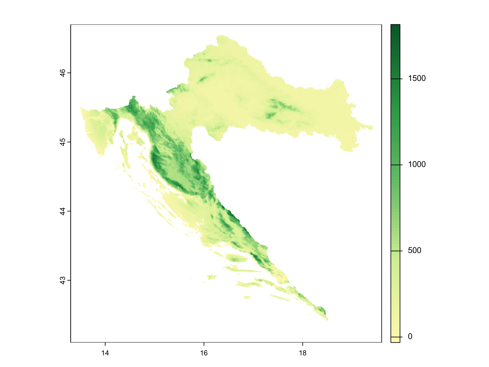
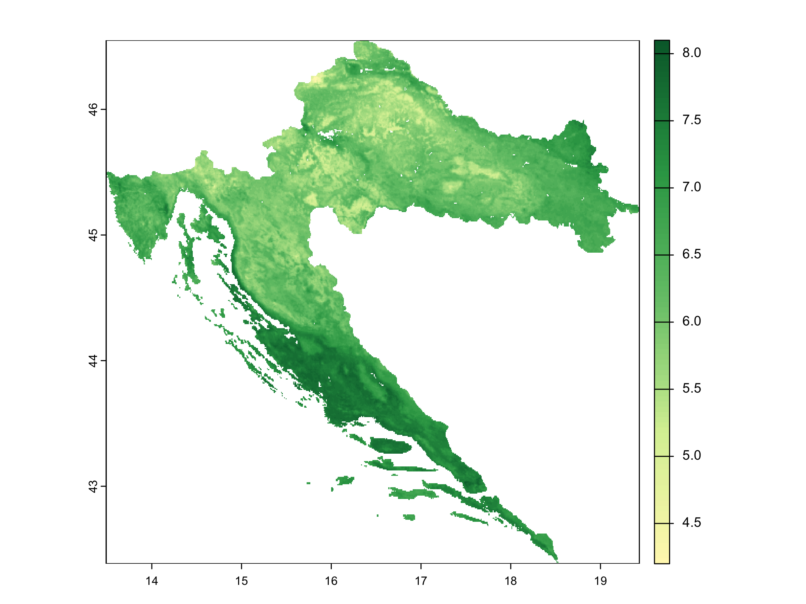
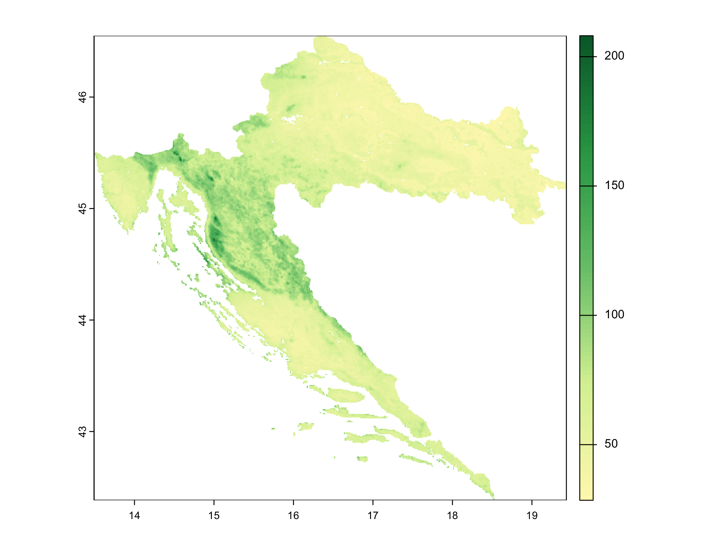
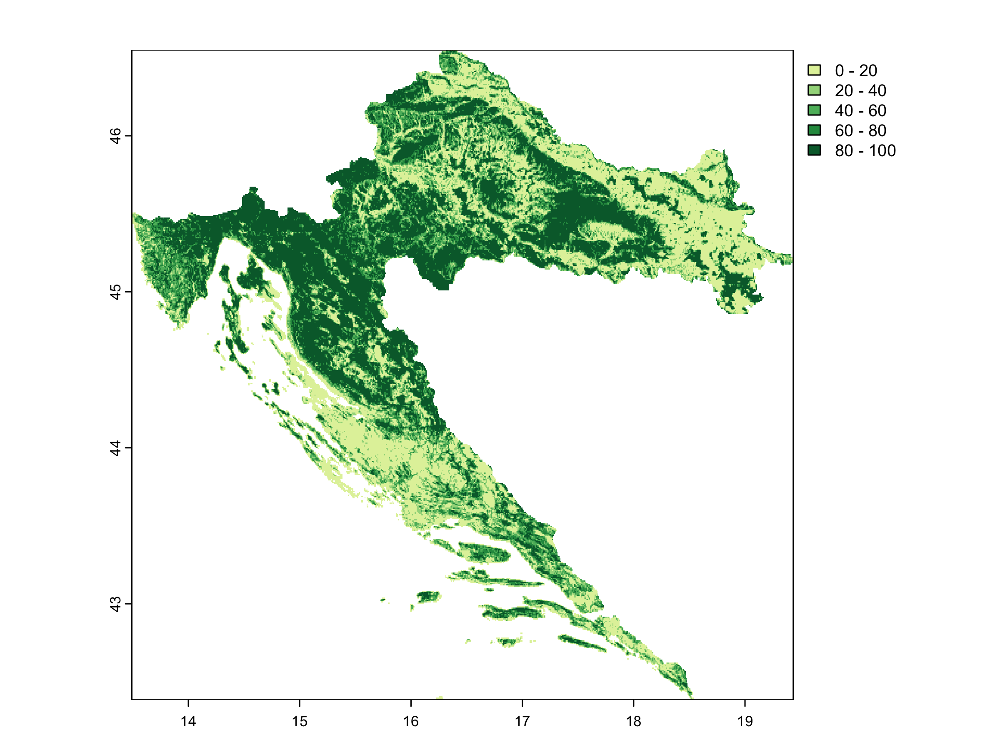
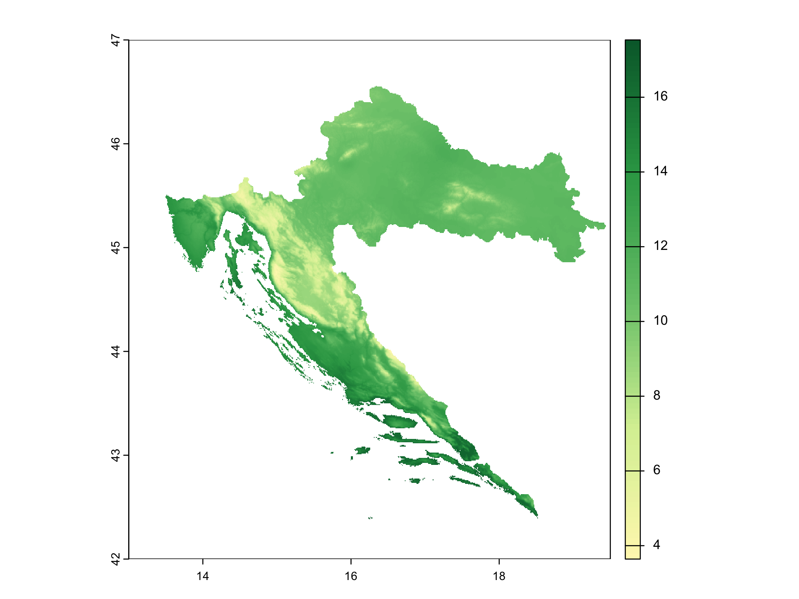
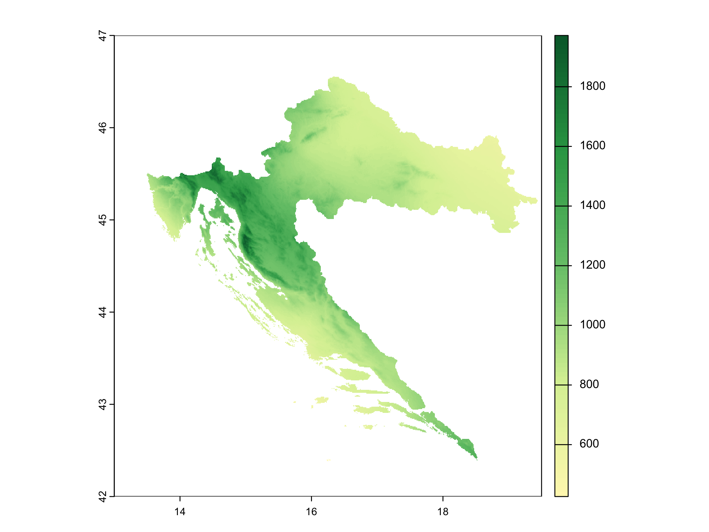
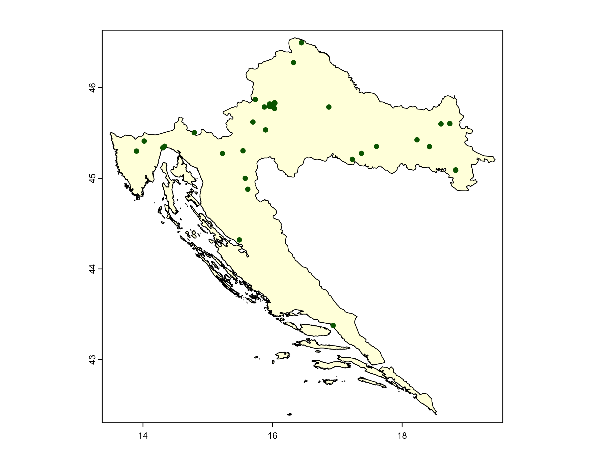
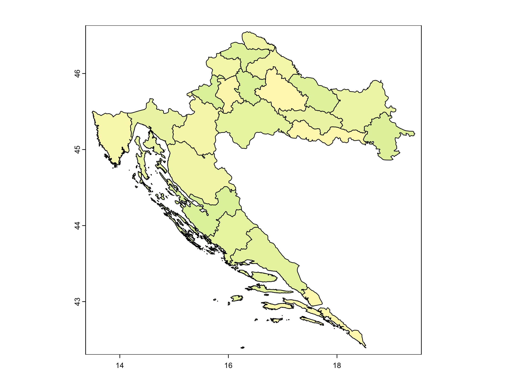

      


**Are you still manually downloading geographic data for your forestry projects?**

I used to spend days collecting geographic data for forest research projects. The process was time-consuming: navigating multiple websites, dealing with inconsistent file formats, wrestling with different coordinate systems, and endless preprocessing.

It always felt like I was spending more time on data collection than on actual science.

But what if I told you that you could:

* Download complete geographic datasets for any forest region in seconds ⏱️
* Access elevation, soil, climate, land cover, and species occurrence data using one consistent interface 🌲
* Transform days of manual work into a 5-minute automated process ✅
* Generate publication-ready visualizations with minimal code 📊

In this tutorial, I'll show you exactly how the geodata R package gives researchers immediate access to important geographic datasets. You'll see examples with complete code that you can adapt for your own projects.

<br>
<br>

## Why Geographic Data Collection Frustrates Forest Researchers

Here's the typical researcher workflow:

- Manual website browsing - Navigate through multiple specialized data portals
- Format inconsistencies - Deal with different file formats, projections, and resolutions
- Data preprocessing - Hours of cleaning and merging datasets
- Quality control nightmares - Checking for missing values, outliers, and errors

But here's what changes everything: The geodata package provides instant access to high-quality geographic datasets with just a few lines of R code.

<br>

## The geodata Package: A Complete Geographic Data Solution

The geodata package is a powerful R tool that provides direct access to a wide range of geographic datasets:

1. **Climate data** - Current and future climate variables 🌡️
2. **Elevation data** - Global terrain metrics 🏔️
3. **Soil properties** - Soil characteristics at different depths 🌱
4. **Land cover** - Forest cover and vegetation types 🌍
5. **Administrative boundaries** - Country and regional borders 🗺️
6. **Species occurrence data** - Tree and plant distribution records 🌳

Let's start by installing and loading the required packages:


``` r
# Install packages if needed
# install.packages(c("geodata", "terra", "tidyverse", "viridis", "sf"))

# Import packages
library(geodata)    # Geographic data access
library(terra)      # Spatial data manipulation
library(tidyverse)  # Data wrangling and visualization
library(viridis)    # Color palettes
library(sf)         # Simple features for spatial data

# Create directories for downloaded data and exports
data_dir <- "data"
dir.create(data_dir, showWarnings = FALSE)
dir.create(file.path(data_dir, "climate"), showWarnings = FALSE)
dir.create(file.path(data_dir, "elevation"), showWarnings = FALSE)
dir.create(file.path(data_dir, "soil"), showWarnings = FALSE)
dir.create(file.path(data_dir, "landcover"), showWarnings = FALSE)
dir.create(file.path(data_dir, "boundaries"), showWarnings = FALSE)
dir.create(file.path(data_dir, "species"), showWarnings = FALSE)
dir.create(file.path(data_dir, "exports"), showWarnings = FALSE)

# Define a forest-themed color palette
forest_palette <- colorRampPalette(c("#FFF7BC", "#D9F0A3", "#78C679", "#31A354", "#006837"))

# Check package versions
packageVersion("geodata")  # Should be 0.6-2 or newer
packageVersion("terra")    # Should be 1.7+ for best performance
```

<br>

## Tutorial: Accessing Key Forest-Relevant Datasets

Let's explore the various geographic datasets available through geodata that are particularly valuable for forestry research.

### 1. Elevation Data

Terrain characteristics significantly influence forest growth, species distribution, and management practices:


``` r
# Download Croatia boundaries first (we'll use these throughout)
croatia <- gadm(country="HRV", level=0, path="data/boundaries/")

# Download elevation data for Croatia
croatia_elevation <- elevation_30s(
  country = "Croatia", 
  path = "data/elevation/"
)

# Ensure it's properly masked to Croatia's boundaries
croatia_elevation <- mask(croatia_elevation, croatia)

plot(croatia_elevation, main = "Elevation in Croatia (m)",
     col = forest_palette(100))

```

<div class="figure" style="text-align: center">

<p class="caption"><span id="fig:unnamed-chunk-1"></span>Figure 1: Elevation in Croatia (m)</p>
</div>

<br>

### 2. Soil Properties

Soil characteristics are crucial for understanding forest productivity and species distribution:


``` r
# Download global soil pH data (0-5cm depth)
soil_ph <- soil_world(
  var = "phh2o",  # pH in H2O
  depth = 5,      # 0-5cm depth
  path = "data/soil/"
)

# Proper cropping and masking to Croatia
croatia_soil_ph <- crop(soil_ph, ext(croatia))
croatia_soil_ph <- mask(croatia_soil_ph, croatia)

plot(croatia_soil_ph, main = "Soil pH (0-5cm depth)", 
     col = forest_palette(100))
```

<div class="figure" style="text-align: center">

<p class="caption"><span id="fig:unnamed-chunk-2"></span>Figure 2: Soil pH (0-5cm depth)</p>
</div>

Other valuable soil variables include:
- "clay" - Clay content (%)
- "silt" - Silt content (%)
- "sand" - Sand content (%)
- "soc" - Soil organic carbon (g/kg)
- "bdod" - Bulk density (kg/m³)

And multiple depth options (5, 15, 30, 60, 100, 200).


The geodata package provides access to global Soil Organic Carbon (SOC) data through its soil_world() function, which retrieves standardized measurements from the SoilGrids database. SOC values, expressed in g/kg, represent carbon stored in soil organic matter at various depths, with the topsoil (0-5cm) typically showing the highest concentrations. 

Let's also look at SOC, an important indicator of soil fertility:


``` r
# Download and process soil organic carbon (SOC) data
soil_soc <- soil_world(
  var = "soc",      # Soil Organic Carbon
  depth = 5,        # 0-5cm depth
  path = "data/soil/"
)

# Proper cropping and masking to Croatia
croatia_soil_soc <- crop(soil_soc, ext(croatia))
croatia_soil_soc <- mask(croatia_soil_soc, croatia)

plot(croatia_soil_soc, 
     main = "Soil Organic Carbon (0-5cm depth, g/kg)", 
     col = forest_palette(100))

```

<div class="figure" style="text-align: center">

<p class="caption"><span id="fig:unnamed-chunk-3"></span>Figure 3: Soil Organic Carbon (0-5cm depth, g/kg)</p>
</div>

<br>

### 3. Land Cover Data

Forest cover and land use are essential for forestry research:


``` r
# Download tree cover data
tree_cover <- landcover(
  var = "trees",  # Tree cover percentage
  year = 2020,    
  path = "data/landcover/"
)

# Proper cropping and masking to Croatia
croatia_trees <- crop(tree_cover, ext(croatia))
croatia_trees <- mask(croatia_trees, croatia)

# Convert to percentages for better visualization (data comes as 0-1)
croatia_trees_pct <- croatia_trees * 100

plot(croatia_trees_pct, main = "Tree Cover % (2020)",
     col = forest_palette(100),
     breaks = c(0, 20, 40, 60, 80, 100),
     lab.breaks = c("0%", "20%", "40%", "60%", "80%", "100%"))

```

<div class="figure" style="text-align: center">

<p class="caption"><span id="fig:unnamed-chunk-4"></span>Figure 4: Tree Cover % (2020)</p>
</div>

Other landcover variables include:
- "crops" - Cropland percentage
- "urban" - Urban/built-up percentage
- "grass" - Grassland percentage
- "shrub" - Shrubland percentage
- "wetland" - Wetland percentage
- "water" - Water percentage

<br>

### 4. Bioclimatic Variables

The 19 bioclimatic variables represent climate factors particularly relevant to biological species:


``` r
# Download bioclimatic variables for Croatia
croatia_bioclim <- worldclim_country(
  country = "Croatia",
  var = "bio",
  res = 30,  # 30 arc-seconds (~1km resolution)
  path = "data/climate/"
)

# Ensure proper masking to Croatia boundaries
croatia_bioclim <- mask(croatia_bioclim, croatia)

# Examine the data structure
croatia_bioclim

```

These bioclimatic variables represent annual trends, seasonality, and extreme conditions - all key factors in understanding forest ecology and species distributions. For the complete description of all 19 bioclimatic variables, see the [WorldClim documentation](https://www.worldclim.org/data/bioclim.html).

Let's focus on a few key variables:


``` r
# Extract forest-relevant variables
forest_vars <- c(
  "wc2.1_30s_bio_1",   # Annual Mean Temperature
  "wc2.1_30s_bio_12"   # Annual Precipitation
)

croatia_forest_climate <- croatia_bioclim[[forest_vars]]

# Rename for clarity
names(croatia_forest_climate) <- c(
  "Annual_Temp", 
  "Annual_Precip"
)

plot(croatia_forest_climate, 
     col = forest_palette(100))
```

<div class="figure" style="text-align: center">

<p class="caption"><span id="fig:unnamed-chunk-5"></span>Figure 5: Annual Mean Temperature in Croatia</p>
</div>

<div class="figure" style="text-align: center">

<p class="caption"><span id="fig:unnamed-chunk-6"></span>Figure 6: Annual Precipitation in Croatia (mm)</p>
</div>

<br>

### 5. Species Occurrence Data

For biodiversity and species distribution studies, geodata provides direct access to GBIF (Global Biodiversity Information Facility) data:


``` r
# Check the number of records first (without downloading)
sp_occurrence("Quercus", "robur", download=FALSE)
# Output will show how many records exist (often > 1,000,000 for common species)

# Use geographic extent parameter to limit the search area
oak_region <- sp_occurrence(
  genus = "Quercus",
  species = "robur",
  ext = c(13, 20, 42, 47),  
  geo = TRUE,
  removeZeros = TRUE,
  path = "data/species/"
)

# Create spatial points from species occurrences
oak_points <- vect(oak_region[, c("lon", "lat")], 
                   crs=crs(croatia))

# Crop to Croatia borders
oak_croatia <- oak_region[terra::relate(oak_points, croatia, "intersects"), ]

# Create a map of the occurrence points
plot(croatia, col="lightyellow", main="Quercus robur occurrences in Croatia")
points(oak_croatia$lon, oak_croatia$lat, col="darkgreen", pch=19, cex=0.8)

```

**Important tip:** When working with species occurrence data, always check the count first with download=FALSE to avoid errors with very common species. GBIF has a 100,000 record limit per request.

<div class="figure" style="text-align: center">

<p class="caption"><span id="fig:unnamed-chunk-7"></span>Figure 7: Quercus robur occurrences in Croatia</p>
</div>

The species occurrence functionality allows you to:
- Download data for specific species or entire genera
- Filter records with geographic coordinates
- Limit searches by geographic extent
- Crop results to specific country boundaries
- Access metadata like collection date and basis of record

<br>

### 6. Administrative Boundaries

Administrative boundaries are useful for forest management and planning:


``` r
# Download country boundaries at administrative level 1 (regions/provinces)
croatia_regions <- gadm(
  country = "HRV",  # ISO3 code for Croatia
  level = 1,        # Level 1 = regions/provinces
  path = "data/boundaries/"
)

plot(croatia_regions, main = "Administrative Regions of Croatia", col = forest_palette(100))

```

<div class="figure" style="text-align: center">

<p class="caption"><span id="fig:unnamed-chunk-8"></span>Figure 8: Administrative Regions of Croatia</p>
</div>

<br>

## BONUS: Forest Site Characterization in Croatia

Now let's combine multiple datasets to create a comprehensive geographic profile for a specific forest site:


``` r
# Define a forest location of interest
forest_loc <- c(16.2, 45.5)  

# Let's create extract function to extract values from rasters
extract_point_data <- function(raster, location) {
   
     point <- terra::vect(matrix(location, ncol=2), type="points", 
                         crs=terra::crs(raster))
    
    result <- terra::extract(raster, point)
    
    if(length(result) > 0 && nrow(result) > 0) {
        return(as.numeric(result[1, -1])) 
    }
    
    return(NA)
}

# Extract data for site using the datasets we've already downloaded
# 1. Elevation 
site_elevation <- extract_point_data(croatia_elevation, forest_loc)

# 2. Soil properties 
site_soil_ph <- extract_point_data(soil_ph, forest_loc)
site_soil_soc <- extract_point_data(soil_soc, forest_loc)

# 3. Tree cover 
site_tree_cover <- extract_point_data(tree_cover, forest_loc)

# 4. Bioclimatic variables 
bio1 <- extract_point_data(croatia_bioclim[[1]], forest_loc) 
bio12 <- extract_point_data(croatia_bioclim[[12]], forest_loc)    

# Create a summary tibble
site_profile <- tibble(
    Site_Name = "Forest Stand 1",
    Longitude = forest_loc[1],
    Latitude = forest_loc[2],
    Elevation_m = site_elevation,
    Soil_pH = site_soil_ph,
    Soil_Organic_Carbon_g_kg = site_soil_soc,
    Tree_Cover_Pct = site_tree_cover * 100, # Convert to percent
    Annual_Mean_Temp_C = bio1,
    Annual_Precipitation_mm = bio12
)

# Display the site profile
site_profile
```


```
#> # A tibble: 9 × 2
#>   Variable                     Value         
#>   <chr>                        <chr>         
#> 1 Site Name                    Forest Stand 1
#> 2 Longitude (°E)               16.2          
#> 3 Latitude (°N)                45.5          
#> 4 Elevation (m)                97            
#> 5 Soil pH                      5.9           
#> 6 Soil Organic Carbon (g/kg)   47.7          
#> 7 Tree Cover (%)               61.0          
#> 8 Annual Mean Temperature (°C) 11.0          
#> 9 Annual Precipitation (mm)    925
```

<br>

This forest stand represents a typical continental woodland in Croatia's lowland Pannonian region (97m elevation). With moderately acidic soil (pH 5.90) optimal for oak species, high organic carbon content (47.7 g/kg), and substantial tree cover (61%), it represents a well-established, productive forest ecosystem with effective nutrient cycling. The climate conditions (10.98°C annual temperature, 925mm precipitation) are characteristic of the sub-Pannonian zone, creating ideal conditions for deciduous forest communities. These parameters indicate a healthy, managed forest system that balances ecological functions with sustainable forestry practices.

<br>

## Exporting Data for Further Analysis

Once you've accessed and processed your geographic data, you may want to export it for use in other software or to share with colleagues:


``` r
# Export raster data to GeoTIFF for use in GIS software
writeRaster(croatia_elevation, "data/exports/croatia_elevation.tif", overwrite=TRUE)
writeRaster(croatia_soil_ph, "data/exports/croatia_soil_ph.tif", overwrite=TRUE)
writeRaster(croatia_trees, "data/exports/croatia_tree_cover.tif", overwrite=TRUE)

# Export vector data (administrative boundaries) to shapefile
writeVector(croatia, "data/exports/croatia_borders.shp", overwrite=TRUE)
writeVector(croatia_regions, "data/exports/croatia_regions.shp", overwrite=TRUE)

# Export point data (species occurrences) to CSV
write.csv(oak_croatia, "data/exports/oak_occurrences.csv", row.names=FALSE)

# Export site profiles to CSV
write.csv(site_profile, "data/exports/forest_site_profile.csv", row.names=FALSE)

# Additionally, you can export maps as image files
png("data/exports/croatia_elevation_map.png", width=2000, height=1500, res=300)
plot(croatia_elevation, main = "Elevation in Croatia (m)",
     col = forest_palette(100))
dev.off()
```

This makes it easy to:
1. Use the data in GIS software like QGIS or ArcGIS
2. Share with colleagues who might not use R
3. Include in reports or presentations
4. Perform further analysis in other environments


<br>

## Real Results from Forest Research

Here's what this workflow delivers for forest researchers:

✅ Time Savings: Geographic data collection reduced from days to minutes  
✅ Comprehensive Data: Access to multiple datasets from a single interface  
✅ Consistent Formats: All data in compatible spatial formats  
✅ Reproducibility: Code-based workflows for transparent methods  
✅ Integrated Analysis: Seamless use with modern spatial packages  

<br>

## References

1. Hijmans, R.J. (2024). [geodata: Download Geographic Data](https://CRAN.R-project.org/package=geodata). R package version 0.6-2.

2. Hijmans, R.J. (2023). [terra: Spatial Data Analysis](https://CRAN.R-project.org/package=terra). R package version 1.7-55.

3. Wickham, H., Averick, M., Bryan, J., et al. (2019). [Welcome to the tidyverse](https://doi.org/10.21105/joss.01686). *Journal of Open Source Software* 4(43): 1686.

4. WorldClim (2020). [WorldClim - Global Climate Data](https://www.worldclim.org/). Free climate data for ecological modeling and GIS.

5. ISRIC - World Soil Information (2023). [SoilGrids - Global Gridded Soil Information](https://soilgrids.org/). 250m resolution soil property maps.

<br>
<br>

---

<br>

**Need Advanced Forest Data Science?**

*I help research organizations transform their data workflows from manual to automated, providing comprehensive services from statistical analysis and modeling to spatial data integration and advanced visualizations. If you're spending days on data collection and processing instead of focusing on analysis and insights, let's talk about how custom R solutions can streamline your research pipeline.*

*My clients typically see:*

* *90% reduction in data processing time*
* *Improved accuracy through automated workflows*
* *Rigorous statistical insights that strengthen research conclusions*
* *Reproducible analyses that scale across projects*

*Contact me: marijana@andalytics.com*

