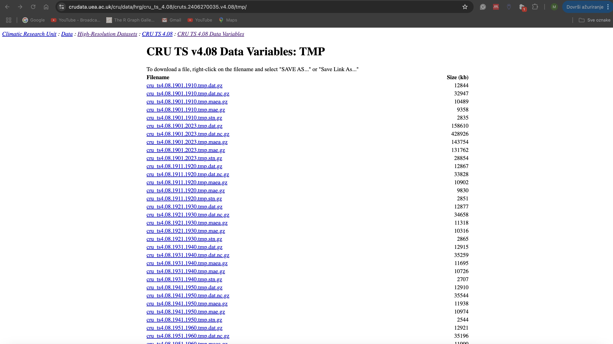

      
```{r setup, include=FALSE}
knitr::opts_chunk$set(
  echo = TRUE,
  warning = FALSE,
  message = FALSE,
  cache = TRUE,
  fig.align = 'center',
  fig.cap = TRUE,
  out.width = '60%',
  collapse = TRUE,  
  comment = "#>",   
  prompt = FALSE    
)
```

## Introduction

Have you ever found yourself staring at your forest plot data wondering how to combine it with historical climate information? Or maybe you've heard other researchers talk about "NetCDF files" and "CRU data" and felt a bit lost? Don't worry. I've been there too! When I first encountered these mysterious .nc files in my research, I had no idea how to handle them. But today, I'm going to show you just how approachable they can be.

## What Are NetCDF Files

NetCDF (Network Common Data Form) is a specialized file format created by the scientific community to store and share complex scientific data. Think of a NetCDF file as a magical container that can hold an entire world of climate data. Unlike our familiar Excel spreadsheets that are basically flat tables, NetCDF files are more like sophisticated 3D puzzles. They can store multiple layers of information. Imagine having temperature, precipitation, and humidity data for every point on Earth, across many years, all neatly packed into a single file.

For forest researchers, this is incredibly valuable. When we're trying to understand how forests grow, respond to climate change, or recover from disturbances, we need to look at climate patterns over long periods and across different locations. NetCDF files make this possible without drowning us in thousands of separate spreadsheets.

## Setting Up Our R Environment

Before we dive into working with climate data, we need to prepare our R environment with the right tools. Let's install and set up these essential packages.

```{r, echo=FALSE}
library(ncdf4)
library(raster)
library(sf)
library(tidyverse)
library(lubridate)
library(R.utils)
```

```{r install-packages, eval=FALSE}
# First, let's install all the packages we need
install.packages(c(
    "ncdf4",       # For handling NetCDF files - climate data format
    "raster",      # For working with spatial data
    "sf",          # For handling forest plot locations and spatial operations
    "tidyverse",   # For data manipulation and visualization
    "lubridate",   # For handling dates in climate data
    "R.utils"      # For working with compressed files
))

# Now let's load these packages into current R session
library(ncdf4)
library(raster)
library(sf)
library(tidyverse)
library(lubridate)
library(R.utils)

```


## Enter the CRU Dataset

Remember that time you needed historical climate data for your study site but all the local weather stations were too far away or didn't have long enough records? That's where the Climate Research Unit (CRU) dataset comes to the rescue. Created by the University of East Anglia, the CRU dataset is like having a time machine that lets us look at climate patterns anywhere on Earth, going all the way back to 1901.

What makes CRU data particularly valuable for forest research is its consistency and comprehensive coverage. Whether you're studying forest growth or urban tree health, CRU can provide you with reliable climate data.

Now, here's the exciting part, getting this valuable data is actually quite straightforward. While in the past you might have needed to navigate through complex data portals or send formal requests, today I'll show you a simple R function that does all the heavy lifting for us.

Before we jump into the code, let me show you where our climate data lives. If you visit the <a href="https://crudata.uea.ac.uk/cru/data/hrg/" target="_blank">CRU website</a> (shown in the image below), you'll find a treasure trove of climate data organized in a specific way. Understanding this organization is like having a map to a library. Once you know the system, finding what you need becomes much easier.

```{r image-cru, echo=FALSE, out.width='80%', fig.cap="CRU website download page"}

```


Looking at the website, you can see how CRU organizes their files by version numbers and variables. This structured approach is what allows our download function to work its magic.

Here's something important I learned the hard way. When downloading NetCDF files, we need to give R enough time to complete the task. By default, R only waits 60 seconds before giving up on a download, which often isn't enough for climate data files.

Let's adjust this setting before we start downloading. This simple adjustment can save you from frustrating failed downloads.

```{r set-timeout}
# Increase the download timeout to 10 minutes (600 seconds)
# Climate data files can be large, so we need to be patient
options(timeout = 600)

# Let's verify new setting
getOption("timeout")
```

One of the most powerful features of CRU data is its extensive temporal coverage combined with regular managed updates. The current 4.08 version provides climate information spanning from 1901 to 2023, offering over a century of data for your research. What makes CRU particularly valuable is its commitment to quality and continuous improvement through systematic updates. 

The data is available in various time chunks and our download function is designed to handle this flexibility. You can request the entire historical record (1901-2023), specific decades or other custom time period within download page list.

Let's look at our download function, designed to make accessing this data as easy as possible.
```{r download-function}
download_cru_climate <- function(variable, start_year = 1901, end_year = 2023, version = "4.08") {
    
    # First, we tell our function where to find the data
    base_url <- paste0("https://crudata.uea.ac.uk/cru/data/hrg/",
                       "cru_ts_", version,
                       "/cruts.2406270035.v", version)
    
    # Now we specify which climate variable we want
    var_url <- file.path(base_url, tolower(variable))
    
    # Create the exact filename we need
    # This follows CRU's specific naming convention
    filename <- sprintf("cru_ts%s.%d.%d.%s.dat.nc.gz",
                        version, start_year, end_year, 
                        tolower(variable))
    
    # Combine everything to get download link
    download_url <- file.path(var_url, filename)
    
    # Set up where we'll save the file on computer
    dest_file <- file.path(getwd(), filename)
    dest_file_uncompressed <- gsub("\\.gz$", "", dest_file)
    
    # Keep us informed about what's happening
    message("Starting to download ", variable, " data")
    message("This might take a while - perfect time to grab a coffee!")
    
    # Download file (the heavy lifting happens here)
    download.file(download_url, dest_file, mode = "wb", quiet = FALSE)
    message("Download finished - now let's unpack it")
    
    # Unzip the file (it comes compressed to save space)
    R.utils::gunzip(dest_file, dest_file_uncompressed, remove = FALSE)
    message("All done! Your data is ready to use")
    
    return(dest_file_uncompressed)
}
```

Using this function is as simple as telling it what climate variable you want. For example, if you need precipitation and temperature data for your study, just type:

```{r download-data}
precip_file <- download_cru_climate("pre")
temp_file <- download_cru_climate("tmp")

# You can change the function parameters for specific downloading
# precip_file <- download_cru_climate("tmp", start_year = 1991, end_year = 2023)
# tmp_file <- download_cru_climate("pre", start_year = 2001, end_year = 2010)
```

That's it! Two lines of code, and you'll have temperature and precipitation data spanning from 1901 to 2023.

## Reading and Exploring NetCDF Data

Now that we've successfully downloaded climate data, let's peek inside these NetCDF files and understand what we're looking at. There's a lot of information in there, and knowing how it's organized is the key to finding exactly what we need.

Let's start by opening and examining our files. When we run this code, we'll see something like this.
```{r}
# Open NetCDF file
nc_temp <- nc_open(temp_file)
nc_precip <- nc_open(precip_file)

#  Let's see what's inside
print(nc_temp)
```


Informations are organized into three main sections. Let's walk through each one to understand exactly what we're looking at and why it matters for our climate research.

The dimensions section reveals how data is structured in space and time, creating a three-dimensional framework for all climate measurements. Longitude spans 720 points around the Earth, giving us measurements every 0.5 degrees from west to east. Imagine drawing 720 vertical lines on a world map, each half a degree apart. Similarly, latitude contains 360 points running from south to north, like horizontal lines crossing map every half degree. The time dimension shows 1476 points, each representing one month since January 1901, following a standard Gregorian calendar. Together, these dimensions create a comprehensive grid system that captures climate variations across both space and time.

Looking at the variables section, we discover four key components that work together to tell us about our climate data. The primary variable is temperature (tmp), measured in degrees Celsius, which shows us near-surface temperature measurements across our global grid. The data includes a correlation decay distance of 1200, helping us understand how far temperature patterns typically extend. Any gaps in temperature measurements are carefully marked with a specific value (9.96920996838687e+36), ensuring we don't mistake missing data for actual readings.
Supporting our temperature data, we have three additional variables that help us assess data quality. The station count (stn) tells us how many weather stations contributed to each measurement point. More stations generally mean more reliable data. The mean absolute error (MAE) helps us understand measurement accuracy by showing average differences between actual and interpolated values. Finally, the MAE anomaly indicates how unusual measurement errors are compared to typical patterns, helping identify potentially problematic data points.

The global attributes section rounds out our understanding by providing crucial context about the dataset's origin and quality.

Now that we understand how NetCDF file is structured, let's start working with the actual climate data. First, we need to extract some basic information about the spatial and temporal dimensions of our dataset.

```{r}
# Extract basic dimensions
lon <- ncvar_get(nc_temp, "lon")
lat <- ncvar_get(nc_temp, "lat")
time <- ncvar_get(nc_temp, "time")

# Let's look at what time periods we're dealing with
time_units <- ncatt_get(nc_temp, "time", "units")$value

# Convert these numeric values to actual dates
dates <- as.Date(time, origin = "1900-01-01")

# Look at date range
range(dates)
```

When we check date range, we'll see that data spans from 1901 to 2023, giving us over a century of climate information to work with.

Let's put this information to practical use by extracting temperature data for a specific location. We'll use Zagreb, Croatia as our example to demonstrate how to move from global gridded data to local climate information.

```{r temp-zagreb}
# First, let's set up Zagreb's coordinates
zagreb_lat <- 45.815
zagreb_lon <- 15.982

# Find the closest grid points in CRU data
lon_idx <- which.min(abs(lon - zagreb_lon))
lat_idx <- which.min(abs(lat - zagreb_lat))

# Get Zagreb's monthly temperatures for 2023
year_2023_idx <- which(format(dates, "%Y") == "2023")

# Function ncvar_get extracts the data we need from large climate dataset
zagreb_temp_2023 <- ncvar_get(nc_temp, "tmp",
                             start = c(lon_idx, lat_idx, year_2023_idx[1]),
                             count = c(1, 1, 12))

# Create a nicely formatted table for Zagreb's temperatures
zagreb_temps <- data.frame(
    Month = month.abb,                        # Abbreviated month names (Jan, Feb, etc.)
    Temperature = round(zagreb_temp_2023, 1)  # Rounded to one decimal place
)

# Print the table 
cat("\nMonthly Temperatures in Zagreb (°C) - 2023\n")
print(zagreb_temps, row.names = FALSE)
```

You can apply this same approach to extract precipitation data as well. Just change nc_temp to nc_precip in the ncvar_get() function. Next, let's explore how we can visualize climate patterns across the globe for May 2023.

```{r plot-global, fig.cap="Global temperature pattern - May 2023", out.width="80%"}
# First, find the data point for May 2023 in timeline
may_2023_idx <- which(format(dates, "%Y-%m") == "2023-05")

# Extract temperature data for May 2023
# We're getting data for all locations (-1, -1) at one specific time point (1)
temp_may2023 <- ncvar_get(nc_temp, "tmp",
                         start = c(1, 1, may_2023_idx),
                         count = c(-1, -1, 1))

# Convert temperature data into a raster (gridded) format
# The t() function transposes the data to get the correct orientation
temp_may2023_raster <- raster(t(temp_may2023))       

# Set the coordinate reference system (CRS)
# This tells R how to properly map data onto the globe
crs(temp_may2023_raster) <- CRS("+proj=longlat +ellps=WGS84 +datum=WGS84 +no_defs")

# Set the proper geographic extent
# This ensures our map covers the whole world from -180° to 180° longitude
# and from -90° to 90° latitude
extent(temp_may2023_raster) <- extent(-180, 180, -90, 90)

# Flip the raster in the y direction to get the correct north-south orientation
temp_may2023_raster <- flip(temp_may2023_raster, direction='y')       

# Create a color palette that intuitively shows temperature variations
temp_colors <- colorRampPalette(c(
    "darkblue",   # Very cold temperatures
    "blue",       # Cold
    "lightblue",  # Cool
    "white",      # Moderate
    "yellow",     # Warm
    "orange",     # Hot
    "red",        # Very hot
    "darkred"     # Extremely hot
))(100)

# Create the final map
plot(temp_may2023_raster,
     main = "",
     xlab = "Longitude",
     ylab = "Latitude",
     col = temp_colors,
     legend.args = list(text = "Temperature (°C)",
                       side = 4,
                       line = 2.5))

```


## Converting NetCDF to Raster Objects

One of the most powerful tools in our R toolkit is the ability to convert NetCDF data into raster objects - think of this as transforming complex climate data cube into a stack of digital maps. Let's look at two ways to work with climate data in raster format. First, we can create what's called a "raster brick". Imagine this as a neat stack of climate maps, one for each time period in our dataset.

```{r mean-temp, fig.cap="Mean temperature 2020", out.width='80%'}
# Create a raster brick from temperature data
temp_brick <- brick(temp_file, varname = "tmp")

# Set proper dates as layer names
names(temp_brick) <- format(dates, "%Y_%m")

# Plot mean annual temperature for 2020
mean_temp_2020 <- calc(subset(temp_brick, 
                             which(year(dates) == 2020)), 
                      mean)

plot(mean_temp_2020,
     main = "",
     col = terrain.colors(100))
```

Remember our global temperature visualization from earlier? That was another way of working with raster data, where we created a single raster layer for a specific month. Both approaches have their uses. Raster bricks are great for analyzing patterns over time, while individual raster layers are perfect for detailed analysis of specific time periods.

## Bringing Climate Data Down to Earth: Spatial Interpolation for Forest Plots

When working with climate data in forest research, we often face a scale mismatch. Our CRU data comes in a relatively coarse 0.5° grid (approximately 50-55 km at the equator), while our forest plots represent specific points on the landscape. While there exists a wide range of downscaling methods in climate science, here we focus on spatial interpolation approaches that help bridge this scale gap. These methods range from simple interpolation techniques to more complex approaches that incorporate additional environmental information.

Before we dive into the implementation, let's understand our options and when to use them. The choice of interpolation method should be guided by both our input data resolution and research needs.

1. Nearest Neighbor
The simplest approach, taking values from the closest grid cell and preserving original values without interpolation. This method is particularly useful when working with high-resolution climate data (e.g. 1x1 km grid). In such cases, the additional complexity of interpolation might not provide meaningful benefits and could even introduce unnecessary uncertainty.

2. Bilinear Interpolation
Uses weighted averages from surrounding grid cells and creates smooth transitions between points. This method becomes valuable when working with medium-resolution data (like our CRU dataset) where the grid cells are larger than our study plots but we still have reasonable confidence in the gradual change of climate variables between grid points. 

3. Elevation-Based Interpolation
Incorporates the effect of elevation on climate variables. This approach becomes crucial in mountainous regions and requires additional elevation data. When working in areas with significant topographic variation, simple distance-based methods might miss important climate variations driven by elevation changes. However, this method requires reliable digital elevation models and an understanding of local elevation-climate relationships.

4. Statistical Interpolation
Uses complex statistical relationships and can incorporate multiple environmental variables, but requires extensive calibration data.

The choice between these methods often depends on finding the right balance between data resolution, computational resources, and research requirements. For instance, if you're working with fine-resolution data like WorldClim (1 km) nearest neighbor might be perfectly adequate. However, when dealing with coarser products like CRU data, as in our case, bilinear interpolation offers a good compromise between computational efficiency and accuracy. It helps us avoid the potential "blockiness" of nearest neighbor while not requiring the extensive additional data needed for more complex methods.

For our example, we'll use 452 forest plots distributed across the Dinaric region in Croatia. Each plot location is recorded in Gauss-Kruger coordinates, which we'll need to convert to match climate data's coordinate system.

```{r transform_coordinate}
# First, let's read forest plot coordinates
forest_plots <- read.csv("extracted_coordinates.csv")

# Create an sf object with GK5 coordinates
plots_sf <- st_as_sf(forest_plots, 
                     coords = c("x_coordinate", "y_coordinate"),
                     crs = 31275)  # EPSG code for GK5/M28

# Transform to WGS84 (the coordinate system used by climate data)
plots_wgs84 <- st_transform(plots_sf, 4326)

# Extract the transformed coordinates
transformed_coords <- st_coordinates(plots_wgs84)
forest_plots$transformed_lon <- transformed_coords[,1]
forest_plots$transformed_lat <- transformed_coords[,2]

# Let's look at transformed coordinates
head(forest_plots)
```


We'll use bilinear interpolation. Bilinear interpolation is like having a sophisticated calculator that estimates values between grid points. Imagine CRU grid as a checkerboard, where each square has a temperature value. When forest plot falls between these squares, bilinear interpolation considers the values of the four nearest grid cells and calculates a weighted average based on the plot's distance from each cell.

Let's start by understanding our approach. We'll create three key functions that work together.

1. A validation function to ensure our data is correct
2. An interpolation function to calculate precise climate values
3. A main function that brings everything together

Here's the complete solution, with detailed explanations of how everything works.

```{r functions}
#-----------------------------------------------------------------
# First, we create a validation function to check NetCDF data
#-----------------------------------------------------------------
validate_netcdf <- function(nc_data, var_name) {
   
     # Safety check #1: Make sure we actually have data
    if(is.null(nc_data)) {
        stop(paste("NetCDF object is NULL for", var_name))
    }
    
    # Safety check #2: Verify all required dimensions are present
    # Climate data needs longitude, latitude, and time - like a 3D coordinate system
    required_dims <- c("lon", "lat", "time")
    missing_dims <- setdiff(required_dims, names(nc_data$dim))
    if(length(missing_dims) > 0) {
        stop(paste("Missing dimensions in NetCDF:", paste(missing_dims, collapse = ", ")))
    }
    
    TRUE
}

#----------------------------------
# Next, our interpolation function 
#----------------------------------
interpolate_climate <- function(nc_data, lon, lat, variable) {
    
    # First, validate inputs
    validate_netcdf(nc_data, variable)
    if(is.na(lon) || is.na(lat)) {
        stop("Invalid coordinates: longitude or latitude is NA")
    }
    
    # Get grid coordinates safely
    lon_vals <- try(ncvar_get(nc_data, "lon"))
    lat_vals <- try(ncvar_get(nc_data, "lat"))
    
    if(inherits(lon_vals, "try-error") || inherits(lat_vals, "try-error")) {
        stop("Failed to retrieve coordinate values from NetCDF")
    }
    
    # Find the nearest grid points 
    lon_idx <- which.min(abs(lon_vals - lon))
    lat_idx <- which.min(abs(lat_vals - lat))
    
    # Make sure we can interpolate by having surrounding points
    lon_idx <- pmin(pmax(lon_idx, 2), length(lon_vals) - 1)
    lat_idx <- pmin(pmax(lat_idx, 2), length(lat_vals) - 1)
    
    # Get surrounding points
    lon_surrounding <- lon_vals[lon_idx + c(-1:0)]
    lat_surrounding <- lat_vals[lat_idx + c(-1:0)]
    
    # Calculate how far we are from each point (interpolation weights)
    lon_diff <- lon_surrounding[2] - lon_surrounding[1]
    lat_diff <- lat_surrounding[2] - lat_surrounding[1]
    
    # Safety check for valid grid spacing
    if(abs(lon_diff) < 1e-10 || abs(lat_diff) < 1e-10) {
        stop("Grid cells too close together for interpolation")
    }
    
    # Calculate proportional distances
    wx <- (lon - lon_surrounding[1]) / lon_diff
    wy <- (lat - lat_surrounding[1]) / lat_diff
    
    # Ensure weights make sense (between 0 and 1)
    wx <- pmin(pmax(wx, 0), 1)
    wy <- pmin(pmax(wy, 0), 1)
    
    # Return interpolation weights and indices
    list(
        weights = c((1-wx)*(1-wy), wx*(1-wy), wx*wy, (1-wx)*wy),
        indices = list(
            lon = lon_idx + c(-1:0),
            lat = lat_idx + c(-1:0)
        )
    )
}

#------------------------------------------------------------
# Finally, main function that brings everything together
#------------------------------------------------------------
create_climate_dataset <- function(forest_plots, temp_nc, precip_nc) {
   
    # Initialize our storage 
    plot_results <- vector("list", nrow(forest_plots))
    
    # Set up timeline - notice the multiplication by 1 to ensure proper numeric conversion
    dates <- as.Date(ncvar_get(temp_nc, "time") * 1, origin = "1900-01-01")
    
    # Keep us informed about progress
    message("Starting to process ", nrow(forest_plots), " forest plots")
    message("Time period: ", min(dates), " to ", max(dates))
    
    # Process each plot one by one
    for(i in 1:nrow(forest_plots)) {
        current_plot <- forest_plots[i, ]
        
        tryCatch({
            # Find the nearest grid points for this plot
            lon_idx <- which.min(abs(ncvar_get(temp_nc, "lon") - current_plot$transformed_lon))
            lat_idx <- which.min(abs(ncvar_get(temp_nc, "lat") - current_plot$transformed_lat))
            
            # Ensure we stay within bounds
            lon_idx <- min(max(lon_idx, 2), 719)  # 720 total longitude points
            lat_idx <- min(max(lat_idx, 2), 359)  # 360 total latitude points
            
            # Extract climate data
            temp_data <- ncvar_get(temp_nc, "tmp",
                                 start = c(lon_idx - 1, lat_idx - 1, 1),
                                 count = c(2, 2, length(dates)))
            
            precip_data <- ncvar_get(precip_nc, "pre",
                                   start = c(lon_idx - 1, lat_idx - 1, 1),
                                   count = c(2, 2, length(dates)))
            
            # Get the exact grid cell coordinates
            lons <- ncvar_get(temp_nc, "lon")[lon_idx + c(-1,0)]
            lats <- ncvar_get(temp_nc, "lat")[lat_idx + c(-1,0)]
            
            # Calculate interpolation weights
            wx <- (current_plot$transformed_lon - lons[1]) / (lons[2] - lons[1])
            wy <- (current_plot$transformed_lat - lats[1]) / (lats[2] - lats[1])
            
            # Ensure proper weight bounds
            wx <- pmax(0, pmin(1, wx))
            wy <- pmax(0, pmin(1, wy))
            
            # Set up the weights for our four surrounding points
            weights <- c(
                (1-wx) * (1-wy),  # Bottom-left
                wx * (1-wy),      # Bottom-right
                wx * wy,          # Top-right
                (1-wx) * wy       # Top-left
            )
            
            # Create a data frame for this plot's results
            plot_results[[i]] <- data.frame(
                plot_id = current_plot$plot_number,
                x_coordinate = current_plot$x_coordinate,
                y_coordinate = current_plot$y_coordinate,
                transformed_lon = current_plot$transformed_lon,
                transformed_lat = current_plot$transformed_lat,
                date = dates,
                year = format(dates, "%Y"),
                month = format(dates, "%m"),
                temperature = NA_real_,
                precipitation = NA_real_,
                stringsAsFactors = FALSE
            )
            
            # Calculate final values for each time point
            for(t in 1:length(dates)) {
                temp_slice <- c(temp_data[1,1,t], temp_data[2,1,t],
                              temp_data[2,2,t], temp_data[1,2,t])
                precip_slice <- c(precip_data[1,1,t], precip_data[2,1,t],
                                precip_data[2,2,t], precip_data[1,2,t])
                
                # Apply our weighted averaging
                plot_results[[i]]$temperature[t] <- sum(temp_slice * weights, na.rm = TRUE)
                plot_results[[i]]$precipitation[t] <- sum(precip_slice * weights, na.rm = TRUE)
            }
            
        }, error = function(e) {
            warning(sprintf("Error processing plot %s: %s", 
                          current_plot$plot_number, e$message))
            plot_results[[i]] <- NULL
        })
    }
    
    # Combine all results into one neat package
    final_dataset <- do.call(rbind, plot_results[!sapply(plot_results, is.null)])
    rownames(final_dataset) <- NULL
    
    message("\nProcessing completed. Successfully processed ", 
            length(unique(final_dataset$plot_id)), " plots.")
    
    return(final_dataset)
}

```

When we run this code, we get clean, interpolated climate data for each of our forest plots, with both temperature and precipitation values spanning from 1901 to 2023. That's 122 years of monthly climate data, precisely calculated for each plot location. What's truly remarkable about this approach is its efficiency. In just a few minutes, we can process over a century of climate data for hundreds of forest plots. 

```{r run-function}
# Now let's run our main function
climate_data <- create_climate_dataset(forest_plots, nc_temp, nc_precip)

# See the final dataset
climate_data %>% 
    head()

# Let's look at a summary 
summary(climate_data)
```

Our dataset, comprising 667,152 observations, captures climate variations across both space and time. The forest plots are distributed across a significant portion of the region. The temperature regime shows a characteristic continental climate pattern, with mean annual temperature of 9.54°C and a substantial range from -9.8°C to 26.5°C, reflecting both cold winters and warm summers. The precipitation analysis reveals an asymmetric rainfall pattern, with a monthly mean of 124.25mm exceeding the median of 113.74mm. This right-skewed distribution indicates that while most months experience moderate rainfall, the region occasionally faces intense precipitation events reaching up to 504.20mm per month.

After successfully downscaling climate data, we can now explore the temperature patterns across forest plots over the past century. Temperature trends are particularly crucial for understanding forest dynamics, as they directly influence tree growth, phenology, and overall ecosystem health. By visualizing these long-term temperature patterns, we can better understand how forest plots have experienced climate change over the past 122 years.
Let's create a visualization that shows both the seasonal temperature variations and the long-term trend.

```{r temp-plot, fig.cap="Long-term temperature trends (1901-2023)", out.width='80%'}
ggplot(climate_data, aes(x = as.Date(date), y = temperature)) +
  
  # Add individual plot temperatures as semi-transparent lines
  # This shows the natural variation across all forest plots
  geom_line(aes(group = plot_id), 
            alpha = 0.1,           
            color = "gray70") +    
  
  # Add the smoothed trend line with confidence interval
  # This helps us see the overall temperature pattern
  geom_smooth(color = "darkred",     
              se = TRUE) +           
  
  # Format the x-axis to show years in 10-year intervals
  scale_x_date(date_breaks = "10 years", 
               date_labels = "%Y") +
  
  # Add clear, informative labels
  labs(
    title = "",
    subtitle = "Individual forest plots with overall trend",
    x = "",
    y = "Temperature (°C)"
  ) +
  
  theme_minimal() +
  theme(
    axis.text.x = element_text(angle = 45, hjust = 1),  
    panel.grid.minor = element_blank()                   
  )
```

The gray lines represent monthly temperatures for individual forest plots showing clear seasonal patterns with summer peaks reaching around 20°C and winter temperatures falling to -10°C. The red trend line, representing the smoothed average temperature across all plots, indicates a gradual warming trend over the past century. This warming appears to accelerate after the 1980s, with average temperatures rising from approximately 8°C in 1901 to about 11°C by 2023.

While our previous visualization showed us the long-term trends, let's dive deeper into the seasonal patterns of rainfall.

```{r precp-plot, fig.cap="Monthly precipitation distribution (1901-2023)", out.width='80%'}
# First, we need to properly format month data
climate_data_fixed <- climate_data %>%
    
    # Transform month numbers into proper month names
    # This makes visualization more readable and intuitive
    mutate(
        month_name = factor(month,                           # Start with month column
                            levels = sprintf("%02d", 1:12),  # Create proper format for months (01-12)
                            labels = month.abb,              # Use standard month abbreviations
                            ordered = TRUE)                  # Keep months in correct order
    )

# Now we create box plot visualization
ggplot(climate_data_fixed, aes(x = month_name, y = precipitation)) +
    geom_boxplot(
        fill = "skyblue",        
        alpha = 0.7,             
        outlier.alpha = 0.3,     
        outlier.size = 1         
    ) +
    labs(
        x = "",
        y = "Precipitation (mm)"
    ) +
    # Set appropriate scale to capture all important data
    scale_y_continuous(
        limits = c(0, 500),     
        breaks = seq(0, 500, 100)  
    ) +
    theme_minimal() +
    theme(
        axis.text.x = element_text(angle = 0),  
        panel.grid.minor = element_blank()     
    )
```

The resulting visualization reveals a pattern in our forest's precipitation regime. July emerges as the driest month with median rainfall around 90mm, while autumn months, particularly November, show the highest precipitation with medians reaching 180mm. What's particularly interesting is how the variability changes across seasons. Notice those long "whiskers" and outlier points in the autumn months, showing occasional extreme rainfall events that can reach up to 500mm.

## Limitations

While our downscaling approach successfully provided localized climate data for forest plots, it's important to acknowledge certain limitations. The bilinear interpolation method, though efficient, assumes linear relationships between grid points and may not fully capture local topographic effects or microclimatic conditions that could influence temperature and precipitation patterns at the plot level. Additionally, the CRU dataset's 0.5° spatial resolution, while suitable for regional climate analysis, means that some local-scale climate variations might be smoothed out in the interpolation process. Future improvements could incorporate digital elevation models and local meteorological station data to enhance the downscaling accuracy, particularly in regions with complex terrain or unique microclimatic conditions.

## Conclusions

Working with NetCDF files in forest research opens up exciting possibilities for understanding climate-forest interactions across multiple spatial and temporal scales. Through R programming, we've transformed what could have been weeks of manual data processing into an elegant automated workflow. We've gone from raw global climate data to plot-specific insights in just a few lines of code.

The structured nature of NetCDF files, with their well-organized dimensions and comprehensive metadata, makes them invaluable tools for climate data analysis in forest research. These files effectively serve as digital repositories, containing decades of systematically organized climate information that can be efficiently accessed and analyzed. The workflow presented here provides a foundation that can be adapted and extended to various research projects requiring climate data analysis, from local forest plot studies to broader ecological investigations.

## References

1. <a href="https://crudata.uea.ac.uk/cru/data/hrg/" target="_blank">Harris, I., Osborn, T. J., Jones, P., & Lister, D. (2020). Version 4 of the CRU TS monthly high-resolution gridded multivariate climate dataset. Scientific Data, 7(1), 1-18.</a>
2. <a href="https://cran.r-project.org/web/packages/raster/index.html" target="_blank">Hijmans, R. J. (2022). raster: Geographic Data Analysis and Modeling. R package version 3.6-3.</a>
3. <a href="https://cran.r-project.org/web/packages/ncdf4/index.html" target="_blank">Pierce, D. (2019). ncdf4: Interface to Unidata netCDF (Version 4 or Earlier) Format Data Files. R package version 1.17.</a>
4. <a href="https://climatedataguide.ucar.edu/climate-tools/regridding-overview" target="_blank">National Center for Atmospheric Research Staff (Eds). Last modified 13 Jan 2014. "The Climate Data Guide: Regridding Overview.</a> 

