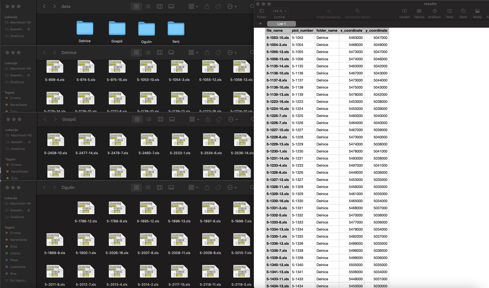

## Introduction

While digital data collection enables more comprehensive analysis and deeper insights it often results in large numbers of structured files that require systematic processing. This is particularly evident in forestry, where field measurements, spatial data, and environmental observations are routinely collected and stored in standardized formats across multiple locations.

Traditional manual approaches to data extraction and compilation are not only time-consuming but also prone to human error, potentially compromising data integrity and research quality. The need for efficient, accurate, and reproducible data processing methods has become increasingly important in modern forest research workflows.

This blog post presents an automated approach to extracting specific data from multiple files using R programming language. It demonstrates the practical application of this method through a case study involving 452 forest plots distributed across four different locations. While this example focuses on forest plots coordinate extraction, the methodology presented here can be adapted to various types of research data, offering a flexible framework for different data processing needs.

By implementing automation in data processing workflows, researchers can not only save valuable time but also ensure consistency and repeatability in their data handling procedures. The following sections detail the step-by-step process of developing and implementing such an automated system, from initial data structure analysis to final validation and visualization of results.

The image below shows the starting point, multiple Excel files organized across different location folders and the end result, a clean structured dataset containing coordinates for all 452 forest plots. Through automation, this entire process, including data extraction, validation, and compilation, takes approximately 5 minutes to complete. This represents a significant improvement over manual data entry, which could take hours and would be prone to human error. Let's dive into how we can achieve this transformation using R, turning what might seem like a daunting task into an efficient, automated workflow.

<div class="figure" style="text-align: center">

<p class="caption"><span id="fig:folder-structure"></span>Figure 1: Transforming 452 excel files into a single, analysis-ready dataset. This automated workflow takes approximately 5 minutes to process.</p>
</div>


## Required Packages

First, let's load all necessary packages.


``` r
# Load required packages
library(readxl)          # reading excel files
library(dplyr)           # data manipulation
library(purrr)           # functional programming operations
library(stringr)         # string manipulation
library(ggplot2)         # visualization
library(rnaturalearth)   # accessing Natural Earth map data (administrative boundaries)
library(sf)              # handling spatial vector data and coordinate transformations
library(sp)              # spatial data manipulation and projections
```


## Understanding Data Structure

Our data are field measurements from forest plots stored in excel (.xls) format, with each plot's data contained in a separate file. In total, we have 452 plots distributed across four different geographical locations, with the files organized accordingly in four folders. 

Before developing any automation functions, let's examine the structure of a single file to understand its layout.


``` r
# Read a sample file
test_file <- read_excel("data/Delnice/5-1053-10.xls")

# View the structure
print(test_file)
#> # A tibble: 34 × 22
#>    `Formular TRAKT` ...2  ...3  ...4  ...5  ...6   ...7  ...8  ...9  ...10 ...11
#>    <chr>            <chr> <chr> <chr> <chr> <chr>  <chr> <chr> <chr> <chr> <chr>
#>  1 <NA>             <NA>  <NA>  <NA>  <NA>  <NA>   <NA>  <NA>  <NA>  <NA>  <NA> 
#>  2 STRATUM          <NA>  <NA>  <NA>  <NA>  Broj … <NA>  <NA>  11    Broj… <NA> 
#>  3 DATUM            <NA>  <NA>  <NA>  <NA>  <NA>   <NA>  <NA>  Koor… <NA>  <NA> 
#>  4 1.               13    <NA>  9     <NA>  2007   <NA>  <NA>  Refe… <NA>  <NA> 
#>  5 2.               <NA>  <NA>  <NA>  <NA>  <NA>   <NA>  <NA>  x     <NA>  5463…
#>  6 <NA>             DD    <NA>  MM    <NA>  GG     <NA>  <NA>  y     <NA>  5047…
#>  7 <NA>             <NA>  <NA>  <NA>  <NA>  <NA>   <NA>  <NA>  <NA>  <NA>  <NA> 
#>  8 VRIJEME          1     <NA>  2     <NA>  <NA>   <NA>  <NA>  <NA>  <NA>  <NA> 
#>  9 <NA>             sat   min   sat   <NA>  min    <NA>  <NA>  <NA>  <NA>  <NA> 
#> 10 Odlazak          10    15    <NA>  <NA>  <NA>   <NA>  <NA>  <NA>  <NA>  <NA> 
#> # ℹ 24 more rows
#> # ℹ 11 more variables: ...12 <chr>, ...13 <dbl>, ...14 <chr>, ...15 <dbl>,
#> #   ...16 <lgl>, ...17 <lgl>, ...18 <lgl>, ...19 <chr>, ...20 <lgl>,
#> #   ...21 <lgl>, ...22 <chr>
```

After examining our test file's structure, we identified that coordinates appear two columns after their respective "x" and "y" markers. To ensure this pattern is consistent across all files, we'll create a function to check structural consistency across all files.


``` r

verify_file_structure <- function(file_path) {
    # Use tryCatch to handle potential errors during file processing
    tryCatch({
        # Read the Excel file - no column names as they're not standardized
        raw_data <- read_excel(file_path, sheet = 1, col_names = FALSE)
        
        # Create a results list to store verification outcomes
        results <- list(
            file_name = basename(file_path),    
            is_valid = TRUE,                    # Initially assume file is valid
            issues = character(0)               # Empty vector to store any issues found
        )
        
        # Initialize flags to track if coordinates were found
        # Will be set to TRUE when valid coordinates are found
        found_x <- FALSE
        found_y <- FALSE
        
        # Loop through each row to find 'x' and 'y' markers and their coordinates
        for(i in 1:nrow(raw_data)) {
            row_data <- raw_data[i,]
            
            # Check for 'x' marker if not already found
            if("x" %in% row_data && !found_x) {
                
                # Get position of first 'x' in the row
                x_position <- which(row_data == "x")[1]
                
                # Check if we can look two columns ahead (where coordinate should be)
                if(x_position + 2 <= ncol(raw_data)) {
                    
                    # Try to convert the value two columns after 'x' to numeric
                    x_value <- suppressWarnings(as.numeric(row_data[x_position + 2]))
                    
                    # If conversion successful (not NA), mark as found
                    if(!is.na(x_value)) {
                        found_x <- TRUE
                    }
                }
            }
            
            # Check for 'y' marker if not already found
            if("y" %in% row_data && !found_y) {
                
                # Get position of first 'y' in the row
                y_position <- which(row_data == "y")[1]
                
                # Check if we can look two columns ahead
                if(y_position + 2 <= ncol(raw_data)) {
                    
                    # Try to convert the value two columns after 'y' to numeric
                    y_value <- suppressWarnings(as.numeric(row_data[y_position + 2]))
                    
                    # If conversion successful, mark as found
                    if(!is.na(y_value)) {
                        found_y <- TRUE
                    }
                }
            }
            
            # If both coordinates found, no need to check remaining rows
            if(found_x && found_y) break
        }
        
        # Update results if coordinates weren't found
        if(!found_x) {
            results$is_valid <- FALSE
            results$issues <- c(results$issues, 
                "No valid x-coordinate found two columns after 'x' marker")
        }
        if(!found_y) {
            results$is_valid <- FALSE
            results$issues <- c(results$issues, 
                "No valid y-coordinate found two columns after 'y' marker")
        }
        
        return(results)
        
    }, error = function(e) {
        # If any error occurs, return error information
        return(list(
            file_name = basename(file_path),
            is_valid = FALSE,
            issues = sprintf("Error reading file: %s", e$message)
        ))
    })
}


verify_all_files <- function(base_path) {
    folders <- list.dirs(base_path, full.names = FALSE, recursive = FALSE)
    total_files <- 0
    valid_files <- 0
    
    for(folder in folders) {
        folder_path <- file.path(base_path, folder)
        excel_files <- list.files(
            path = folder_path,
            pattern = "\\.(xls|xlsx)$",
            full.names = TRUE
        )
        
        total_files <- total_files + length(excel_files)
        folder_results <- lapply(excel_files, verify_file_structure)
        valid_in_folder <- sum(sapply(folder_results, function(x) x$is_valid))
        valid_files <- valid_files + valid_in_folder
    }
    
    # Create a data frame with summary statistics
    summary_df <- data.frame(
        total_files_checked = total_files,
        files_valid = valid_files,
        files_with_issues = total_files - valid_files
    )
    
    # Print summary
    cat("\n=== Verification Summary ===\n")
    cat(sprintf("Total files checked: %d\n", total_files))
    cat(sprintf("Files with valid structure: %d\n", valid_files))
    cat(sprintf("Files with issues: %d\n", total_files - valid_files))
    
    return(summary_df)
}


verify_files <- verify_all_files("content/en/posts/forest-data-extraction/data/")
```


``` r

verify_files <- read.csv("verify_files.csv")
cat("=== Verification Summary ===\n")
#> === Verification Summary ===
cat(sprintf("Total files checked: %d\n", verify_files$total_files_checked))
#> Total files checked: 452
cat(sprintf("Files with valid structure: %d\n", verify_files$files_valid))
#> Files with valid structure: 452
cat(sprintf("Files with issues: %d\n", verify_files$files_with_issues))
#> Files with issues: 0
```


The verification results confirmed that all files follow the same structure giving us confidence to proceed with developing our main coordinate extraction function.

## Main Coordinates Extraction Function

The extract_coordinates function processes a single excel file to extract coordinates.


``` r

extract_coordinates <- function(file_path) {
    # Wrap everything in tryCatch to handle any errors 
    tryCatch({
        # Read the Excel file's first sheet without assuming column names
        raw_data <- read_excel(file_path, sheet = 1, col_names = FALSE)
        
        # Initialize coordinate variables as NULL
        x_coord <- NULL
        y_coord <- NULL
        
        # Loop through each row of the file
        for(i in 1:nrow(raw_data)) {
            
            # Check if "x" exists in the current row
            if("x" %in% raw_data[i,]) {
                x_row <- i  # Remember which row we found "x" in
                # Find the column position of the first "x"
                x_col <- which(raw_data[i,] == "x")[1]
                
                # Check if we can look two columns ahead (where the coordinate should be)
                if(x_col + 2 <= ncol(raw_data)) {
                    # Get the value two columns after "x"
                    x_val <- raw_data[x_row, x_col + 2]
                    # If it's not NA, convert to numeric
                    if(!is.na(x_val)) {
                        x_coord <- as.numeric(x_val)
                    }
                }
            }
            
            # Do the same for "y" coordinate
            if("y" %in% raw_data[i,]) {
                y_row <- i
                y_col <- which(raw_data[i,] == "y")[1]
                if(y_col + 2 <= ncol(raw_data)) {
                    y_val <- raw_data[y_row, y_col + 2]
                    if(!is.na(y_val)) {
                        y_coord <- as.numeric(y_val)
                    }
                }
            }
        }
        
        # If both coordinates were found
        if(!is.null(x_coord) && !is.null(y_coord)) {
            # Extract plot number from filename (pattern: numbers-numbers)
            plot_number <- str_extract(basename(file_path), "\\d+-\\d+")
            
            # Create a data frame with all the information
            result <- data.frame(
                file_name = basename(file_path),      
                plot_number = plot_number,            # Extracted plot number
                folder_name = basename(dirname(file_path)), # Folder name
                x_coordinate = x_coord,               # X coordinate
                y_coordinate = y_coord,               # Y coordinate
                stringsAsFactors = FALSE              # Don't convert strings to factors
            )
            
            return(result)
        } else {
            # If coordinates weren't found, warn and return NULL
            warning(sprintf("Could not find coordinates in file: %s", basename(file_path)))
            return(NULL)
        }
    }, error = function(e) {
        # If any error occurs, warn and return NULL
        warning(sprintf("Error processing file %s: %s", basename(file_path), e$message))
        return(NULL)
    })
}
```

The process_folders function handles multiple folders and files.


``` r

process_folders <- function(base_path, folder_names = NULL) {
    # If no specific folders provided, get all folders in base path
    if(is.null(folder_names)) {
        folder_names <- list.dirs(base_path, full.names = FALSE, recursive = FALSE)
    }
    
    # Create empty list to store results from each folder
    all_results <- list()
    
    # Process each folder
    for(folder in folder_names) {
        # Print progress message
        cat(sprintf("\nProcessing folder: %s\n", folder))
        
        # Create full path to current folder
        folder_path <- file.path(base_path, folder)
        
        # Get all Excel files in the current folder
        excel_files <- list.files(
            path = folder_path,          # Current folder path
            pattern = "\\.(xls|xlsx)$",  # Match Excel files
            full.names = TRUE,           # Get full file paths
            recursive = FALSE            # Don't look in subfolders
        )
        
        # Print number of files found
        cat(sprintf("Found %d Excel files\n", length(excel_files)))
        
        # Process each file using purrr::map_df
        folder_results <- map_df(excel_files, function(file) {
            cat(sprintf("Processing file: %s\n", basename(file)))
            extract_coordinates(file)
        })
        
        # Store results for this folder
        all_results[[folder]] <- folder_results
    }
    
    # Combine all folder results into one data frame
    final_results <- bind_rows(all_results)
    
    return(final_results)
}

base_path <- "content/en/posts/forest-data-extraction/data/"
folder_names <- c("Delnice", "Gospić", "Ogulin", "Senj")

# Process all folders and extract coordinates
results <- process_folders(base_path)
```

Now let's see the results.


``` r

results <- read.csv("results.csv")
print(head(results))
#>       file_name plot_number folder_name x_coordinate y_coordinate
#> 1 5-1053-10.xls      5-1053     Delnice      5463000      5047000
#> 2  5-1054-3.xls      5-1054     Delnice      5468000      5049000
#> 3 5-1055-12.xls      5-1055     Delnice      5473000      5047000
#> 4 5-1056-13.xls      5-1056     Delnice      5474000      5046000
#> 5 5-1135-14.xls      5-1135     Delnice      5463000      5042000
#> 6 5-1136-10.xls      5-1136     Delnice      5467000      5043000
```

## Data Validation and Testing

To ensure complete processing, we can perform several checks.

``` r

# Check for missing values and file processing
missing_coords <- sum(is.na(results$x_coordinate) | is.na(results$y_coordinate))
total_files <- length(list.files(path = base_path, 
                               pattern = "\\.(xls|xlsx)$", 
                               recursive = TRUE))
processed_files <- nrow(results)

# Simple logical checks
all_files_processed <- total_files == processed_files
no_missing_values <- missing_coords == 0

# Print validation results
cat("Validation Results:\n")
#> Validation Results:
cat(sprintf("Total files in directories: %d\n", total_files))
#> Total files in directories: 452
cat(sprintf("Files processed: %d\n", processed_files))
#> Files processed: 452
cat(sprintf("Files with missing coordinates: %d\n", missing_coords))
#> Files with missing coordinates: 0
cat(sprintf("All files processed: %s\n", ifelse(all_files_processed, "Yes", "No")))
#> All files processed: Yes
cat(sprintf("No missing values: %s\n", ifelse(no_missing_values, "Yes", "No")))
#> No missing values: Yes
```

## Data Visualisation

After successfully extracting coordinates from all four folders and 452 files, let's visualize their spatial distribution. However, since our coordinates are in the Gauss-Krüger coordinate system (EPSG:31275), we need to transform them to the WGS84 coordinate system (EPSG:4326) to properly display them on a map. The following code performs the coordinate transformation and creates a map showing the distribution of all 452 forest plots across their respective locations.


``` r
# Convert our data frame to spatial points
# First create spatial points with Gauss-Krüger CRS
points_gk <- st_as_sf(results, 
                      coords = c("x_coordinate", "y_coordinate"),
                      crs = 31275)  # EPSG code for Gauss-Krüger zone 5

# Transform to WGS84
points_wgs84 <- st_transform(points_gk, crs = 4326)

# Extract transformed coordinates
results_transformed <- results
results_transformed$lon <- st_coordinates(points_wgs84)[,1]
results_transformed$lat <- st_coordinates(points_wgs84)[,2]

# Display the first few rows of transformed data
results_transformed %>% 
    head()
#>       file_name plot_number folder_name x_coordinate y_coordinate      lon
#> 1 5-1053-10.xls      5-1053     Delnice      5463000      5047000 14.52124
#> 2  5-1054-3.xls      5-1054     Delnice      5468000      5049000 14.58516
#> 3 5-1055-12.xls      5-1055     Delnice      5473000      5047000 14.64935
#> 4 5-1056-13.xls      5-1056     Delnice      5474000      5046000 14.66221
#> 5 5-1135-14.xls      5-1135     Delnice      5463000      5042000 14.52162
#> 6 5-1136-10.xls      5-1136     Delnice      5467000      5043000 14.57275
#>        lat
#> 1 45.56628
#> 2 45.58453
#> 3 45.56674
#> 4 45.55779
#> 5 45.52129
#> 6 45.53049

# Load Croatia's map from Natural Earth package
croatia <- ne_countries(scale = "large", country = "croatia", returnclass = "sf")

# Convert folder_name column to a factor for better handling of categorical variables
results_transformed$folder_name <- factor(results_transformed$folder_name)

# Create visualization
ggplot() +
  # Add Croatia's map as background
  # lightgray is fill color, darkgray is border color
  geom_sf(data = croatia, 
          fill = "lightgray", 
          color = "darkgray") +
  
  # Add points to the map
  geom_point(data = results_transformed %>% 
               mutate(folder_name = droplevels(folder_name)), 
             aes(x = lon, y = lat, 
                 color = folder_name),  
             size = 1.3,      # point size
             alpha = 0.6) +   # point transparency
  
  # Define custom colors for each category (folder)
  # setNames pairs colors with factor levels
  scale_color_manual(
    values = setNames(
      c("#284345c7", "#5F6F52", "#a78780", "#783D19"),
      levels(results_transformed$folder_name)
    )
  ) +
  
  # Set minimal theme for clean visualization
  theme_minimal() +
  
  # Set plot labels
  labs(title = "",         
       color = "Location") +  
  
  # Position legend at bottom of plot
  theme(legend.position = "bottom")
```

<div class="figure" style="text-align: center">
}}index_files/figure-html/map-plots-1.png" alt="Spatial distribution of 452 forest plots across four management units in Croatia" width="80%" />
<p class="caption"><span id="fig:map-plots"></span>Figure 2: Spatial distribution of 452 forest plots across four management units in Croatia</p>
</div>


## Saving Results

The final results were saved in a tabular format (CSV file) for further analysis.


``` r
# Save to CSV
write.csv(results, "extracted-coordinates.csv", row.names = FALSE)
```


## Conclusion

This automated approach successfully processed 452 plot files across 4 geographical regions in approximately 5 minutes
with zero manual data entry errors. Each file was processed systematically to obtain its spatial coordinates, and the completeness of the extraction was validated through comprehensive checks. The extracted data was organized into a structured dataset, enabling easy access and analysis. To provide a clear understanding of the spatial distribution of forest plots, we generated visualization that illustrate the geographical spread across the four locations. 

By automating the extraction of coordinates from numerous files we not only saved considerable time but also eliminated potential manual entry errors. This approach can be adapted for various types of forest research data, making it a valuable tool for forest scientists working with multiple data files. Remember to always validate your results and adjust the code according to your specific requirements.

